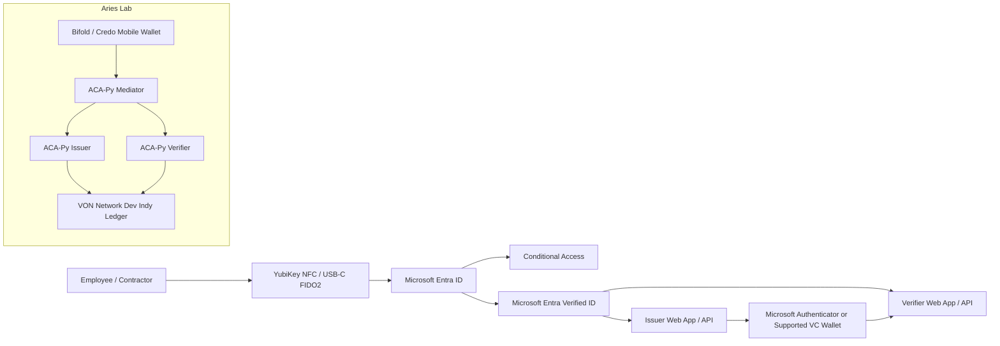
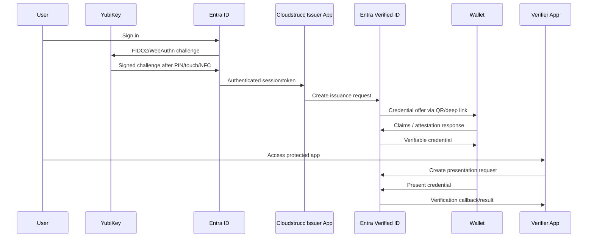
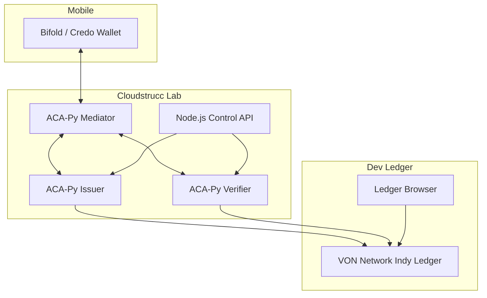
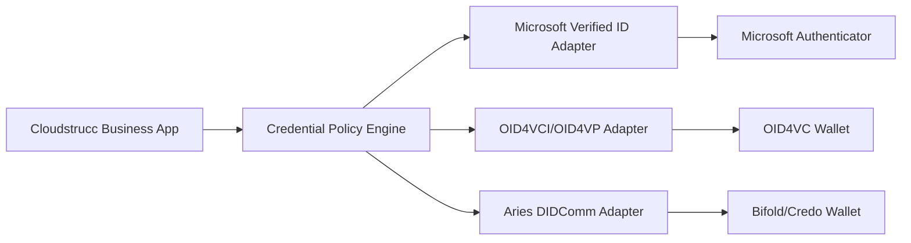

# Cloudstrucc Implementation Guide: YubiKey + Microsoft Entra Verified ID + Aries / ACA-Py Wallet & DID Service

**Audience:** Cloudstrucc architects, identity engineers, Codex implementation agents, DevSecOps, and solution delivery teams.  
**Goal:** Implement phishing-resistant authentication with YubiKey, issue/present verifiable credentials with Microsoft Entra Verified ID, and optionally run an Aries/ACA-Py interoperability stack using a mobile wallet, mediator, DID service, and VON/Indy development ledger.

---

## 1. Executive Architecture Decision

Use **two complementary tracks**:

1. **Production Microsoft-native track**  
   Use Microsoft Entra ID + YubiKey FIDO2/passkeys + Microsoft Entra Verified ID. This is the recommended production path for Microsoft-centric enterprise and government environments.

2. **Interoperability / lab track**  
   Use ACA-Py + Bifold/Credo wallet + mediator + VON Network. This track is valuable for Aries, DIDComm, AnonCreds, and wallet interoperability testing. Treat VON as a development ledger only, not a production trust registry.

Do **not** assume that every wallet, DID method, VC format, or OIDC4VC profile is mutually interoperable. Implement clear adapters and keep the Microsoft Verified ID path separate from the Aries path unless a specific wallet/protocol bridge is proven in testing.

---

## 2. Standards Position

| Area | Recommended Standard / Protocol | Notes |
|---|---|---|
| Hardware authentication | FIDO2 / WebAuthn / passkeys | Use device-bound YubiKey for high assurance. |
| Enterprise identity | Microsoft Entra ID | Configure passkey/FIDO2 authentication methods and Conditional Access. |
| Microsoft VC issuance/verification | Microsoft Entra Verified ID Request Service REST API | Use issuer/verifier APIs and Verified ID Network where applicable. |
| Wallet-facing issuance | OID4VCI | OpenID for Verifiable Credential Issuance is an OAuth-protected API for VC issuance. |
| Wallet-facing presentation | OID4VP | Use for standards-based VC presentation where supported. |
| Aries messaging | DIDComm | Used by ACA-Py, Bifold/Credo, mediator-based mobile flows. |
| Aries credentials | AnonCreds or W3C VC Data Model | Choose based on wallet and verifier compatibility. |
| Development ledger | VON Network / local Indy | Local dev only. |
| Production DID method | did:web / did:ion / did:key / did:webvh, depending on ecosystem | Avoid local Indy/VON for production. |

---

## 3. Target Solution Overview



---

## 4. Production Reference Architecture

### 4.1 Roles

| Role | Component | Responsibility |
|---|---|---|
| Identity Provider | Microsoft Entra ID | Authenticates users using YubiKey FIDO2/passkeys. |
| Hardware Authenticator | YubiKey 5 NFC / 5C NFC / Security Key NFC | Device-bound private key; user presence/PIN gesture. |
| Issuer | Cloudstrucc issuer web service + Entra Verified ID | Issues employee/contractor/government credentials. |
| Holder | Microsoft Authenticator or compatible wallet | Stores and presents credentials. |
| Verifier | Cloudstrucc verifier web service + Entra Verified ID | Requests and verifies credentials. |
| Trust Discovery | Verified ID Network or configured issuer metadata | Helps verifiers discover issuer DID and credential type. |
| Audit | App Insights / Log Analytics / SIEM | Tracks issuance, presentation, errors, and admin operations. |

### 4.2 Production Flow



---

## 5. Prerequisites

### 5.1 Microsoft / Azure

- Microsoft Entra tenant.
- Authentication Methods Policy admin access.
- Conditional Access admin access.
- Microsoft Entra Verified ID configured.
- Azure Key Vault for issuer key material if using Advanced setup.
- App registrations for issuer and verifier services.
- HTTPS callback endpoints for issuance and presentation.
- Publicly reachable domain for issuer/verifier callback URLs.

### 5.2 YubiKey

- YubiKey model supporting FIDO2/WebAuthn.
- NFC model if mobile tap is required, such as YubiKey 5 NFC, YubiKey 5C NFC, or Security Key NFC.
- YubiKey Manager for PIN and interface validation.
- Spare recovery key per privileged user.

### 5.3 Aries Lab

- Docker Desktop or Docker Engine.
- Node.js 20+ for web reference apps.
- Python 3.11+ if extending ACA-Py plugins.
- Local VON Network for dev Indy ledger.
- ACA-Py containers for issuer, verifier, and mediator.
- Bifold wallet build or compatible Aries/Credo wallet.
- Ngrok, Dev Tunnels, or public HTTPS ingress for mobile wallet testing.

---

## 6. Configure YubiKey with Microsoft Entra ID

### 6.1 Enable passkeys/FIDO2 in Entra

1. Go to **Microsoft Entra admin center**.
2. Open **Protection > Authentication methods > Policies**.
3. Enable **Passkey (FIDO2)**.
4. Target a pilot group first, for example `Cloudstrucc-YubiKey-Pilot`.
5. Configure restrictions if required:
   - Enforce key attestation for high assurance.
   - Restrict allowed AAGUIDs to approved YubiKey models.
   - Require self-service registration only from compliant network/device conditions if needed.
6. Save the policy.

### 6.2 Register the YubiKey

1. User opens **My Security Info**.
2. Adds sign-in method: **Security key** or **Passkey**.
3. Chooses USB or NFC depending on device.
4. Inserts/taps the YubiKey.
5. Sets or confirms FIDO2 PIN.
6. Touches the YubiKey when prompted.
7. Names the key, for example `Cloudstrucc YubiKey NFC - Primary`.

### 6.3 Conditional Access baseline

Create a Conditional Access policy:

- **Users:** pilot users or privileged roles.
- **Cloud apps:** issuer app, verifier app, sensitive internal apps.
- **Grant:** require authentication strength with phishing-resistant MFA.
- **Session:** sign-in frequency based on risk profile.
- **Exclude:** break-glass accounts.

### 6.4 NFC usage

NFC is valid for mobile registration and sign-in where the operating system, browser, and app support FIDO2/passkeys over NFC. Always test:

- iPhone + Safari / Microsoft apps.
- Android + Chrome / Microsoft apps.
- Windows device with NFC reader if required.
- USB-C fallback for help desk recovery.

---

## 7. Configure Microsoft Entra Verified ID

### 7.1 Setup model

Use **Quick setup** for demos and **Advanced setup** for production. Advanced setup is preferred when you need explicit Key Vault, key lifecycle, environment separation, and stricter governance.

### 7.2 Credential design

Example credential type:

```json
{
  "credentialType": "CloudstruccEmployeeCredential",
  "displayName": "Cloudstrucc Employee Credential",
  "claims": {
    "employeeId": "string",
    "displayName": "string",
    "email": "string",
    "department": "string",
    "role": "string",
    "assuranceLevel": "string",
    "employmentStatus": "string"
  }
}
```

Recommended claims:

| Claim | Purpose | Sensitivity |
|---|---|---|
| employeeId | Stable employee reference | Internal confidential |
| displayName | Human-readable name | Low |
| email | UPN/email match | Moderate |
| department | Authorization grouping | Moderate |
| role | App access policy | Moderate |
| assuranceLevel | High assurance / hardware-bound enrollment flag | High |
| employmentStatus | Active / contractor / suspended | High |

Avoid putting secrets, clearance details, or unnecessary HR data directly into credentials. Prefer coarse claims like `assuranceLevel` or `eligibilityStatus`.

### 7.3 Issuance pattern

Use one of these attestation patterns:

1. **ID token hint**  
   Issuer app authenticates user with Entra ID and passes trusted claims to Verified ID.

2. **OIDC identity provider claims**  
   Wallet signs in to an OpenID Connect provider and retrieves claims for issuance.

3. **Presentation-based issuance**  
   User presents an existing credential to obtain a derived Cloudstrucc credential.

Recommended for Cloudstrucc: start with **ID token hint** because it aligns well with Entra, YubiKey authentication, and controlled enterprise issuance.

---

## 8. Issuer Application Implementation

### 8.1 Issuer responsibilities

- Authenticate admin/user via Entra ID.
- Confirm YubiKey/passkey sign-in or phishing-resistant authentication strength.
- Build issuance request payload.
- Call Microsoft Entra Verified ID Request Service REST API.
- Render QR code or deep link.
- Receive callback events.
- Persist transaction state.
- Log audit data without storing credential secrets.

### 8.2 Suggested service structure

```text
/cloudstrucc-verified-id
  /apps
    /issuer-web
    /verifier-web
  /services
    /entra-token-service
    /verified-id-client
    /credential-policy-service
    /audit-service
  /infra
    /bicep
    /terraform
  /aries-lab
    /docker-compose.yml
    /issuer
    /verifier
    /mediator
  /docs
    /implementation-guide.md
```

### 8.3 Issuance transaction model

```ts
export interface IssuanceTransaction {
  id: string;
  correlationId: string;
  userObjectId: string;
  credentialType: 'CloudstruccEmployeeCredential';
  status: 'created' | 'qr-rendered' | 'issued' | 'failed' | 'expired';
  requestUrl?: string;
  pin?: string;
  createdAt: string;
  expiresAt: string;
  callbackPayload?: unknown;
}
```

### 8.4 Issuer API pseudocode

```ts
app.post('/api/issuer/create-offer', requireAuth, async (req, res) => {
  const user = req.user;

  await requirePhishingResistantAuth(user);

  const claims = {
    employeeId: user.employeeId,
    displayName: user.name,
    email: user.email,
    department: user.department,
    role: user.role,
    assuranceLevel: 'FIDO2_YUBIKEY',
    employmentStatus: 'active'
  };

  const request = await verifiedIdClient.createIssuanceRequest({
    credentialType: 'CloudstruccEmployeeCredential',
    claims,
    callbackUrl: `${PUBLIC_BASE_URL}/api/issuer/callback`,
    state: crypto.randomUUID()
  });

  await issuanceStore.save(request);

  res.json({
    qrCodeUrl: request.url,
    expiry: request.expiry,
    transactionId: request.id
  });
});
```

---

## 9. Verifier Application Implementation

### 9.1 Verifier responsibilities

- Create presentation request.
- Specify accepted issuer DID and credential type.
- Render QR/deep link.
- Receive callback from Verified ID.
- Validate callback state and transaction correlation.
- Map verified claims to authorization decision.
- Avoid over-collecting claims.

### 9.2 Verification policy example

```json
{
  "acceptedCredentials": [
    {
      "type": "CloudstruccEmployeeCredential",
      "issuerAuthority": "did:example:cloudstrucc-issuer",
      "requiredClaims": [
        "employeeId",
        "email",
        "employmentStatus",
        "assuranceLevel"
      ]
    }
  ],
  "authorizationRules": [
    {
      "when": {
        "employmentStatus": "active",
        "assuranceLevel": "FIDO2_YUBIKEY"
      },
      "grant": "employee_portal_access"
    }
  ]
}
```

### 9.3 Verifier API pseudocode

```ts
app.post('/api/verifier/create-request', async (req, res) => {
  const presentationRequest = await verifiedIdClient.createPresentationRequest({
    acceptedIssuers: [CLOUDSTRUCC_ISSUER_DID],
    credentialType: 'CloudstruccEmployeeCredential',
    requestedClaims: ['employeeId', 'email', 'employmentStatus', 'assuranceLevel'],
    callbackUrl: `${PUBLIC_BASE_URL}/api/verifier/callback`,
    state: crypto.randomUUID()
  });

  await verifierStore.save(presentationRequest);

  res.json({
    qrCodeUrl: presentationRequest.url,
    transactionId: presentationRequest.id,
    expiresAt: presentationRequest.expiresAt
  });
});
```

---

## 10. Aries / ACA-Py Lab Architecture

The Aries lab is useful when Cloudstrucc needs wallet interoperability, DIDComm, AnonCreds, Bifold wallet, or ACA-Py experimentation.



### 10.1 When the DID service is necessary

A DID service is necessary when you need one or more of the following:

- DID creation and rotation outside Microsoft Entra Verified ID.
- DIDComm endpoints for Aries agents.
- Public DID registration on a ledger or did:web location.
- Credential schema and credential definition publishing for AnonCreds.
- Issuer/verifier services that are independent from Microsoft Verified ID.
- Wallet interoperability with Bifold/Credo and other Aries agents.

A separate DID service is **not strictly necessary** for a Microsoft-only Verified ID implementation because Entra Verified ID provisions the issuer DID and manages Verified ID service metadata.

---

## 11. Local Aries Lab Docker Compose

> This is a development scaffold. Harden before production.

```yaml
services:
  von-network:
    image: ghcr.io/bcgov/von-network-base:latest
    profiles: ["manual"]

  acapy-mediator:
    image: ghcr.io/openwallet-foundation/acapy-agent:py3.12-1.6.0
    command: >
      start
      --label Cloudstrucc Mediator
      --inbound-transport http 0.0.0.0 3000
      --outbound-transport http
      --admin 0.0.0.0 3001
      --admin-insecure-mode
      --endpoint http://localhost:3000
      --wallet-type askar
      --wallet-name mediator-wallet
      --wallet-key mediator-wallet-key
      --auto-provision
      --mediator-invitation
      --open-mediation
    ports:
      - "3000:3000"
      - "3001:3001"

  acapy-issuer:
    image: ghcr.io/openwallet-foundation/acapy-agent:py3.12-1.6.0
    command: >
      start
      --label Cloudstrucc Issuer
      --inbound-transport http 0.0.0.0 4000
      --outbound-transport http
      --admin 0.0.0.0 4001
      --admin-insecure-mode
      --endpoint http://localhost:4000
      --wallet-type askar
      --wallet-name issuer-wallet
      --wallet-key issuer-wallet-key
      --auto-provision
      --auto-accept-invites
      --auto-accept-requests
      --auto-ping-connection
    ports:
      - "4000:4000"
      - "4001:4001"

  acapy-verifier:
    image: ghcr.io/openwallet-foundation/acapy-agent:py3.12-1.6.0
    command: >
      start
      --label Cloudstrucc Verifier
      --inbound-transport http 0.0.0.0 5000
      --outbound-transport http
      --admin 0.0.0.0 5001
      --admin-insecure-mode
      --endpoint http://localhost:5000
      --wallet-type askar
      --wallet-name verifier-wallet
      --wallet-key verifier-wallet-key
      --auto-provision
      --auto-accept-invites
      --auto-accept-requests
      --auto-ping-connection
    ports:
      - "5000:5000"
      - "5001:5001"
```

For real mobile wallet testing, replace `localhost` endpoints with public HTTPS endpoints exposed through an ingress, dev tunnel, or reverse proxy.

---

## 12. Aries Admin API Examples

### 12.1 Create issuer invitation

```bash
curl -X POST http://localhost:4001/connections/create-invitation \
  -H 'Content-Type: application/json' \
  -d '{"metadata": {}, "my_label": "Cloudstrucc Issuer"}'
```

### 12.2 Create schema

```bash
curl -X POST http://localhost:4001/schemas \
  -H 'Content-Type: application/json' \
  -d '{
    "schema_name": "cloudstrucc-employee",
    "schema_version": "1.0.0",
    "attributes": [
      "employeeId",
      "displayName",
      "email",
      "department",
      "role",
      "assuranceLevel",
      "employmentStatus"
    ]
  }'
```

### 12.3 Create credential definition

```bash
curl -X POST http://localhost:4001/credential-definitions \
  -H 'Content-Type: application/json' \
  -d '{
    "schema_id": "REPLACE_WITH_SCHEMA_ID",
    "support_revocation": true,
    "tag": "cloudstrucc-employee-v1"
  }'
```

### 12.4 Issue credential

```bash
curl -X POST http://localhost:4001/issue-credential-2.0/send \
  -H 'Content-Type: application/json' \
  -d '{
    "connection_id": "REPLACE_CONNECTION_ID",
    "filter": {
      "indy": {
        "cred_def_id": "REPLACE_CRED_DEF_ID",
        "issuer_did": "REPLACE_ISSUER_DID",
        "schema_id": "REPLACE_SCHEMA_ID"
      }
    },
    "credential_preview": {
      "@type": "issue-credential/2.0/credential-preview",
      "attributes": [
        {"name":"employeeId","value":"E12345"},
        {"name":"displayName","value":"Fredercik Pearson"},
        {"name":"email","value":"fpearson@cloudstrucc.com"},
        {"name":"department","value":"Architecture"},
        {"name":"role","value":"Solution Architect"},
        {"name":"assuranceLevel","value":"FIDO2_YUBIKEY"},
        {"name":"employmentStatus","value":"active"}
      ]
    }
  }'
```

### 12.5 Request proof

```bash
curl -X POST http://localhost:5001/present-proof-2.0/send-request \
  -H 'Content-Type: application/json' \
  -d '{
    "connection_id": "REPLACE_CONNECTION_ID",
    "presentation_request": {
      "indy": {
        "name": "Cloudstrucc Employee Access Proof",
        "version": "1.0",
        "requested_attributes": {
          "attr1_referent": {"name": "employeeId"},
          "attr2_referent": {"name": "email"},
          "attr3_referent": {"name": "employmentStatus"},
          "attr4_referent": {"name": "assuranceLevel"}
        },
        "requested_predicates": {}
      }
    }
  }'
```

---

## 13. OIDC4VC Implementation Guidance

### 13.1 When OIDC4VC makes sense

Use OIDC4VC when you need standards-based wallet interactions that align with OpenID/OAuth patterns:

- Issuance via **OID4VCI**.
- Presentation via **OID4VP**.
- Authorization-server-style credential offers.
- Mobile wallet QR/deep-link flows.
- Interoperability beyond Microsoft Authenticator or beyond Aries DIDComm.

### 13.2 Recommended Cloudstrucc stance

- Use Microsoft Entra Verified ID where the relying parties are Microsoft-native or enterprise-controlled.
- Use OIDC4VC profiles where external wallets and cross-ecosystem interoperability are required.
- Keep DIDComm/Aries flows separate from OIDC4VC flows until interoperability is proven.
- Prefer SD-JWT VC for selective disclosure where ecosystem support exists.
- Prefer AnonCreds in Aries labs where Bifold/Credo and ACA-Py support is mature.

### 13.3 Adapter pattern



Implement one business policy layer and multiple protocol adapters.

---

## 14. Security Controls

### 14.1 Authentication

- Require phishing-resistant MFA for issuer administration.
- Require YubiKey/passkey authentication for credential issuance to employees.
- Enforce Conditional Access for issuer/verifier admin portals.
- Use separate break-glass accounts excluded from risky policies and monitored heavily.

### 14.2 Credential minimization

- Do not issue sensitive claims unless required.
- Use coarse-grained authorization claims.
- Avoid embedding security clearance or protected HR details.
- Use short credential lifetimes where revocation latency is unacceptable.

### 14.3 Key management

- Use Key Vault-backed keys where supported.
- Separate sandbox, staging, and production issuers.
- Rotate keys through a tested process.
- Monitor DID document and metadata changes.

### 14.4 Callback security

- Validate `state` and correlation IDs.
- Require HTTPS.
- Validate callback source and token/signature requirements per provider documentation.
- Store callback payloads with redaction.
- Do not trust front-channel QR/deep-link data as final verification.

### 14.5 Aries lab security

- Never expose ACA-Py admin APIs without authentication in production.
- Do not use `--admin-insecure-mode` outside local lab.
- Use persistent encrypted wallets and secure wallet keys.
- Use real HTTPS endpoints for mobile wallets.
- Treat VON ledger as local test infrastructure only.

---

## 15. DevOps and Infrastructure

### 15.1 Environments

| Environment | Purpose | Notes |
|---|---|---|
| local | Developer testing | Mock Entra/Verified ID where needed; ACA-Py local. |
| sandbox | Integration demos | Real Entra sandbox tenant and Verified ID setup. |
| staging | Pre-production | Mirrors production policies and Key Vault. |
| production | Live issuance/verification | Strict governance, monitoring, and change control. |

### 15.2 Secrets

Store in Key Vault or equivalent:

- Verified ID API client secret/certificate.
- App registration credentials.
- ACA-Py wallet keys.
- Webhook validation secrets.
- OIDC client secrets if using confidential clients.

### 15.3 Observability

Log:

- Issuance transaction ID.
- Presentation transaction ID.
- Credential type.
- Issuer DID.
- Verification result.
- Error category.
- User object ID or pseudonymous subject ID.

Do not log full credentials, raw tokens, private keys, or unnecessary personal data.

---

## 16. Codex Implementation Backlog

### Epic 1: Base repository

- Create monorepo structure.
- Add TypeScript strict mode.
- Add ESLint/Prettier.
- Add Docker Compose for local services.
- Add `.env.example` for issuer/verifier configuration.

### Epic 2: YubiKey / Entra authentication

- Add Microsoft identity web sign-in.
- Add authentication strength check abstraction.
- Add admin-only issuer dashboard.
- Add Conditional Access deployment notes.

### Epic 3: Verified ID issuer

- Implement `VerifiedIdClient`.
- Implement `createIssuanceRequest`.
- Render QR code.
- Implement issuance callback endpoint.
- Add transaction persistence.
- Add audit logging.

### Epic 4: Verified ID verifier

- Implement `createPresentationRequest`.
- Render QR code.
- Implement verifier callback endpoint.
- Implement authorization mapping.
- Add admin transaction viewer.

### Epic 5: Aries lab

- Add ACA-Py issuer/verifier/mediator Compose profile.
- Add scripts for invitations, schema creation, credential definition creation, issuance, and proof request.
- Add Bifold wallet connection instructions.
- Add VON Network dev profile.

### Epic 6: OIDC4VC adapter

- Define interface for credential issuance adapters.
- Define interface for presentation request adapters.
- Add OID4VCI metadata endpoint support if implementing custom issuer.
- Add OID4VP presentation request support if implementing custom verifier.
- Add integration tests with selected wallets.

### Epic 7: Security hardening

- Add callback validation.
- Add rate limits.
- Add CSRF protection for admin UI.
- Add audit redaction.
- Add secret scanning.
- Add threat model document.

---

## 17. Suggested TypeScript Interfaces

```ts
export interface CredentialIssuanceAdapter {
  createOffer(input: CreateCredentialOfferInput): Promise<CreateCredentialOfferResult>;
  getStatus(transactionId: string): Promise<CredentialTransactionStatus>;
}

export interface CredentialPresentationAdapter {
  createRequest(input: CreatePresentationRequestInput): Promise<CreatePresentationRequestResult>;
  getResult(transactionId: string): Promise<PresentationResult>;
}

export interface CreateCredentialOfferInput {
  subjectId: string;
  credentialType: string;
  claims: Record<string, string | number | boolean>;
  callbackUrl: string;
}

export interface CreateCredentialOfferResult {
  transactionId: string;
  requestUrl: string;
  qrCodeData: string;
  expiresAt: string;
}

export interface CreatePresentationRequestInput {
  credentialType: string;
  acceptedIssuers: string[];
  requestedClaims: string[];
  callbackUrl: string;
}

export interface CreatePresentationRequestResult {
  transactionId: string;
  requestUrl: string;
  qrCodeData: string;
  expiresAt: string;
}
```

---

## 18. Testing Plan

### 18.1 Microsoft path

- Register YubiKey over USB.
- Register YubiKey over NFC on mobile.
- Sign in to issuer app using phishing-resistant auth.
- Issue `CloudstruccEmployeeCredential`.
- Present credential to verifier app.
- Validate callback handling.
- Validate authorization decision.
- Test expired request.
- Test revoked/suspended user.
- Test wrong issuer DID.
- Test wrong credential type.

### 18.2 Aries path

- Start VON dev ledger.
- Start ACA-Py mediator.
- Start ACA-Py issuer.
- Start ACA-Py verifier.
- Connect Bifold wallet to mediator.
- Connect wallet to issuer.
- Publish schema.
- Publish credential definition.
- Issue credential.
- Connect wallet to verifier.
- Present proof.
- Verify proof result.

### 18.3 OIDC4VC path

- Validate credential issuer metadata.
- Generate credential offer.
- Test wallet acceptance.
- Issue credential.
- Generate presentation request.
- Validate presentation response.
- Confirm selected format: JWT VC, SD-JWT VC, mdoc, or W3C VC.

---

## 19. Production Readiness Checklist

- [ ] Entra passkey/FIDO2 enabled for pilot group.
- [ ] YubiKey AAGUID policy defined if attestation is required.
- [ ] Conditional Access policy requires phishing-resistant MFA.
- [ ] Verified ID tenant configured.
- [ ] Credential display/rules definitions reviewed.
- [ ] Issuer app registration configured.
- [ ] Verifier app registration configured.
- [ ] Callback endpoints deployed over HTTPS.
- [ ] Issuer DID and credential type documented.
- [ ] Verified ID Network evaluated for issuer discovery.
- [ ] Logging and alerting configured.
- [ ] Privacy review completed.
- [ ] Threat model completed.
- [ ] Recovery process for lost YubiKeys documented.
- [ ] Aries admin APIs secured if deployed outside local lab.
- [ ] VON Network restricted to development use.

---

## 20. Recommended First Build Sequence

1. Implement Entra/YubiKey sign-in for the issuer and verifier web apps.
2. Configure Microsoft Entra Verified ID in sandbox.
3. Create the `CloudstruccEmployeeCredential` display/rules definition.
4. Build the Verified ID issuer request endpoint.
5. Build the Verified ID verifier request endpoint.
6. Add callback handling and audit logging.
7. Add Conditional Access authentication strength enforcement.
8. Create the Aries lab stack separately.
9. Add Bifold wallet testing.
10. Add OIDC4VC adapter only after a target wallet and credential format are selected.

---

## 21. Key References

- Microsoft Entra passkeys/FIDO2 authentication method and security-key registration.
- Microsoft Entra Verified ID Request Service REST API for issuance and presentation.
- Microsoft Entra Verified ID rules/display definitions and credential customization.
- Microsoft Verified ID Network for issuer discovery.
- OpenID for Verifiable Credential Issuance 1.0.
- ACA-Py documentation and OpenWallet Foundation ACA-Py project.
- Bifold Wallet project.
- VON Network development Indy ledger.
