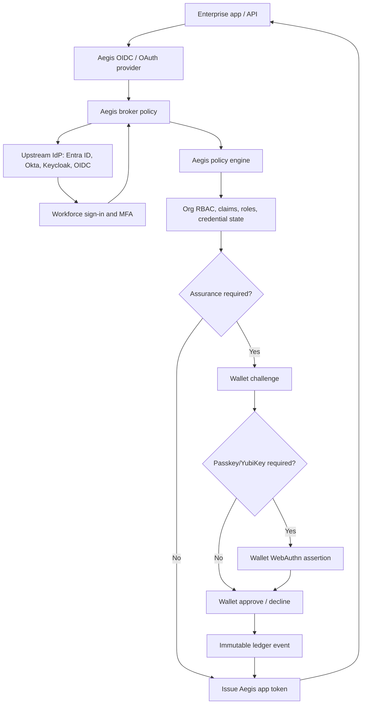
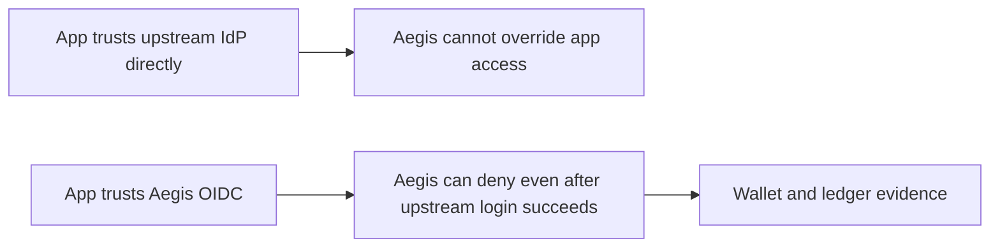
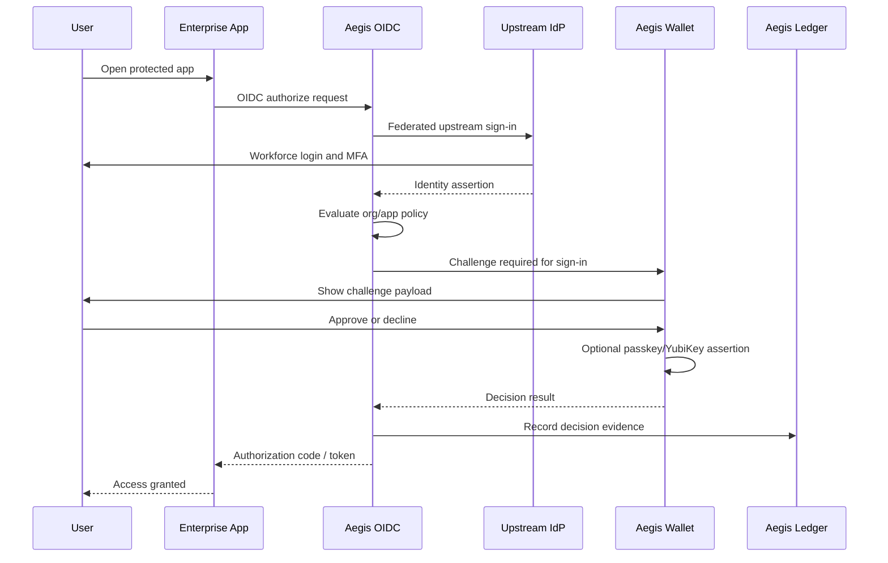
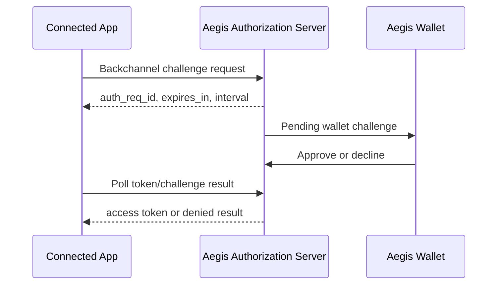

# Aegis OIDC Broker And Assurance Architecture

This document describes the target architecture for using Vanguard Aegis ID as the organization-controlled identity assurance, authorization, wallet challenge, and ledger layer in front of enterprise applications.

It is intentionally a design document first, with implementation status called out where the current pilot already covers a phase. The goal is to make the product direction reviewable as the broker, policy, wallet challenge, and ledger layers mature.

## Executive Summary

Most enterprise customers already use Microsoft Entra ID, Okta, Keycloak, LDAP-backed applications, or another workforce identity provider. Aegis ID should not require those systems to be removed.

Instead, Aegis ID becomes the relying-party identity broker and final authorization layer:

1. Enterprise apps trust Aegis ID as their OIDC/OAuth provider.
2. Aegis ID federates upstream to Entra ID or another configured identity provider for workforce sign-in.
3. Aegis ID evaluates organization policy, credential state, RBAC, claims, revocation, and connected-app rules.
4. Aegis ID sends a mobile wallet challenge when higher assurance is required.
5. The wallet can require passkey/YubiKey-backed proof before approval.
6. Aegis ID records the decision, payload, policy context, and outcome in the immutable ledger.
7. Aegis ID issues the final token to the enterprise application only when policy succeeds.

This lets customers keep their existing workforce sign-in while giving Aegis ID precedence over app access and high-value action authorization for apps integrated through Aegis.

## Target Architecture



## Trust Boundary

Aegis ID should be the final authorization boundary for connected applications.



This is the central product point: upstream identity providers authenticate the account, but Aegis ID authorizes the user, action, and context.

## User Journey



## Why This Matters

This design supports customers who want stronger governance than a typical IdP group or claim model:

- Entra ID or another IdP can prove the workforce account.
- Aegis ID can deny access if the user is not a valid member of the organization workspace.
- Aegis ID can deny access if a credential is revoked, disabled, expired, or missing required claims.
- Aegis ID can require a wallet challenge for sign-in or sensitive actions.
- Aegis ID can require passkey/YubiKey evidence inside the wallet approval.
- Aegis ID can retain immutable evidence showing who approved what, when, for which app, with which payload.

## Scope

### In Scope For This Architecture

- Aegis ID as an OIDC/OAuth provider for connected apps.
- Upstream federation to Entra ID first, then other OIDC providers.
- Aegis policy engine as the final authorization source.
- Aegis wallet challenge for sign-in and sensitive actions.
- Passkey/YubiKey step-up for wallet approvals.
- CIBA-style decoupled challenge patterns for app-to-wallet approval flows.
- Verified ID callback ingestion into the Aegis ledger.
- API and developer documentation for connected apps.

### Out Of Scope For This Phase

- Full OpenID4VP credential wallet support.
- Full OpenID4VCI issuance into the Aegis wallet.
- Replacing Microsoft Authenticator as an Entra MFA method.
- Replacing upstream workforce identity providers.
- Regulated digital signature certification.

These are valuable future areas, but they should not block the OIDC broker and assurance layer.

## Current Implementation Status

- Phase 1 is implemented for Entra upstream federation: Aegis can broker connected-app authorization requests through Entra and issue Aegis authorization codes after upstream identity validation.
- Phase 2 is partially implemented: connected apps are governed by the central policy registry and app configuration. The next hardening step is deeper subject entitlement evaluation before token issuance for every connected app.
- Phase 3 is implemented for connected-app sign-in and action challenges: Aegis creates one-time wallet challenges, rejects expired/replayed decisions, and records outcomes.
- Phase 4 is supported through existing wallet passkey/YubiKey assurance for challenge approvals. Further hardening should add more assertion-binding regression coverage across iOS, Android, and server APIs.
- Phase 5 is implemented as a CIBA-style polling flow with `auth_req_id`, `authorization_pending`, token issuance after approval, and denied/expired error paths.
- Phase 6 is implemented for Verified ID callback continuity, including external callback ledger records when Microsoft Authenticator handles the presentation.

## Build Order

### Phase 1 - OIDC Broker With Entra Upstream

Goal: A connected app can use Aegis ID as its OIDC provider while Aegis federates to Entra ID for workforce identity.

Required work:

- Add upstream IdP configuration to connected apps or organization integrations.
- Support Entra ID as the first upstream provider.
- Add broker login route that redirects to Entra using authorization code + PKCE.
- Validate upstream ID token issuer, audience, nonce, signature, and expiry.
- Map upstream subject/email/UPN to an Aegis user and organization membership.
- Record broker login events.

Recommended libraries:

- `oidc-provider` for Aegis acting as an OIDC provider.
- `openid-client` for Aegis acting as an OIDC client to upstream IdPs.
- `jose` for token validation/signing where needed.
- `passport` for local Aegis web sessions.

Acceptance criteria:

- A connected app redirects to Aegis.
- Aegis redirects to Entra.
- Entra returns identity to Aegis.
- Aegis maps the identity to a known user/org membership.
- Aegis does not issue an app token until Aegis policy succeeds.

### Phase 2 - Aegis Policy As Final Authorization Source

Goal: Aegis can deny app access even if upstream IdP authentication succeeds.

Required work:

- Extend the central authorization service to support connected-app sign-in decisions.
- Evaluate:
  - organization membership
  - connected-app assignment
  - holder credential status
  - roles and claims
  - org revocation state
  - required assurance level
  - app-specific policy
- Add policy result details to audit logs.
- Keep route and service authorization deny-by-default.

Policy decision example:

```json
{
  "subject": "user@example.com",
  "organizationId": "org-123",
  "connectedAppId": "app-456",
  "operation": "app.signIn",
  "decision": "challenge_required",
  "requiredAssurance": "wallet_passkey",
  "reason": "App policy requires wallet challenge for sign-in"
}
```

Acceptance criteria:

- Aegis denies app access for inactive/revoked/unknown users.
- Aegis denies app access for users missing required roles/claims.
- Aegis requires wallet challenge when policy requires it.
- All decisions are logged.

### Phase 3 - Wallet Challenge For Sign-In And Sensitive Actions

Goal: Aegis can send a wallet challenge during login and for app actions.

Required work:

- Standardize wallet challenge payload shape.
- Support challenge types:
  - sign-in
  - approval
  - rejection
  - signature
  - role change
  - credential issuance/revocation
- Add expiry, replay prevention, and one-time challenge IDs.
- Require explicit approve or decline.
- Record challenge decision in the ledger.

Challenge payload example:

```json
{
  "challengeId": "uuid",
  "type": "sign-in",
  "app": {
    "id": "connected-app-id",
    "name": "Business Expenses"
  },
  "subject": "user@example.com",
  "organizationId": "org-id",
  "requestedAt": "2026-06-22T10:00:00Z",
  "expiresAt": "2026-06-22T10:05:00Z",
  "requiredAssurance": "wallet_passkey",
  "payload": {
    "reason": "Sign in to Business Expenses"
  }
}
```

Acceptance criteria:

- Wallet can fetch pending challenges.
- Wallet can approve or decline.
- Server rejects expired or replayed approvals.
- Server records immutable ledger event.
- Connected app receives only final allowed/denied result.

### Phase 4 - Harden Passkey/YubiKey Step-Up

Goal: wallet approvals can require phishing-resistant proof of possession.

Required work:

- Treat wallet passkey policy as an organization/app policy:
  - disabled
  - preferred
  - required
- Require WebAuthn assertion before wallet approval when policy is `required`.
- Support platform passkeys and external security keys where supported by iOS/Android.
- Store only credential public key metadata and counters server-side.
- Enforce challenge binding so the WebAuthn assertion is tied to the specific wallet challenge.
- Record passkey evidence metadata in the ledger without storing private keys or raw secrets.

Security evidence to retain:

- credential ID hash
- authenticator attachment if available
- sign counter
- challenge ID
- origin/rpId
- assertion timestamp
- result

Acceptance criteria:

- Aegis rejects wallet approval without passkey assertion when policy requires it.
- The assertion challenge is bound to the wallet challenge.
- Replays are rejected.
- A decline remains a valid signed decision and is recorded.

### Phase 5 - CIBA-Style Decoupled Challenge Pattern

Goal: align Aegis wallet challenge flows with standard decoupled authentication patterns without forcing every app to poll custom endpoints forever.

CIBA is the OpenID Connect Client-Initiated Backchannel Authentication pattern. A relying party starts an authentication request, the authorization server authenticates the user out-of-band, and the relying party polls or receives a result.

Aegis does not need full CIBA certification immediately, but should model the wallet challenge flow in a CIBA-compatible way:



Required work:

- Add a backchannel challenge endpoint.
- Return `auth_req_id`, expiry, and polling interval.
- Add token/result polling.
- Map challenge results to OAuth-style responses.
- Rate-limit polling.
- Log all backchannel requests.

Acceptance criteria:

- Connected apps can initiate challenge without browser redirect.
- Apps can poll for result using a standard-shaped response.
- Approved challenges can produce app-scoped tokens where appropriate.
- Declined/expired challenges produce clear OAuth-style errors.

### Phase 6 - Verified ID Callback Ledger Continuity

Goal: Verified ID events remain visible in Aegis evidence history even when Microsoft Authenticator handles the presentation.

Current behavior:

- Aegis can create Verified ID issuance and presentation requests.
- Aegis can receive Verified ID callbacks.
- Unknown callback states can become external Verified ID presentation ledger records.

Required hardening:

- Validate callback API key.
- Retain state, request ID, issuer, credential type, subject, and claims summary.
- Do not log raw credentials or unnecessary personal data.
- Correlate callbacks to connected apps and organizations where possible.
- Mark uncorrelated callbacks as external Verified ID events.

Acceptance criteria:

- Manually-created Microsoft Verified ID requests can still appear as Aegis ledger records when callbacks target Aegis.
- Aegis-created requests update existing ledger records.
- Unknown callback state creates an external transaction record, not a failed callback.

## Data Model Additions

### Upstream Identity Provider

```json
{
  "id": "idp-entra-prod",
  "organizationId": "org-id",
  "type": "entra",
  "issuer": "https://login.microsoftonline.com/<tenant-id>/v2.0",
  "clientId": "upstream-client-id",
  "clientSecretRef": "key-vault-or-app-setting-ref",
  "scopes": ["openid", "profile", "email"],
  "enabled": true
}
```

### Brokered Session

```json
{
  "id": "session-id",
  "connectedAppId": "app-id",
  "organizationId": "org-id",
  "upstreamProviderId": "idp-entra-prod",
  "upstreamSubject": "entra-oid",
  "aegisSubject": "user@example.com",
  "policyDecision": "challenge_required",
  "challengeId": "challenge-id",
  "status": "pending"
}
```

### Wallet Challenge

```json
{
  "id": "challenge-id",
  "organizationId": "org-id",
  "connectedAppId": "app-id",
  "subject": "user@example.com",
  "type": "sign-in",
  "status": "pending",
  "requiredAssurance": "wallet_passkey",
  "payloadHash": "sha256",
  "expiresAt": "2026-06-22T10:05:00Z"
}
```

## Security Requirements

### Token Security

- Authorization code + PKCE for browser/mobile sign-in.
- Strict redirect URI matching.
- State and nonce validation.
- Short-lived authorization codes.
- Short-lived access tokens.
- Signed ID/access tokens exposed through JWKS.
- Key rotation plan for token signing keys.

### Connected App Security

- Per-app client IDs.
- Hashed client secrets, displayed once.
- Certificate-backed client authentication for higher assurance clients.
- Secret and certificate rotation.
- Per-app logs and export.
- Admin wallet challenge before revealing secrets.

### Wallet Challenge Security

- One-time challenge IDs.
- Explicit approve and decline.
- Expiry and replay protection.
- Challenge payload hash recorded.
- Optional or required passkey/YubiKey assertion.
- Ledger record includes policy decision and assurance result.

### Policy Security

- Deny by default.
- Source-controlled core personas.
- Organization-admin-managed roles and claims extend, not replace, core policy.
- Route-level and service-layer authorization checks.
- Tests fail when mutating routes omit authorization.

## Testing Strategy

### Unit Tests

- Upstream IdP config validation.
- Upstream token validation.
- User/org mapping.
- Policy decision outcomes.
- Wallet challenge creation and expiry.
- Passkey assertion binding.
- CIBA-style result polling.

### Integration Tests

- Connected app OIDC sign-in through mock upstream IdP.
- Entra-compatible upstream discovery and callback handling.
- Aegis denial after successful upstream sign-in.
- Aegis wallet challenge required before token issuance.
- Declined wallet challenge denies token issuance.
- Expired challenge denies token issuance.
- Verified ID unknown-state callback creates external ledger record.

### Security Regression Tests

- New mutating routes require `authorize(...)`.
- Connected app credentials cannot be read without policy.
- Client secrets remain masked unless challenge is approved.
- Tokens are rejected after expiry.
- Redirect URI mismatch is rejected.
- Replay of wallet challenge decision is rejected.

## Operational Requirements

- Store production signing keys and upstream IdP secrets in Azure Key Vault or equivalent.
- Persist user/org/credential/challenge data in a tenant-isolated durable store.
- Emit structured audit events for broker, policy, wallet, passkey, and token decisions.
- Keep raw credentials, private keys, access tokens, and unnecessary PII out of logs.
- Provide environment-specific issuer URLs for local, dev, QA, and production.
- Treat the Aries lab as interoperability testing only, not as the production trust boundary.

## Future OpenID4VP Wallet Milestone

Full OpenID4VP support remains a future wallet milestone. It is valuable, but it should be implemented after the broker and assurance model is stable.

Future capabilities:

- W3C verifiable credential storage in the Aegis wallet.
- Holder DID and private key management.
- OpenID4VP request fetching and presentation submission.
- Presentation Exchange or DCQL matching.
- Verifiable presentation signing.
- Credential revocation/status checks.
- OpenID4VCI issuance/import support.
- Microsoft Verified ID interoperability testing.

This future work would let Aegis Wallet satisfy standards-based `openid-vc://` presentation requests directly. Until then, Microsoft Verified ID presentations can still be recorded in the Aegis ledger through Verified ID callbacks.

## Recommended Implementation Sequence

1. Add upstream IdP configuration and Entra broker sign-in.
2. Make Aegis policy decision mandatory before connected-app token issuance.
3. Require wallet challenge for sign-in when app/org policy says so.
4. Harden wallet passkey/YubiKey assertions and bind them to specific challenge IDs.
5. Add CIBA-style backchannel challenge initiation and polling.
6. Continue Verified ID callback ledger ingestion.
7. Add OpenID4VP wallet support as a separate standards-wallet milestone.

## Reference Standards And Vendor Docs

- OpenID Connect Core: https://openid.net/specs/openid-connect-core-1_0.html
- OAuth 2.0 Authorization Server Metadata: https://www.rfc-editor.org/rfc/rfc8414
- OAuth 2.0 PKCE: https://www.rfc-editor.org/rfc/rfc7636
- OpenID Connect CIBA Core: https://openid.net/specs/openid-client-initiated-backchannel-authentication-core-1_0.html
- WebAuthn Level 3: https://www.w3.org/TR/webauthn-3/
- FIDO passkeys: https://fidoalliance.org/passkeys/
- Microsoft identity platform OIDC: https://learn.microsoft.com/en-us/entra/identity-platform/v2-protocols-oidc
- Microsoft Entra Verified ID Request Service API: https://learn.microsoft.com/en-us/entra/verified-id/get-started-request-api
- Microsoft Entra Verified ID presentation request API: https://learn.microsoft.com/en-us/entra/verified-id/presentation-request-api
- OpenID for Verifiable Presentations: https://openid.net/specs/openid-4-verifiable-presentations-1_0.html
- OpenID for Verifiable Credential Issuance: https://openid.net/specs/openid-4-verifiable-credential-issuance-1_0.html
