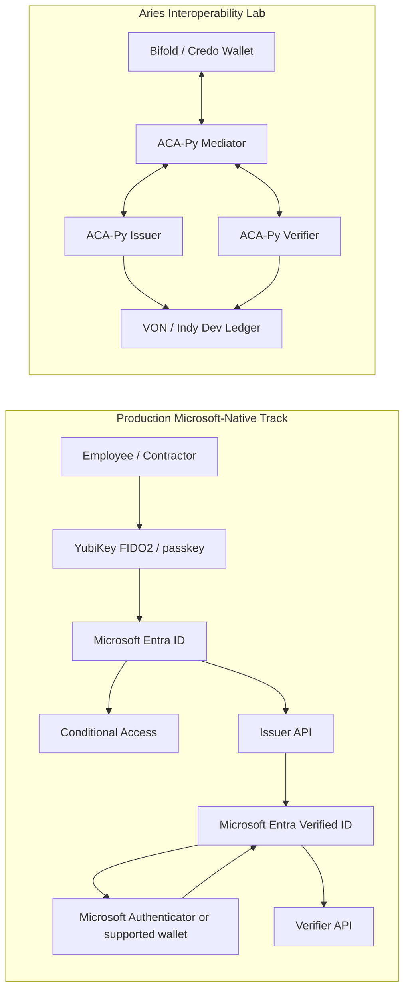

# Vanguard Cloud Services - Aegis ID Architecture

Vanguard Cloud Services - Aegis ID uses a dual-track architecture. The Microsoft-native track is the production path. The Aries track is a lab for protocol and wallet interoperability.

## Track Boundaries

The production path should not depend on ACA-Py, DIDComm, AnonCreds, or VON. The Aries lab can reuse the same credential claim vocabulary, but it remains a separate harness until a wallet/protocol bridge is proven.

## Application Structure

- `src/adapters/microsoft`: Microsoft Entra Verified ID adapter.
- `src/adapters/aries`: Local ACA-Py lab adapter.
- `src/services/credential-policy-service.js`: Shared business policy and claim vocabulary.
- `src/routes/api.js`: Issuer, verifier, callback, and lab status endpoints.
- `aries-lab`: Docker Compose and ACA-Py helper scripts.
- `infra/bicep`: Azure App Service infrastructure baseline.

## Production Path

1. Authenticate users with Microsoft Entra ID and phishing-resistant YubiKey/passkey sign-in.
2. Create an issuance request through the Verified ID Request Service REST API.
3. Render the wallet QR or deep link.
4. Receive callbacks and persist redacted transaction/audit data.
5. Create presentation requests for verifier workflows.
6. Map verified claims to an authorization decision.

## Aries Lab Path

1. Start ACA-Py mediator, issuer, and verifier.
2. Connect a Bifold/Credo-compatible wallet.
3. Publish a schema and credential definition against a development ledger when needed.
4. Issue a test credential.
5. Request and verify an AnonCreds proof.

VON/Indy is development infrastructure only. Do not treat it as a production trust registry.
