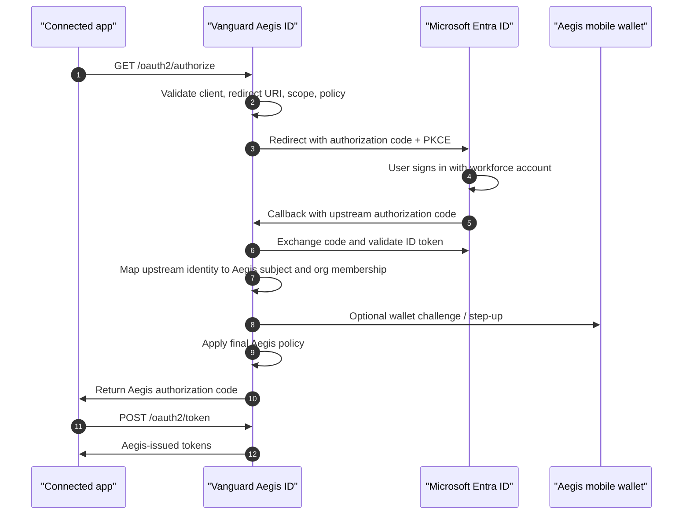

# Entra Upstream OIDC Broker Build Book

Vanguard Aegis ID can act as the OIDC/OAuth authority for connected applications while using Microsoft Entra ID as an upstream workforce identity provider. In this model, the relying application trusts Aegis ID. Aegis ID may then redirect the user to Entra for workforce sign-in, but Aegis remains the final authorization layer.

## Target Flow



## What This Gives You

- Existing M365 users can sign in with their normal Entra credentials.
- Connected apps do not need to trust Entra directly; they trust Aegis ID.
- Aegis can deny access even when Entra authentication succeeds.
- Aegis can add organization membership, roles, claims, wallet challenge evidence, and immutable audit events before issuing tokens.
- Entra remains the workforce authentication source, while Aegis becomes the application authorization and assurance policy point.

## 1. Register the Upstream Entra Application

In the Microsoft Entra admin center:

1. Open **Identity > Applications > App registrations**.
2. Select **New registration**.
3. Name it, for example `Aegis ID upstream broker`.
4. Choose the supported account type for the customer tenant. For enterprise deployments, use a single-tenant registration unless the customer explicitly needs multitenant support.
5. Add a **Web** redirect URI:

```text
https://<aegis-host>/oauth2/upstream/entra/callback
```

Examples:

```text
https://vanguard-aegis-id-65067d.azurewebsites.net/oauth2/upstream/entra/callback
https://vanguard-aegis-id-dev-65067d.azurewebsites.net/oauth2/upstream/entra/callback
https://vanguard-aegis-id-qa-65067d.azurewebsites.net/oauth2/upstream/entra/callback
```

6. Open **Certificates & secrets** and create a client secret.
7. Store the secret in the target environment only. Do not commit it to source control.

Official references:

- [Microsoft identity platform OpenID Connect protocol](https://learn.microsoft.com/en-us/entra/identity-platform/v2-protocols-oidc)
- [Microsoft identity platform OAuth 2.0 authorization code flow](https://learn.microsoft.com/en-us/entra/identity-platform/v2-oauth2-auth-code-flow)
- [Register an application with Microsoft Entra ID](https://learn.microsoft.com/en-us/entra/identity-platform/quickstart-register-app)

## 2. Configure Aegis ID Environment Variables

For the target Aegis environment, set:

```env
CONNECTED_APP_UPSTREAM_IDP_MODE=entra
CONNECTED_APP_UPSTREAM_ENTRA_TENANT_ID=<entra-tenant-id>
CONNECTED_APP_UPSTREAM_ENTRA_CLIENT_ID=<entra-app-client-id>
CONNECTED_APP_UPSTREAM_ENTRA_CLIENT_SECRET=<entra-app-client-secret>
CONNECTED_APP_UPSTREAM_ENTRA_REDIRECT_URI=https://<aegis-host>/oauth2/upstream/entra/callback
CONNECTED_APP_UPSTREAM_ENTRA_SCOPES=openid profile email
CONNECTED_APP_UPSTREAM_ENTRA_ISSUER=https://login.microsoftonline.com/<entra-tenant-id>/v2.0
CONNECTED_APP_UPSTREAM_ENTRA_AUTHORIZATION_ENDPOINT=https://login.microsoftonline.com/<entra-tenant-id>/oauth2/v2.0/authorize
CONNECTED_APP_UPSTREAM_ENTRA_TOKEN_ENDPOINT=https://login.microsoftonline.com/<entra-tenant-id>/oauth2/v2.0/token
CONNECTED_APP_UPSTREAM_ENTRA_JWKS_URI=https://login.microsoftonline.com/<entra-tenant-id>/discovery/v2.0/keys
```

For local development, keep `CONNECTED_APP_UPSTREAM_IDP_MODE=local` unless you are using a public HTTPS tunnel and a matching Entra redirect URI.

## 3. Configure a Connected App

Inside Aegis ID:

1. Sign in as an organization administrator.
2. Open the organization workspace.
3. Open **Connected apps**.
4. Create or edit a connected app.
5. Set at least one redirect URI for the relying party.
6. Enable the `authorization_code` grant.
7. Include the `openid`, `profile`, and `email` scopes.
8. Choose whether the connected app requires a sign-in challenge. If enabled, Aegis will create a wallet challenge after upstream Entra sign-in and before the relying party can redeem the Aegis authorization code.
9. Choose the claims Aegis should release to the relying party.
10. Generate a client secret or import a certificate credential.

The connected app should use:

```text
Discovery:     https://<aegis-host>/oauth2/.well-known/openid-configuration
Authorize:     https://<aegis-host>/oauth2/authorize
Token:         https://<aegis-host>/oauth2/token
JWKS:          https://<aegis-host>/oauth2/jwks
Scopes:        openid profile email
Response type: code
```

## 4. Validate the Flow

Open a browser to:

```text
https://<aegis-host>/oauth2/authorize?client_id=<client-id>&redirect_uri=<registered-callback>&response_type=code&scope=openid%20profile%20email&state=<opaque-state>&nonce=<opaque-nonce>
```

Expected behavior:

1. Aegis validates the connected app request.
2. Aegis redirects to Entra.
3. Entra signs the user in.
4. Entra returns to `/oauth2/upstream/entra/callback`.
5. Aegis logs the upstream sign-in and issues an Aegis authorization code to the relying party.
6. If sign-in assurance is required, the authorization code remains pending until the Aegis wallet challenge is accepted.

Expected log events:

- `oauth.upstream.redirected`
- `oauth.upstream.completed`
- `oauth.authorization_code.issued` or `oauth.authorization_code.pending_challenge`
- `oauth.token.issued`

## Security Notes

- Aegis validates the connected app and redirect URI before redirecting to Entra.
- The upstream request uses PKCE and nonce protection.
- The upstream state is short-lived and stored separately from connected app authorization codes.
- Aegis validates the upstream ID token issuer, audience, nonce, signature, and expiry.
- Entra authenticates the workforce account. Aegis authorizes the relying-party session.
- Production secrets should live in Azure App Service settings backed by Key Vault or another managed secret store.
