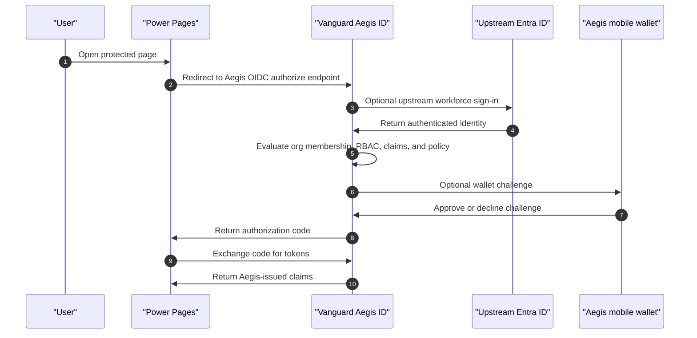

# Power Pages and Aegis ID OIDC Build Book

This build book shows how to connect a Microsoft Power Pages site to Vanguard Aegis ID as the OpenID Connect provider. Power Pages becomes the relying party. Aegis ID becomes the OIDC authority and can optionally federate upstream to Entra ID before applying Aegis organization policy and wallet assurance.

## Target Journey



## 1. Create the Connected App in Aegis ID

1. Sign in to Aegis ID as an organization administrator.
2. Open the target organization workspace.
3. Open **Connected apps**.
4. Select **Create registration**.
5. Use a name such as `Power Pages Portal`.
6. Set the app type to `web`.
7. Add the callback URI from your Power Pages OpenID Connect provider configuration.
8. Enable `authorization_code`.
9. Enable scopes:
   - `openid`
   - `profile`
   - `email`
10. Choose the sign-in challenge policy. For a high-assurance portal demo, use **Wallet approval at sign-in** or **Wallet plus passkey at sign-in**.
11. Choose the claims Power Pages should receive.
12. Generate a client secret and copy it immediately.

Keep this Aegis metadata handy:

```text
Authority / metadata: https://<aegis-host>/oauth2/.well-known/openid-configuration
Client ID:            <connected-app-client-id>
Client secret:        <connected-app-secret>
Redirect URI:         <power-pages-callback-uri>
Scopes:               openid profile email
Response type:        code
```

## 2. Configure Power Pages Authentication

In Power Pages, configure an OpenID Connect provider using the Aegis ID connected app values.

Typical values:

```text
Authority:        https://<aegis-host>/oauth2
Metadata address: https://<aegis-host>/oauth2/.well-known/openid-configuration
Client ID:        <connected-app-client-id>
Client secret:    <connected-app-secret>
Response type:    code
Scope:            openid profile email
```

Use the callback URI Power Pages provides for the site and make sure the same URI exists in the Aegis connected app registration.

Official references:

- [Power Pages authentication overview](https://learn.microsoft.com/en-us/power-pages/security/authentication/configure-site)
- [Configure OpenID Connect provider settings for Power Pages](https://learn.microsoft.com/en-us/power-pages/security/authentication/openid-settings)

## 3. Test the Sign-In

1. Open the Power Pages site in a private browser window.
2. Select the Aegis ID sign-in provider.
3. Confirm the browser redirects to Aegis ID.
4. If upstream federation is enabled, confirm Aegis redirects to Entra ID.
5. Complete sign-in.
6. If the connected app policy requires it, approve the Aegis wallet challenge.
7. Confirm Power Pages receives an authenticated session.

## 4. Troubleshooting

| Symptom | Check |
| --- | --- |
| `invalid_redirect_uri` | The Power Pages callback URI must exactly match an Aegis connected app redirect URI. |
| User signs in to Entra but Power Pages remains unauthenticated | Confirm Aegis returned to the Power Pages callback and Power Pages exchanged the authorization code. |
| Token exchange fails | Confirm the connected app secret is current and the client authentication method matches the app configuration. |
| Token exchange says `authorization_pending` | Aegis has sent a sign-in wallet challenge and is waiting for the user to approve it. Approve the challenge in the Aegis mobile wallet, then retry the token exchange. |
| Missing claims | Add the required claim keys to the Aegis connected app configuration. |
| Wallet challenge never appears | Confirm the connected app policy requires a wallet challenge and the user has an active Aegis credential/wallet subject. |

## Security Notes

- Power Pages should trust Aegis ID, not the upstream provider directly, when Aegis is intended to be the final policy layer.
- Use authorization-code flow. Do not enable implicit flow for new deployments.
- Store connected app secrets in Power Pages site settings or the customer-approved secret store.
- Rotate secrets on a defined schedule.
- Use certificate-backed client authentication when the relying platform supports it.
