# Cloudstrucc Aegis ID

<p align="center">
  
</p>

<p align="center">
  <strong>End-to-End Subscriber, Aries Invitation, Wallet Acceptance, and Challenge Runbook</strong><br>
  Cloudstrucc Inc. | Aegis ID | Microsoft-native production path plus Aries interoperability lab
</p>

<p align="center">
  
  
  
  
</p>

## Purpose

This runbook walks through the full Cloudstrucc Aegis ID lab journey:

- Register through the public web app.
- Land in the subscriber dashboard.
- Start the Aries interoperability lab.
- Generate and send an Out-of-Band wallet invitation.
- Accept the invitation with an Aries-compatible holder.
- Test a wallet challenge over the completed DIDComm connection.

The current Aries lab runs in `--no-ledger` mode by default. That is ideal for proving connectivity, invitations, DIDExchange, trust ping, and basic DIDComm messages. Full credential issuance and presentation proofs require a ledger-backed profile or a separate W3C credential flow.

## Lab Checklist

- [ ] Web app is running locally.
- [ ] Subscriber registration reaches the dashboard.
- [ ] Docker Desktop is running.
- [ ] Aries issuer, verifier, and mediator return healthy status.
- [ ] Invitation URL uses the Mac LAN IP.
- [ ] Wallet or holder stand-in accepts the invitation.
- [ ] Connection state is `active` and RFC 23 state is `completed`.
- [ ] Trust ping or basic message challenge succeeds.

## E2E Flow

```mermaid
flowchart LR
    Visitor["Anonymous user"] --> Landing["Cloudstrucc landing page"]
    Landing --> Subscribe["Subscribe"]
    Subscribe --> Dashboard["Subscriber dashboard"]
    Dashboard --> AriesStatus["Aries lab status check"]
    AriesStatus --> Invite["Create OOB invitation"]
    Invite --> Wallet["Wallet or holder agent"]
    Wallet --> DIDExchange["DIDExchange completed"]
    DIDExchange --> Challenge["Trust ping / wallet challenge"]
    Challenge --> Pass["Pass: active connection"]

    classDef cloud fill:#e0f2fe,stroke:#2563eb,color:#0f172a;
    classDef lab fill:#dcfce7,stroke:#0f766e,color:#052e16;
    classDef check fill:#fef3c7,stroke:#d97706,color:#451a03;
    class Visitor,Landing,Subscribe,Dashboard cloud;
    class AriesStatus,Invite,Wallet,DIDExchange lab;
    class Challenge,Pass check;
```



## What You Are Proving

| Step | Cloudstrucc proof point | Pass condition |
| --- | --- | --- |
| Web registration | Anonymous user can subscribe to Aegis ID | Subscriber dashboard opens |
| Lab health | ACA-Py issuer, verifier, and mediator are reachable | `/api/aries/status` returns `ok: true` for all agents |
| Invite delivery | A Cloudstrucc Aries agent can produce an OOB invitation | `invitation_url` is created and rendered as a QR/link |
| Wallet acceptance | Holder can complete DIDExchange with the Cloudstrucc agent | Connection state is `active` and RFC 23 state is `completed` |
| Wallet challenge | Cloudstrucc can send a DIDComm challenge over the connection | Trust ping/basic message is delivered without admin API errors |

## Prerequisites

- macOS with Docker Desktop running.
- Node.js 20 or newer.
- `jq` installed for JSON filtering.
- This repository cloned locally.
- iPhone on the same Wi-Fi network as the Mac, or a local ACA-Py holder stand-in.
- For a real mobile wallet test, an Aries/DIDComm wallet that supports Out-of-Band invitations and DIDExchange.

> Note: The native iOS starter in `ios/CloudstruccAegisWallet` scans and stores OOB invitations, but it does not complete DIDExchange yet. Use it for Cloudstrucc UX work. Use an Aries-compatible wallet or the holder stand-in below for the protocol challenge.

## 1. Start The Web App

From the repository root:

```bash
npm install
cp .env.example .env
PUBLIC_BASE_URL=http://localhost:3000 npm run dev
```

Open:

```text
http://localhost:3000
```

## 2. Register Through The Web App

1. Open the Cloudstrucc Aegis ID home page.
2. Select the subscription call to action.
3. Enter the subscriber details.
4. Submit the form.
5. Confirm the browser redirects to:

```text
http://localhost:3000/dashboard/<subscription-id>
```

On the dashboard, confirm the platform cards are visible for:

- Microsoft Entra Verified ID / Azure.
- Keycloak.
- Okta.
- Generic OIDC / SAML.

For this Aries lab journey, keep the dashboard open as the subscriber control surface, then use the lab scripts to create the wallet invitation.

## 3. Start The Aries Lab

Use your Mac LAN IP for wallet-reachable endpoints. `localhost` works from the Mac, but it does not work from an iPhone because the phone resolves `localhost` to itself.

```bash
cd /Users/frederickpearson/repos/aegis-id
MAC_IP="$(ipconfig getifaddr en0)"
echo "$MAC_IP"
```

Create or update the Aries lab environment:

```bash
cd aries-lab
cp .env.example .env
```

Edit `aries-lab/.env` so these values use the Mac IP:

```env
MEDIATOR_ENDPOINT=http://<your-mac-lan-ip>:3010
ISSUER_ENDPOINT=http://<your-mac-lan-ip>:4010
VERIFIER_ENDPOINT=http://<your-mac-lan-ip>:5010
```

Start the lab agents:

```bash
docker compose up -d acapy-mediator acapy-issuer acapy-verifier
docker compose ps
```

If the containers were already running before you changed `aries-lab/.env`, recreate them so ACA-Py advertises the new wallet-reachable endpoint:

```bash
docker compose up -d --force-recreate acapy-mediator acapy-issuer acapy-verifier
```

Return to the repository root:

```bash
cd /Users/frederickpearson/repos/aegis-id
```

Check the web app's Aries status endpoint:

```bash
curl -s http://localhost:3000/api/aries/status | jq
```

Expected result:

```json
{
  "track": "aries-interoperability-lab",
  "checks": [
    { "name": "issuer", "baseUrl": "http://localhost:4011", "ok": true, "status": 200 },
    { "name": "verifier", "baseUrl": "http://localhost:5011", "ok": true, "status": 200 },
    { "name": "mediator", "baseUrl": "http://localhost:3011", "ok": true, "status": 200 }
  ]
}
```

## 4. Generate The Cloudstrucc Wallet Invitation

### Web App Path

Open the Architecture page:

```text
http://localhost:3000/architecture
```

Select **Create Issuance Offer**. The response panel renders:

- A **Scan with Cloudstrucc iOS Wallet** QR code that opens the Cloudstrucc iOS app through `cloudstrucc-wallet://` and imports the Aries OOB issuer invitation.
- A **Scan Microsoft Wallet Offer** QR code for the Microsoft/mock Verified ID issuance request.
- The raw JSON response for debugging.

Use the Cloudstrucc iOS wallet starter or iPhone Camera to scan the Cloudstrucc iOS Wallet QR. Use Microsoft Authenticator or the mock wallet page for the Verified ID QR. Microsoft Authenticator will not accept the Aries OOB QR.

### Script Path

Create an issuer invitation:

```bash
./aries-lab/scripts/create-issuer-invitation.sh > /tmp/cloudstrucc-issuer-invite.json
jq -r .invitation_url /tmp/cloudstrucc-issuer-invite.json
```

Create a verifier invitation when you want the wallet to connect directly to the verifier challenge surface:

```bash
./aries-lab/scripts/create-verifier-invitation.sh > /tmp/cloudstrucc-verifier-invite.json
jq -r .invitation_url /tmp/cloudstrucc-verifier-invite.json
```

The URL must contain the Mac LAN IP, not `localhost`. A phone can open:

```text
http://<your-mac-lan-ip>:4010?oob=...
```

A phone cannot open:

```text
http://localhost:4010?oob=...
```

## 5. Send The Invitation To The Wallet

### Option A: Render A QR Code

Generate a QR code from the invitation URL:

```bash
node -e "const fs=require('fs'); const QRCode=require('qrcode'); const invite=JSON.parse(fs.readFileSync('/tmp/cloudstrucc-issuer-invite.json','utf8')); QRCode.toFile('/tmp/cloudstrucc-issuer-invite.png', invite.invitation_url, { width: 900, margin: 2 }).then(()=>console.log('/tmp/cloudstrucc-issuer-invite.png'))"
open /tmp/cloudstrucc-issuer-invite.png
```

Scan the QR code with the Aries-compatible wallet.

### Option B: Send The Link

Copy the invitation URL:

```bash
jq -r .invitation_url /tmp/cloudstrucc-issuer-invite.json | pbcopy
```

Send it to the iPhone by AirDrop, Messages, email, or another secure internal channel.

## 6. Accept The Invitation

### With An Aries-Compatible Mobile Wallet

1. Open the wallet on iPhone.
2. Choose the wallet action for scanning or importing an invitation.
3. Scan the QR code or paste the invitation URL.
4. Accept the Cloudstrucc Aries Issuer invitation.
5. Wait for the connection to become active.

Confirm from the Cloudstrucc issuer admin API:

```bash
curl -s http://localhost:4011/connections | jq '.results[] | {connection_id, state, rfc23_state, their_label}'
```

Pass condition:

```json
{
  "state": "active",
  "rfc23_state": "completed"
}
```

### With The Local Holder Stand-In

Use this when a mobile Aries wallet is not ready yet, or when you want a deterministic protocol test.

```bash
MAC_IP="$(ipconfig getifaddr en0)"

docker rm -f cloudstrucc-aegis-holder >/dev/null 2>&1 || true
docker run -d --name cloudstrucc-aegis-holder \
  -p 6010:6010 -p 6011:6011 \
  ghcr.io/openwallet-foundation/acapy-agent:1.6 \
  start \
  --label "Cloudstrucc iOS Holder Stand-in" \
  --inbound-transport http 0.0.0.0 6010 \
  --outbound-transport http \
  --admin 0.0.0.0 6011 \
  --admin-insecure-mode \
  --endpoint "http://$MAC_IP:6010" \
  --no-ledger \
  --wallet-type askar \
  --wallet-name holder-wallet \
  --wallet-key change-me-holder \
  --auto-provision \
  --auto-accept-invites \
  --auto-accept-requests \
  --auto-ping-connection
```

Decode the OOB invitation and have the holder accept it:

```bash
node -e "const fs=require('fs'); const invite=JSON.parse(fs.readFileSync('/tmp/cloudstrucc-issuer-invite.json','utf8')); const url=new URL(invite.invitation_url); const encoded=url.searchParams.get('oob'); const normalized=encoded.replace(/-/g,'+').replace(/_/g,'/'); console.log(JSON.stringify(JSON.parse(Buffer.from(normalized,'base64').toString('utf8')), null, 2));" > /tmp/cloudstrucc-issuer-oob.json

curl -sS -X POST "http://localhost:6011/out-of-band/receive-invitation?auto_accept=true&use_existing_connection=true" \
  -H "Content-Type: application/json" \
  --data @/tmp/cloudstrucc-issuer-oob.json | jq
```

Check both sides of the connection:

```bash
curl -s http://localhost:6011/connections | jq '.results[] | {side:"holder", connection_id, state, rfc23_state, their_label}'
curl -s http://localhost:4011/connections | jq '.results[] | {side:"issuer", connection_id, state, rfc23_state, their_label}'
```

## 7. Test A Wallet Challenge

For the current no-ledger lab, use a DIDComm trust ping and optional basic message as the wallet challenge. This proves the connection is live and the wallet/holder can receive protocol messages from Cloudstrucc.

Get the latest completed issuer connection:

```bash
ISSUER_CONN_ID="$(curl -s http://localhost:4011/connections | jq -r '.results[] | select(.rfc23_state=="completed") | .connection_id' | tail -n 1)"
echo "$ISSUER_CONN_ID"
```

Send a trust ping:

```bash
curl -sS -X POST "http://localhost:4011/connections/$ISSUER_CONN_ID/send-ping" \
  -H "Content-Type: application/json" \
  -d '{"comment":"Cloudstrucc wallet challenge"}' | jq
```

Send a basic message challenge:

```bash
curl -sS -X POST "http://localhost:4011/connections/$ISSUER_CONN_ID/send-message" \
  -H "Content-Type: application/json" \
  -d '{"content":"Cloudstrucc wallet challenge: confirm DIDComm channel is live."}' | jq
```

If using the local holder stand-in, inspect the holder logs:

```bash
docker logs --tail=80 cloudstrucc-aegis-holder
```

Pass condition:

- The trust ping request returns successfully.
- The connection remains `active`.
- The holder or wallet receives the challenge message.

## 8. Optional Verifier-Side Challenge

To test the verifier as the challenge sender, repeat the invitation acceptance flow with the verifier invitation:

```bash
./aries-lab/scripts/create-verifier-invitation.sh > /tmp/cloudstrucc-verifier-invite.json
```

After the wallet accepts the verifier invitation, get the verifier connection ID:

```bash
VERIFIER_CONN_ID="$(curl -s http://localhost:5011/connections | jq -r '.results[] | select(.rfc23_state=="completed") | .connection_id' | tail -n 1)"
echo "$VERIFIER_CONN_ID"
```

Send the verifier challenge:

```bash
curl -sS -X POST "http://localhost:5011/connections/$VERIFIER_CONN_ID/send-ping" \
  -H "Content-Type: application/json" \
  -d '{"comment":"Cloudstrucc verifier wallet challenge"}' | jq
```

## Issuance vs Presentation

| Term | Meaning in Cloudstrucc Aegis ID |
| --- | --- |
| Issuance | Cloudstrucc creates or offers a credential to a holder wallet. In Microsoft Verified ID, this is the QR/link that lets Microsoft Authenticator receive a credential. In Aries, this becomes an issue-credential protocol after a connection exists. |
| Presentation | A verifier asks the wallet to prove something. In Microsoft Verified ID, this is a presentation request QR/link. In Aries, this becomes a proof request after the holder has a credential and the verifier can evaluate the proof. |
| Wallet challenge | A lightweight DIDComm test that proves the connection is alive. In this runbook, the trust ping/basic message challenge is the current no-ledger proof-of-connection. |

## Credential Proof Next Step

The commands below are intentionally separate because they require a ledger-backed issuer/verifier profile:

```bash
SCHEMA_RESPONSE="$(./aries-lab/scripts/create-schema.sh)"
echo "$SCHEMA_RESPONSE"

./aries-lab/scripts/create-credential-definition.sh "<schema-id>"
./aries-lab/scripts/issue-credential.sh "<connection-id>" "<cred-def-id>" "<issuer-did>" "<schema-id>"
./aries-lab/scripts/request-proof.sh "<connection-id>"
```

Use this phase when Cloudstrucc is ready to test a true credential presentation instead of a connection challenge.

## Troubleshooting

<details>
<summary>The phone opens the QR link, but nothing happens</summary>

Confirm the invitation URL uses your Mac LAN IP. If it contains `localhost`, regenerate the invitation after updating `aries-lab/.env` with `ISSUER_ENDPOINT`, `VERIFIER_ENDPOINT`, and `MEDIATOR_ENDPOINT` set to `http://<your-mac-lan-ip>:<port>`.

</details>

<details>
<summary>`jq: parse error` after running an invitation script</summary>

Run the script from the repository root with a leading `./`:

```bash
cd /Users/frederickpearson/repos/aegis-id
./aries-lab/scripts/create-issuer-invitation.sh | jq
```

If it still fails, run without `jq` and inspect the raw output. A shell error or ACA-Py error page means the command did not return JSON.

</details>

<details>
<summary>`/api/aries/status` shows `ECONNREFUSED`</summary>

Docker Desktop may not be running, or the ACA-Py containers may be stopped.

```bash
cd /Users/frederickpearson/repos/aegis-id/aries-lab
docker compose ps
docker compose up -d acapy-mediator acapy-issuer acapy-verifier
```

</details>

<details>
<summary>The Cloudstrucc iOS starter imports the invite but does not connect</summary>

That is expected today. The starter currently handles scanning, parsing, and local UX storage. DIDComm packing, DIDExchange, holder key management, credential issuance, and proof presentation still need a real Aries engine adapter.

</details>

## Cleanup

Stop the holder stand-in:

```bash
docker rm -f cloudstrucc-aegis-holder
```

Stop the Aries lab:

```bash
cd /Users/frederickpearson/repos/aegis-id/aries-lab
docker compose down
```

## Related Cloudstrucc Docs

- [Operator guide](cloudstrucc-aegis-id-operator-guide.md)
- [Aries lab guide](aries-lab.md)
- [iOS Aries wallet starter](ios-wallet.md)
- [Subscriber onboarding](subscriber-onboarding.md)
- [Architecture](architecture.md)
