# Implementation Plan — Verifiable Evidence Ledger & Hyperledger Indy Network Integration

> **Status:** IN PROGRESS on branch `feature/evidence-ledger-and-indy-profiles` (local only — not deployed to Azure).
> **Implemented so far:** Feature A evidence ledger (hash-chain + local/Key-Vault signer + local-file/Azure-Blob anchor + verify API/CLI), the ledger-profile registry (VON/CANdy/Sovrin), the identity-evidence helpers (§5.F/§5.H event types), config keys (§6), a VON Docker override, and tests. See [`docs/evidence-ledger.md`](../evidence-ledger.md).
> **Scaffolded, not executed:** live VON/CANdy/Sovrin writes, Azure Key Vault signing, Azure immutable-Blob anchoring, Microsoft Graph sign-in ingestion, Postgres issuer wallet (all require external services / onboarding).
> This document describes the *current* architecture, the *gaps*, and the *proposed* changes for four features:
> **(A)** a tamper-evident, cryptographically signed audit/evidence ledger, **(B)** a local VON/Indy
> ledger profile with an end-to-end AnonCreds flow, **(C)** integration to **CANdy-prod**, and
> **(D)** integration to **Sovrin MainNet**.
>
> Please review Sections 1–3 first (context, gaps, feature summary), then the detailed design in Sections 4–7.
> Open decisions I need from you are collected in **Section 11**.

---

## Executive summary — what will be implemented

Assuming you accept the two recommendations below, this revision commits Aegis to a **broker-centric identity architecture** with a **cryptographically verifiable evidence ledger** and **pluggable Indy trust registries** — while keeping the Microsoft-native `did:web` path as the default. In one line: *fast passkey sign-in for everyday access, risk-based wallet approvals for high-value actions, a tamper-evident ledger recording all of it, and did:indy networks added only where a partner mandates them.*

**Accepted recommendations (this revision)**
- **R1 — DID method strategy (§5.E):** keep **did:web** for Entra/Verified ID; add **did:indy** for the Aries/Indy track. Same entity, two DIDs, no lock-in.
- **R2 — Entra ID direct federation + passkeys, Aegis as broker (§5.G, worked example §5.H):** federate to Entra ID, enforce central RBAC, broker downstream apps; **passkey = everyday sign-in**, **wallet = risk-based step-up** (signatures, Protected B encrypt/decrypt, approvals).

**Ledger & platform work (independent of R1/R2)**
- **Feature A — tamper-evident evidence ledger (§5.A):** hash-chain + Azure Key Vault signing + WORM anchoring + independent verify API/CLI.
- **Feature B — local VON/Indy + AnonCreds end-to-end (§5.B):** genesis wiring, issuer DID, tails server, schema→cred-def→issue→prove→revoke.
- **Features C & D — CANdy-prod & Sovrin MainNet (§5.C/§5.D):** via a **ledger-profile registry**, incl. **TAA acceptance (§5.F)** and endorser onboarding.
- **Cross-cutting:** ledger-profile/network registry, Postgres-backed issuer wallet, and the new config keys in §6.

**Before → After**

| Capability | Before (today) | After (this plan) |
|---|---|---|
| Everyday sign-in | Password + ad-hoc MFA | **Passkey/YubiKey passwordless** (one gesture) |
| High-value actions | No explicit signed approval | **Wallet step-up**, signed to the ledger |
| Evidence log | Append-only JSON, not tamper-evident | **Hash-chained + signed + WORM-anchored + verifiable** |
| DID methods | did:web only | **did:web (Entra) + did:indy (Indy)** |
| Indy ledger | Lab only, `--no-ledger` | **VON (dev) + CANdy-prod + Sovrin MainNet** via profile registry |
| Persistence (prod) | Flat JSON files | Files + **Postgres** (issuer wallet / chain sequence) |

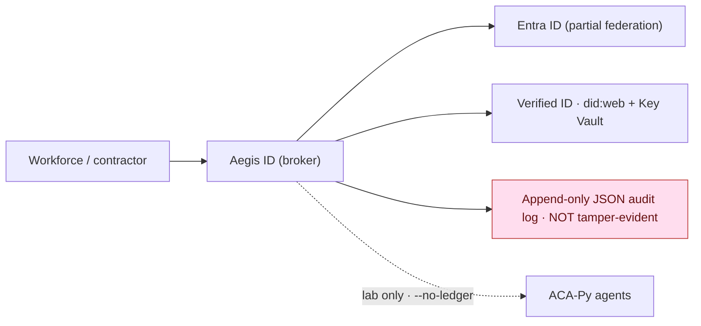

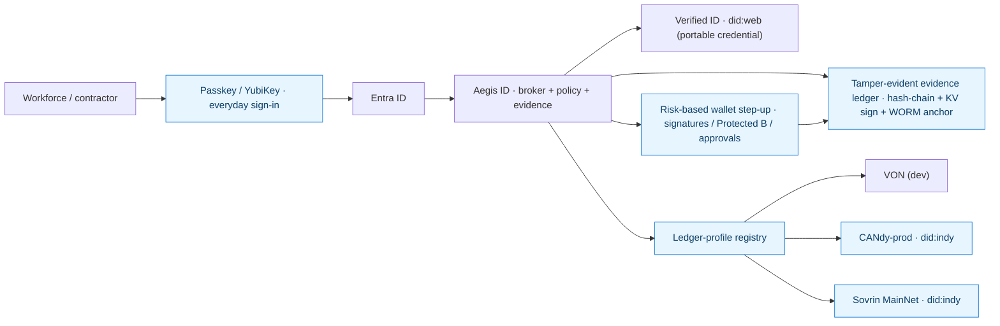

---

## 0. How to read this document

| Section | What it covers |
|---|---|
| 1 | **As-is** architecture — dev and prod, the two identity tracks, and what "the ledger" actually is today |
| 2 | **Gap analysis** — what is missing and the risk of leaving it |
| 3 | **Feature summary** — the four features in plain language + the unifying "ledger profile" concept |
| 4 | **To-be** architecture — dev and prod target diagrams |
| 5 | **Detailed design** per feature (data models, algorithms, sequence diagrams, config) |
| 5.E | **DID method strategy** — did:web (Entra) + did:indy (Indy), how they coexist *(NEW)* |
| 5.F | **TAA acceptance in production** — the full Transaction Author Agreement flow *(NEW)* |
| 5.G | **Entra ID direct federation + passkeys** — Aegis as broker (alternative to Verified ID) *(NEW)* |
| 5.H | **Worked example** — federal workforce onboarding, streamlined sign-in, risk-based step-up *(NEW)* |
| 6 | Configuration & secrets matrix |
| 7 | Testing strategy |
| 8 | Security, compliance & data-sovereignty analysis |
| 9 | Production ledger comparison — did:web vs CANdy vs Sovrin |
| 10 | Phased rollout & sequencing |
| 11 | Open decisions I need from you |
| 12 | Reference links |
| Appendix A | **Regulations, statutes & certifications** to seek *(NEW)* |

---

## 1. Current architecture (as-is)

Aegis ID runs a **dual-track identity architecture** (this is already documented in [`docs/architecture.md`](../architecture.md)):

- **Microsoft-native track = the production path.** Entra Verified ID + `did:web` anchored on your own domain, signing keys in Azure Key Vault.
- **Aries track = an interoperability lab.** ACA-Py agents (issuer / verifier / mediator) over DIDComm, used to prove wallet + AnonCreds interoperability. Runs `--no-ledger` by default.

Both tracks are reached through a clean **adapter seam** in `src/adapters/`:

- `src/adapters/microsoft/verified-id-adapter.js`
- `src/adapters/aries/aries-lab-adapter.js`

This seam is important: it is where the new ledger-network selection logic will live, so the rest of the app does not change.

### 1.1 Dev / local topology (today)

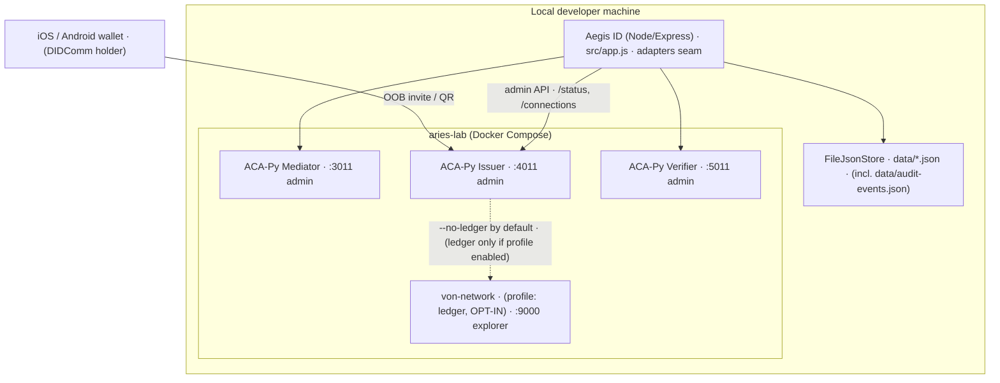

**Key facts about today's dev setup**
- ACA-Py starts with `--no-ledger` ([`aries-lab/docker-compose.yml`](../../aries-lab/docker-compose.yml)), so connections/DIDComm work but **schemas and credential definitions cannot be published** (they require a ledger).
- `von-network` exists in the compose file but is gated behind the `ledger` **profile**, so it does not start unless explicitly requested — and nothing wires the ACA-Py issuer to it yet (no genesis file passed).
- The AnonCreds helper scripts ([`aries-lab/scripts/create-schema.sh`](../../aries-lab/scripts/create-schema.sh) etc.) call the issuer admin API but will fail without a ledger-backed profile.

### 1.2 Production topology on Azure (today)

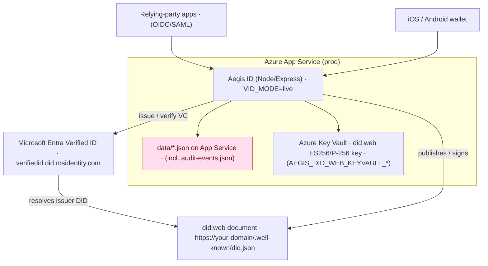

**Key facts about today's production setup**
- The production trust root is **`did:web` + Azure Key Vault** — there is *no* Indy/VON ledger in production. The Aries lab is not deployed to Azure.
- Persistence is **flat JSON files** in every environment, including prod (`FileJsonStore`). This is highlighted in pink above because it is the main durability/immutability weakness we are addressing in Feature A.

### 1.3 What "the ledger" actually is today

The product overview promises an *"immutable evidence ledger"* where *"each block carries the fingerprint of the one before it."* The **current implementation** ([`src/services/audit-service.js`](../../src/services/audit-service.js)) is:

- An **append-only JSON array** at `data/audit-events.json`.
- Each event: `{ id (uuid), type, data (secret-redacted), createdAt }`.
- **No `prevHash`, no per-record hash, no signature, no Merkle root, no external anchoring.**

So it is *append-only by convention* but **not cryptographically tamper-evident**. There is plenty of SHA-256 elsewhere (ID/face evidence hashes, secret hashes, `did:web` signing), but the audit log itself is not chained or signed. **Feature A closes exactly this gap** so the overview's claim becomes literally true and demonstrable.

---

## 2. Gap analysis — what is missing and why

| Capability | Today | Gap | Risk if left as-is |
|---|---|---|---|
| Evidence integrity | Append-only JSON | No hash-chain, no signature, no anchoring | A privileged actor (or a bug) can silently edit/delete history; the "immutable" claim is not defensible in an audit or to a client |
| Non-repudiation | None on the audit log | Events are not signed | Cannot prove *who* recorded an event or that it wasn't altered after the fact |
| Independent verifiability | None | No verification tool/endpoint | An auditor cannot check the chain themselves |
| AnonCreds issuance (lab) | Blocked (`--no-ledger`) | No genesis wiring, no issuer DID on-ledger | Cannot demo end-to-end verifiable-credential issuance/proof with revocation |
| Production trust registry (Indy) | Not present | No CANdy / Sovrin integration, no endorser DID, no TAA handling, no tails server | Cannot serve clients who mandate Hyperledger AnonCreds on a real network (e.g., Canadian public sector on CANdy) |
| Ledger-network portability | VON hardcoded/implicit | No abstraction to select network | Adding CANdy/Sovrin later would mean scattered, hardcoded changes |
| Wallet storage (prod issuer) | SQLite (askar default) | Not production-grade for a writing issuer | Concurrency/HA limits for a real issuer agent |
| Revocation | Not exercised | No tails file host | Cannot issue revocable credentials |

---

## 3. Feature summary (plain language)

### The unifying idea: a **Ledger Profile / Network Registry**

Rather than bolt each network on separately, we introduce **one abstraction** — a *ledger profile* — chosen by configuration. A profile bundles everything ACA-Py and the app need to talk to a specific Indy network:

```
ledger profile = {
  id:            "von-local" | "candy-test" | "candy-prod" | "sovrin-staging" | "sovrin-main" | "none"
  genesisSource: URL or file path to the network's genesis transactions
  writable:      true|false        # verifiers read-only; only the issuer writes
  taaRequired:   true|false        # Sovrin/CANdy require Transaction Author Agreement
  endorserDid:   "did:indy:..."     # who is allowed to write, if not us directly
  tailsServer:   URL                # for revocation registries
  jurisdiction:  "local" | "CA" | "global"
}
```

This makes B, C, and D the *same feature* pointed at different networks, and keeps `did:web` (the Microsoft-native path) untouched and default.

### Feature A — Tamper-evident evidence ledger
Turn `audit-service.js` into a **hash-chained, digitally signed, externally anchored** ledger:
1. **Hash-chain** every event to its predecessor (edit one → all later hashes break).
2. **Sign** the chain head with an Azure Key Vault key (non-repudiation).
3. **Anchor** the signed head to write-once storage (Azure immutable Blob / WORM), so nobody can rewrite *and* re-sign the whole chain unnoticed.
4. Provide a **verification API + CLI** so anyone can independently check integrity.

### Feature B — Local VON/Indy ledger + AnonCreds E2E
Wire the ACA-Py **issuer** to the local `von-network` genesis, register an issuer DID, and make the schema → cred-def → issue → proof → revoke flow work end-to-end for demos and tests.

### Feature C — CANdy-prod integration
Add a **CANdy** ledger profile (test first, then prod). CANdy is the Canadian public-sector Indy network — the natural production trust registry for federal/provincial use cases. Requires a DID with write permission (endorser) and TAA acceptance.

### Feature D — Sovrin MainNet integration
Add a **Sovrin** ledger profile (StagingNet first, then MainNet) for international/global interoperability. Requires TAA acceptance and an endorser relationship.

---

## 4. Target architecture (to-be)

### 4.1 Dev / local (to-be)

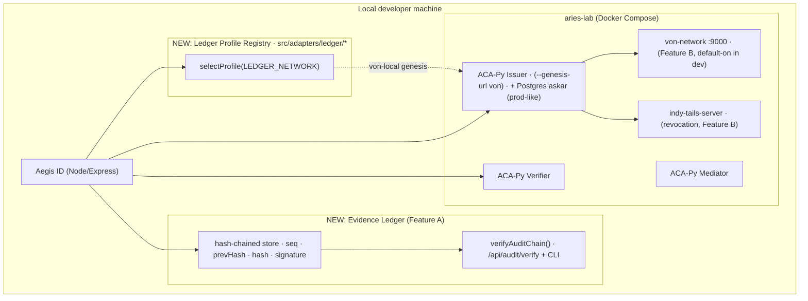

### 4.2 Production (to-be)

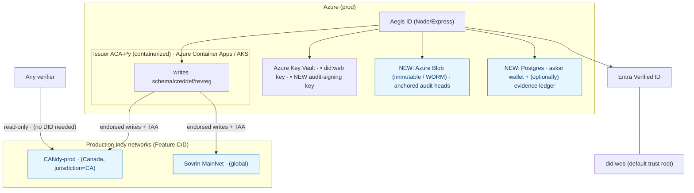

Note the important asymmetry: **verifiers only read** the ledger (no DID, no write, no TAA); **only the issuer writes**. So the production ledger work is concentrated in the issuer agent, not the whole platform.

---

## 5. Detailed design

### 5.A Feature A — Tamper-evident evidence ledger

#### 5.A.1 New record shape

Each event grows from `{id,type,data,createdAt}` to:

```jsonc
{
  "seq": 42,                       // monotonic, gap-free
  "id": "uuid",
  "type": "wallet.challenge.approved",
  "createdAt": "2026-07-30T14:37:02.101Z",
  "data": { /* secret-redacted, unchanged from today */ },
  "payloadHash": "sha256-b64(canonicalJson(core))",
  "prevHash": "sha256-b64 of record 41's hash (or 000… for seq 0)",
  "hash": "sha256-b64( seq || prevHash || payloadHash )",
  "sig": {                          // present on signed records / heads
    "alg": "ES256",
    "keyId": "https://kv.../keys/aegis-audit-signing/<ver>",
    "value": "base64url signature over `hash`"
  },
  "anchor": {                       // present once anchored
    "target": "azure-blob-immutable",
    "ref": "audit-heads/2026-07-30T00:00:00Z.json",
    "at": "2026-07-31T00:05:00Z"
  }
}
```

#### 5.A.2 Chain + signing + anchoring algorithm

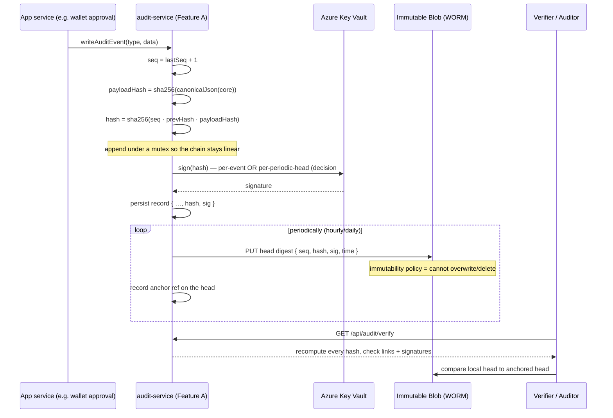

**Why each layer matters**
- **Hash-chain** → makes any *edit/deletion* mathematically detectable within the file.
- **Signature** → proves the head was produced by a key only Aegis controls (non-repudiation); stops an attacker who edits *and* recomputes all hashes, because they cannot forge the signature.
- **Anchoring to WORM** → stops an attacker who *also* steals the signing key and rewrites+resigns the entire chain, because the older head is preserved in write-once storage they cannot alter.
- **Independent verification** → lets an auditor confirm all of the above without trusting us.

This is the standard "hash-chain + notarization" pattern used by transparency logs (e.g., Certificate Transparency, RFC 6962) — see references.

#### 5.A.3 New surface area (proposed)
- `src/services/audit-service.js` — extend `writeAuditEvent` (chain + sign), add `verifyAuditChain()`, keep the public API backward-compatible.
- `src/services/audit-anchor.js` (new) — periodic head export to Azure Blob (immutability policy).
- `src/adapters/azure/keyvault-signer.js` (new or reuse the `did:web` signer) — Key Vault sign/verify.
- `GET /api/audit/verify` (RBAC-protected, admin only) — returns `{ ok, checkedCount, brokenAtSeq }`.
- `scripts/verify-audit-chain.js` — offline verifier for CI and auditors.
- Config: `AUDIT_SIGNING_ENABLED`, `AUDIT_SIGNING_KEYVAULT_KEY_ID`, `AUDIT_ANCHOR_MODE` (`none|azure-blob`), `AUDIT_ANCHOR_CONTAINER`, `AUDIT_ANCHOR_INTERVAL`.

#### 5.A.4 Migration & honesty note
Existing unchained events are imported in `createdAt` order and chained from `seq 0`, flagged `migrated:true`. **Events created before migration cannot be retroactively proven** to be unaltered — only integrity *from the migration head forward* is guaranteed. We will document this explicitly rather than imply retroactive proof.

#### 5.A.5 Concurrency constraint
The chain is linear, so appends must be **serialized**. On a single App Service instance a process-level mutex is enough. **If prod scales to multiple instances**, the chain needs a shared sequence source (Postgres sequence / advisory lock) — this is Decision #5 and the reason Postgres appears in the to-be prod diagram.

---

### 5.B Feature B — Local VON/Indy + AnonCreds E2E

#### 5.B.1 Compose & agent changes
- Turn on `von-network` by default in dev (or a documented one-liner) and expose the genesis at `http://von-network:9000/genesis`.
- Start the **issuer** with a ledger profile instead of `--no-ledger`:
  ```
  --genesis-url http://von-network:9000/genesis
  --wallet-type askar
  --seed <deterministic-dev-seed>        # dev only, creates a stable DID
  --tails-server-base-url http://tails:6543
  ```
- Register the issuer DID on VON automatically (VON's `/register` endpoint) during lab bootstrap.
- Add `indy-tails-server` service for revocation-registry tails files.

#### 5.B.2 End-to-end flow to make green

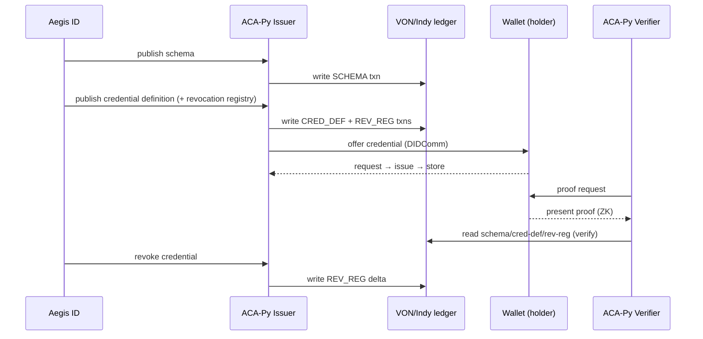

Success criteria: the schema/cred-def appear in the VON explorer (`:9000`), a proof verifies, and a revoked credential fails verification.

---

### 5.C / 5.D Features C & D — CANdy-prod and Sovrin MainNet

C and D reuse the **same ledger-profile mechanism** as B; only the profile contents differ. The extra work versus a local VON ledger is entirely about **being allowed to write to a real network**:

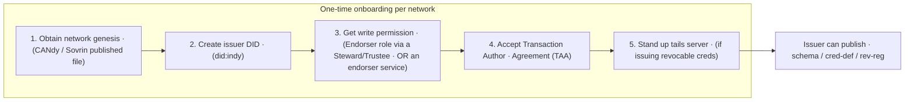

**Sequencing safeguards**: each network is added **test-net first** (CANdy-test, Sovrin StagingNet) to validate the full flow before touching production. ACA-Py can also run **multi-ledger** (a `ledgers.yml` listing several networks with one marked default), so verifiers can *read* multiple networks while the issuer *writes* to the chosen one.

**Per-network specifics to handle in the profile + issuer config**
- **Genesis source** — CANdy and Sovrin each publish genesis transaction files; the profile stores the URL/pin.
- **TAA acceptance** — ACA-Py `--taa-accept` / accept-and-cache flow; must record the accepted version + mechanism (compliance evidence — good candidate for an *audit event* via Feature A).
- **Endorser** — either our DID is granted `ENDORSER` role by a network Steward, or we use ACA-Py's endorser protocol where a Steward co-signs our writes.
- **Wallet storage** — the production issuer should use **Postgres-backed askar**, not SQLite.
- **did:indy** — use the modern `did:indy` method rather than legacy unqualified DIDs.

See **Section 9** for the decision matrix on *which* production ledger to lead with.

---

### 5.E DID method strategy — did:web and did:indy (implementation)

**Principle: one DID method per track, and the *same legal entity* holds both.** There is no single DID method that is optimal for both the Microsoft-native ecosystem and the Hyperledger/AnonCreds ecosystem — they are different credential formats. Aegis therefore represents "Vanguard/the issuer" with **two DIDs**, chosen by track, and never tries to force one method to do both jobs.

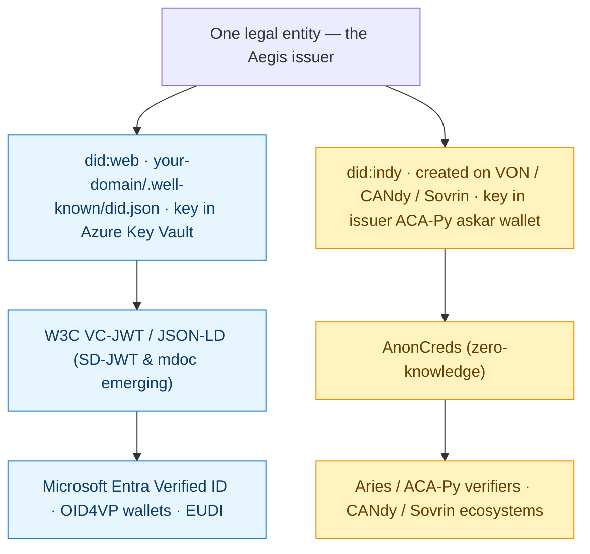

**Why did:web stays for the Entra track (confirmed):** Entra Verified ID moved off `did:ion` and its supported method is **did:web**. It does **not** support did:indy. So did:web is the correct, already-implemented choice for the Microsoft-native production path ([`src/services/did-web-service.js`](../../src/services/did-web-service.js), keys in Key Vault). We keep it as the **default trust root** and change nothing about it.

> ⚠️ Confirm against current Microsoft docs before finalizing — Verified ID's supported DID methods/credential formats evolve (did:web today; SD-JWT VC / ISO mdoc support is expanding).

**Capability → method map**

| Capability | DID method | Why |
|---|---|---|
| Entra Verified ID issuance/verification | **did:web** | Only method Verified ID supports |
| OID4VP / EUDI / SD-JWT VC interop | **did:web** | Broadest modern-wallet interop |
| AnonCreds on VON (lab) | **did:indy** | AnonCreds needs an on-ledger issuer DID |
| AnonCreds on CANdy / Sovrin (prod) | **did:indy** | Same, on a real network |
| did:web AnonCreds *(future/optional)* | **did:web** | Emerging path to do AnonCreds without Indy |

**Implementation deltas (small — the seam already exists):**
- **did:web** — no change; already produced/signed by [`did-web-service.js`](../../src/services/did-web-service.js) with a Key Vault key.
- **did:indy** — created inside the **issuer ACA-Py wallet** when a ledger profile is active: ACA-Py generates the key, writes the `NYM` (DID) transaction to the selected network (directly if we hold `ENDORSER`, or via the endorser protocol otherwise), and exposes it as `did:indy:<namespace>:<id>`. The **ledger-profile registry** (Section 3) supplies the network namespace + genesis.
- **Resolution** — verifiers resolve **did:web over HTTPS** and **did:indy via the ledger** (ACA-Py multi-ledger can read several Indy networks at once). No PII is ever in either DID document.
- **New config:** `AEGIS_ISSUER_DID_METHOD` per track (`web` default for the Entra path; `indy` on the Aries path), `AEGIS_INDY_DID_NAMESPACE` (e.g. `candy:prod`, `sovrin`).

**Interop direction:** the industry is converging on **OpenID4VCI/OpenID4VP + SD-JWT VC + ISO mdoc**, all of which pair naturally with **did:web**. If forced to standardize on one method for maximum reach, did:web wins; did:indy is reserved for partners that specifically mandate an Indy network. We will keep the two-DID design so we can serve both without lock-in.

---

### 5.F TAA acceptance in production (implementation)

The **Transaction Author Agreement (TAA)** is the legal-plus-technical gate that Sovrin and CANdy put in front of anyone who **writes** to the ledger. Its text and version live *on the ledger*, alongside an **AML (Acceptance Mechanism List)** of approved ways to accept. Every write must attach `{ taaDigest, mechanism, acceptanceTime }`, and the nodes reject writes whose digest doesn't match a currently-active TAA version. **Only the issuer (a writer) needs it; verifiers never do.**

**Production acceptance flow we will implement:**

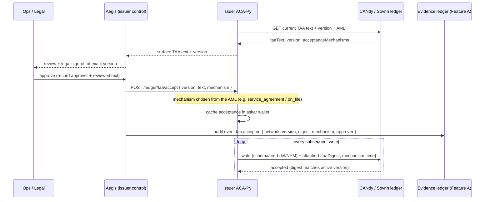

**Key production handling details:**
- **Governance/legal sign-off is a gated step**, not an automated click. Accepting a TAA binds Vanguard to that network's governance framework (e.g. the Sovrin Governance Framework). We store the exact reviewed text + version + approver.
- **Acceptance is recorded as a Feature-A audit event** (`taa.accepted`) — signed and anchored — so you have non-repudiable compliance evidence of *what* you accepted, *when*, and *by whom*.
- **Mechanism** is chosen from the ledger's AML (commonly `service_agreement` / `on_file` for an organizational service; `click_agreement` for interactive).
- **Version drift**: a network can publish a new TAA version; the ledger then rejects writes stamped with the old digest. We add a **preflight check** (compare cached acceptance vs current on-ledger version) and re-run the review→accept flow when it changes. This check runs before any issuance batch and on a schedule.
- **New config:** `LEDGER_TAA_ACCEPT` (`latest` or a pinned version), `LEDGER_TAA_MECHANISM`, `LEDGER_TAA_TEXT_SHA256` (pin the reviewed text so an unexpected change is caught, not blindly accepted).
- **Scope reminder:** this is per **writing network** and only for the **issuer** agent. Reading/verifying CANdy or Sovrin needs no TAA.

---

### 5.G Entra ID direct federation + passkeys — Aegis as broker (alternative to Verified ID)

This is the **pragmatic production path** for the federal-contractor scenario in the brief, and it uses capabilities Aegis **already has**. It does **not** require Verified ID, DIDs, a ledger, or even the wallet for the basic flow — those layer on only where they add unique value.

#### The idea: Aegis is the broker in the middle

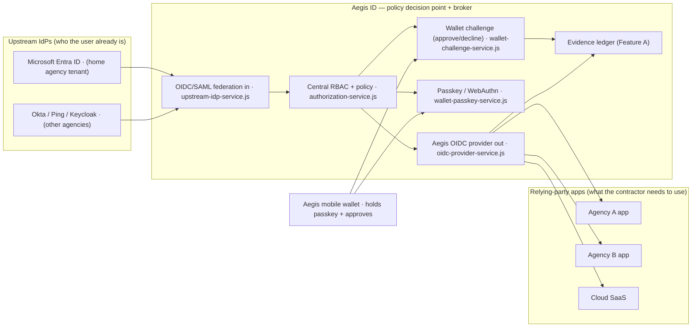

**What each Aegis piece does (all already in the codebase):**
- **Federation IN** — [`upstream-idp-service.js`](../../src/services/upstream-idp-service.js) runs the OIDC auth-code flow to Entra ID (`/oauth2/upstream/entra/authorize` → `…/callback`), verifies the `id_token`, and maps upstream claims to an Aegis subject (`entra:<tenant>:<sub>`) with an assurance marker (`acr = urn:vanguard:aegis-id:auth:upstream-entra`).
- **Central policy** — [`authorization-service.js`](../../src/services/authorization-service.js) applies RBAC/policy (deny-by-default) so *Aegis*, not each app, decides what the contractor may do.
- **Aegis OIDC provider OUT** — [`oidc-provider-service.js`](../../src/services/oidc-provider-service.js) issues Aegis authorization codes + tokens to the relying-party apps, auditing `oidc-provider.authorization.issued` / `token.redeemed`.
- **Passkeys** — [`wallet-passkey-service.js`](../../src/services/wallet-passkey-service.js) (SimpleWebAuthn) registers and verifies FIDO2 credentials bound to Aegis as the relying party (`rpId`/`origin` from config). Phishing-resistant, passwordless.
- **Wallet challenge** — [`wallet-challenge-service.js`](../../src/services/wallet-challenge-service.js) drives approve/decline for sensitive actions, written to the evidence ledger.

#### Federal-contractor journey (SSO via Entra, brokered by Aegis)

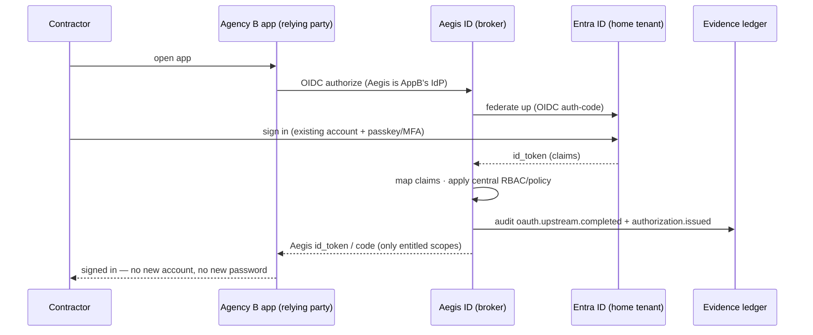

The contractor uses the identity they **already have** at their home agency; Aegis brokers it to Agency B's app, applies **its own central policy**, and issues an Aegis session. No duplicate account, no new password — exactly the "identity sprawl" fix in the brief. When the engagement ends, revoking the contractor centrally in Aegis closes access to *every* downstream app at once.

#### Where the wallet + passkey fit (high-assurance step-up)

Your mobile wallet supporting passkeys is the key. The **wallet is a FIDO2 authenticator**: it holds a passkey in the device secure enclave, registered to **Aegis as the WebAuthn relying party** (`rpId`/`origin` from `PASSKEY_RP_ID` / `PASSKEY_ORIGIN`). That single passkey serves two jobs:

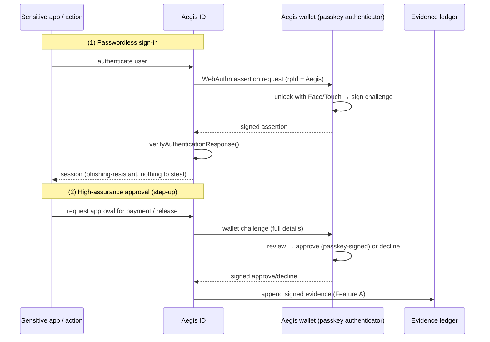

- **(1)** The passkey replaces the password for sign-in — phishing-resistant, biometric-gated, nothing to steal.
- **(2)** The **same wallet + passkey** signs *approvals* for sensitive actions; the approve/decline is written to the tamper-evident evidence ledger (Feature A) as non-repudiable proof of *what the person authorized*.

So the wallet is the common human touchpoint across all three rails: it authenticates (passkey), it approves (wallet challenge → evidence ledger), and — when needed — it can also **hold Verified ID / AnonCreds credentials**.

#### How the three rails coexist (and when to use each)

| Rail | Aegis role | Use it for | Needs |
|---|---|---|---|
| **Entra ID direct (OIDC/SAML) + passkeys** | Federate up, broker down, enforce policy, passkey step-up | The **bulk** of workforce/contractor SSO & authZ | Nothing new — already wired |
| **Verified ID (did:web)** | Issue/verify portable credential | Genuinely **portable cross-agency** proof where parties don't share an IdP | did:web + Key Vault (have it) |
| **Indy / AnonCreds (did:indy)** | Issue/verify ZK credential on a network | Only when a **partner ecosystem mandates** Hyperledger | CANdy/Sovrin + endorser + TAA |

**Why this is the recommended production stack:** it delivers the widest reach with the least operational burden. The everyday case (contractor logs into agency apps) rides **existing Entra + passkeys** with zero ledger/wallet dependency; **Verified ID** is added only for the portable cross-agency credential where it uniquely helps; **Indy** is added only under a partner mandate. Aegis's differentiated value is being the **single broker and policy decision point** that speaks all three — with the wallet as the shared, high-assurance human touchpoint and the evidence ledger recording every decision.

> These new capabilities extend the config matrix in Section 6 (`AEGIS_ISSUER_DID_METHOD`, `AEGIS_INDY_DID_NAMESPACE`, `LEDGER_TAA_*`). The Entra-direct + passkey path uses the **existing** `CONNECTED_APP_UPSTREAM_ENTRA_*` and `PASSKEY_RP_*` settings — no new ledger dependency.

---

### 5.H Worked example — federal workforce onboarding & streamlined sign-in

A federal client runs **AD/Entra ID** as its directory. Aegis **federates** to Entra (no Verified ID required) and acts as the broker, policy decision point, and evidence ledger. This section makes §5.G concrete: onboarding, everyday sign-in, and where the wallet actually earns its place.

#### 5.H.1 Onboarding (identity proofing + authenticator issuance are separate concerns)

```mermaid
sequenceDiagram
  participant Off as Onboarding officer
  participant Entra as Entra ID / AD
  participant Aegis as Aegis ID
  participant Emp as New employee (phone)
  participant AL as Evidence ledger (Feature A)

  Off->>Entra: create account + assign groups/roles
  Note over Off,Emp: identity proofing (in person OR verification service)
  Off->>Aegis: submit proofed ID + face (liveness/photo match)
  Aegis->>AL: identity.proofed { officer, method, idImageHash, faceImageHash }
  Off->>Entra: register YubiKey / device passkey (passwordless credential)
  Off->>Aegis: trigger wallet enrolment invite (QR + aegisid:// deep link)
  Aegis-->>Emp: invite (QR / link)
  Emp->>Emp: install Aegis wallet → register passkey (WebAuthn) / accept credential
  Note over Off,Emp: supervised — officer confirms it is the right person's device
  Emp-->>Aegis: enrolment complete (passkey public key, wallet binding)
  Aegis->>AL: authenticator.bound + wallet.enrolled { subject, credentialId(public), aaguid, type }
```

The output is a durable, ledger-recorded chain: **proofed identity ↔ authenticator (passkey/YubiKey) ↔ wallet**. Private keys never leave the device/YubiKey — only the **public** credential ID is recorded.

#### 5.H.2 Streamlined sign-in with risk-based step-up

The everyday login is **one passkey gesture** — the wallet is *not* in the routine path. Aegis (or Entra Conditional Access) only escalates to a wallet approval when risk warrants it.

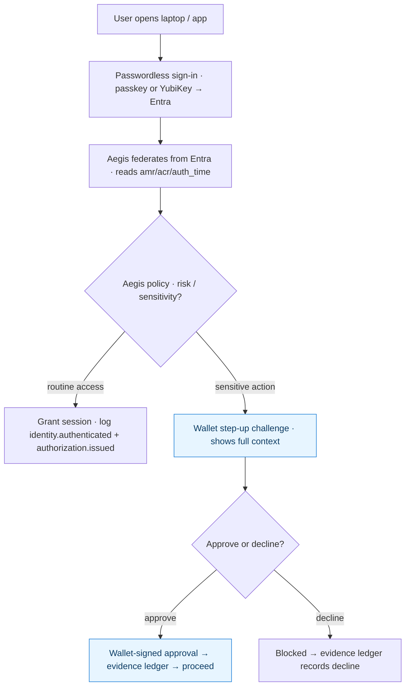

**Result:** normal work = a single tap; only high-risk actions add the wallet approval. Never three steps for routine login.

#### 5.H.3 When the wallet step-up *is* justified — risk use cases

Reserve the explicit, signed wallet approval for actions where a **non-repudiable record of a specific human decision** matters more than login speed:

| Risk scenario | Why the wallet (not just a passkey tap) |
|---|---|
| **Applying a digital signature** to a document, contract, or record | Produces a signed, contextual "I signed *this*" record on the ledger |
| **Decrypting / encrypting a Protected B (or higher) document or email** | Wallet approval gates the key operation (Aegis brokers a Key Vault sign/decrypt only after approval); both approval and key-op are logged |
| **Financial transaction / payment / fund transfer** | Explicit approval of amount + payee, non-repudiable |
| **Releasing or exporting sensitive/classified data** | Human authorization of a specific export, with evidence |
| **Privileged/admin actions** (grant role, change policy, add issuer, revoke credential) | High-blast-radius operations need signed accountability |
| **Break-glass / emergency access** | Deliberate, recorded, reviewable |
| **Consent to disclose PII / share a credential** with a third party | Records informed, specific consent |
| **New device / unusual location / elevated risk sign-in** | Adaptive step-up before trusting the session |

The common thread: the passkey answers *"is this the right person?"*; the wallet answers *"did this person knowingly approve **this specific** thing?"* — and writes that answer to the tamper-evident ledger.

#### 5.H.4 Implementation — logging authentication & authorization via federation

This expands the §5.G note that *"Aegis logs the auth/authz events to the evidence ledger even though the wallet wasn't the authenticator."* Because the passkey ceremony happens against **Entra** (Entra is the WebAuthn relying party for OS/Entra login), Aegis is not in the FIDO2 exchange — it learns about the authentication through **federation** and (optionally) **Entra sign-in logs**. Three complementary mechanisms:

1. **Onboarding binding events (durable trust anchors).** At enrolment Aegis writes, to the Feature-A ledger:
   - `identity.proofed { subject, officer, method, idImageHash, faceImageHash }`
   - `authenticator.bound { subject, credentialId (public), aaguid, type: yubikey|platform, boundBy, at }`
   - `wallet.enrolled { subject, walletId, at }`
   These permanently link the proofed identity to the authenticator(s) and wallet.

2. **Claims-based login evidence (lightweight, ~90% already wired).** On each federated sign-in, [`upstream-idp-service.js`](../../src/services/upstream-idp-service.js) already receives the Entra `id_token`. We read `amr` (methods, e.g. `["fido"]`), `acr`/AAL, `auth_time`, `tid`, `sub`, and write `identity.authenticated { subject, amr, acr, authTime, tenant }` — then, when Aegis issues the downstream token, the existing `oidc-provider.authorization.issued` / `token.redeemed` events capture the **authorization**. Correlation key across all events: the Aegis subject **`entra:<tenant>:<sub>`**.

3. **Graph sign-in-log ingestion (authoritative, optional).** For audit-grade detail Entra doesn't put in the token — exact authenticator used, Conditional Access policy applied, device compliance, sign-in risk — a scheduled/near-real-time pull from **Microsoft Graph `auditLogs/signIns`** enriches the ledger. Requires an Entra app registration with `AuditLog.Read.All`. This makes the evidence ledger a faithful, independently anchored mirror of *how* each session was authenticated, even though the credential lives in Entra/YubiKey.

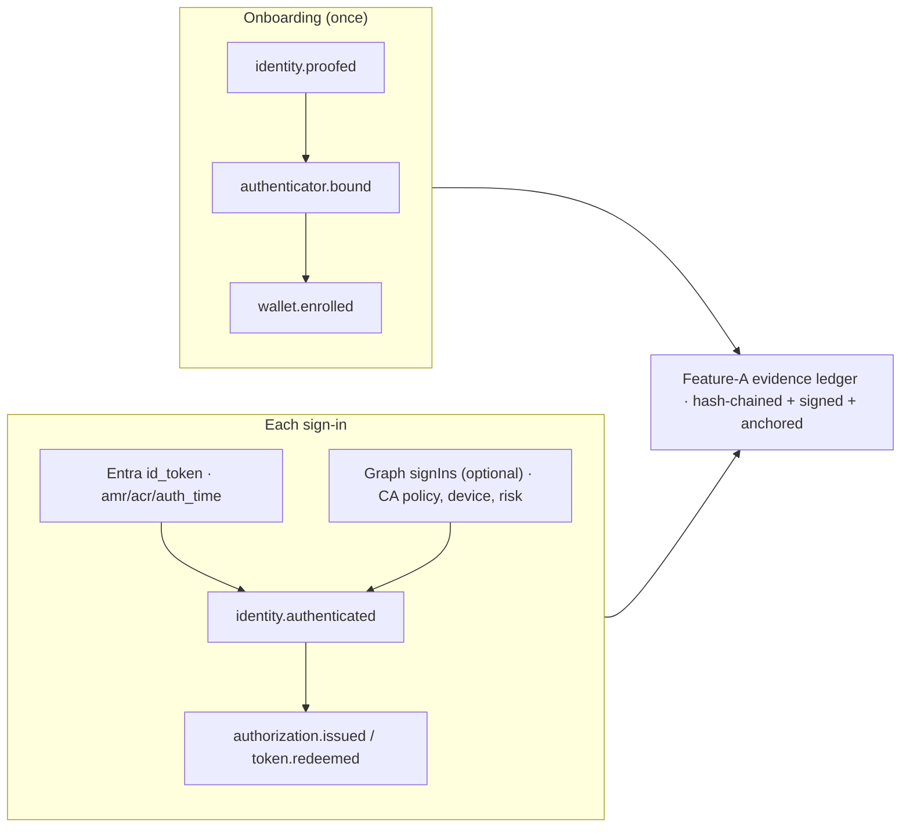

**Net implementation footprint:** mechanism (1) and (2) reuse existing services (`upstream-idp-service.js`, `audit-service.js`, `oidc-provider-service.js`) plus the Feature-A chaining; mechanism (3) is an additive Graph connector behind a flag. No change to the passkey/YubiKey issuance, which stays an Entra credential.

---

## 6. Configuration & secrets matrix (proposed additions)

| Variable | Purpose | local | dev | prod |
|---|---|---|---|---|
| `AEGIS_ISSUER_DID_METHOD` | DID method per track (§5.E) | `web` | `web` / `indy` | `web` (Entra) / `indy` (Aries) |
| `AEGIS_INDY_DID_NAMESPACE` | did:indy network namespace (§5.E) | `von:local` | `candy:test` | `candy:prod` / `sovrin` |
| `LEDGER_NETWORK` | Active ledger profile | `von-local` | `von-local` / `candy-test` | `none` / `candy-prod` / `sovrin-main` |
| `LEDGER_GENESIS_URL` | Genesis source override | VON | CANdy-test | CANdy/Sovrin |
| `LEDGER_TAA_ACCEPT` | Accepted TAA version (§5.F) | n/a | `latest` / pinned | pinned version |
| `LEDGER_TAA_MECHANISM` | Acceptance mechanism from the AML (§5.F) | n/a | `service_agreement` | `service_agreement` / `on_file` |
| `LEDGER_TAA_TEXT_SHA256` | Pinned digest of the reviewed TAA text (§5.F) | — | pinned | pinned (fail-closed on drift) |
| `LEDGER_ENDORSER_DID` | Endorser for writes | — | test endorser | prod endorser |
| `TAILS_SERVER_BASE_URL` | Revocation tails host | local | local | hosted |
| `AUDIT_SIGNING_ENABLED` | Turn on Feature A signing | `false` | `true` | `true` |
| `AUDIT_SIGNING_KEYVAULT_KEY_ID` | KV key for head signing | — | KV key | KV key |
| `AUDIT_ANCHOR_MODE` | Head anchoring target | `none` | `azure-blob` | `azure-blob` |
| `AUDIT_ANCHOR_CONTAINER` | Immutable blob container | — | container | container (WORM policy) |
| `ISSUER_WALLET_DB_URL` | Postgres askar (prod issuer) | — | — | Postgres |

All follow the existing pattern in [`src/config/index.js`](../../src/config/index.js) and the deploy script's app-settings list. The Entra-direct + passkey path (§5.G) reuses the **existing** `CONNECTED_APP_UPSTREAM_ENTRA_*` and `PASSKEY_RP_*` settings and needs none of the ledger keys above.

---

## 7. Testing strategy

| Layer | How we test |
|---|---|
| **Feature A unit** | Build a chain, verify it passes; **mutate one record on disk → assert `verifyAuditChain()` reports the exact broken `seq`**; delete a record → assert detected; tamper after signature → assert signature check fails |
| **Feature A signing** | Mock Key Vault signer in tests; live smoke against a real KV key in dev only |
| **Feature A anchoring** | Assert head written to blob; assert immutability policy rejects overwrite (integration, dev storage account) |
| **Feature B E2E** | Scripted: bring up VON+tails, publish schema/cred-def, issue, prove, revoke, re-prove (must fail). Assert artifacts visible in VON explorer `:9000`. Health via `/api/aries/status` |
| **Feature C/D on test-nets** | Same E2E but against CANdy-test / Sovrin StagingNet; verify TAA acceptance is recorded and endorsed writes land (check network explorer, e.g. CANdyScan) |
| **Regression** | `npm test` + `npm run smoke`; the existing deploy script already gates on tests |
| **Prod verification** | `scripts/verify-audit-chain.js` runnable against the live audit store; read-only proof against CANdy/Sovrin |

Nothing here changes the existing test-run policy — I will add tests but only run them when you ask.

---

## 8. Security, compliance & data-sovereignty

- **No PII on any ledger, ever.** Indy/CANdy/Sovrin store only schemas, cred-defs, DIDs, and revocation registries — never personal data or credential contents. This is a core selling point and must be stated clearly to clients.
- **Data sovereignty**: `did:web` keeps the trust root entirely on your Azure/domain (most sovereign). **CANdy keeps it in Canadian jurisdiction** (strong for federal/provincial). **Sovrin is global** (use when cross-border interop matters more than locality).
- **Key custody**: audit-signing and `did:web` keys stay in Azure Key Vault; the app never sees private key material (consistent with existing `did:web` design).
- **TAA acceptance** is itself compliance evidence — we will record it as a Feature-A audit event.
- **Least privilege**: verifiers get read-only network access; only the issuer agent holds a writing DID.

---

## 9. Production ledger comparison — which to lead with

| | **did:web + Key Vault** | **CANdy-prod** | **Sovrin MainNet** |
|---|---|---|---|
| Credential model | Entra Verified ID (JSON-LD / SD-JWT) | AnonCreds (ZK) | AnonCreds (ZK) |
| Trust root location | Your domain / Azure | Canada (public sector) | Global |
| Operator | You | Canadian gov digital-trust community | Sovrin Foundation |
| Write prerequisite | Key Vault key | Endorser DID + TAA | Endorser DID + TAA |
| Best for | Microsoft-native, fastest path, max sovereignty | Canadian federal/provincial mandates for Hyperledger | International interop |
| Cost/ops | Lowest | Community/steward onboarding | Steward onboarding |
| Recommended role | **Default production trust root** | **Add when a client mandates AnonCreds in Canada** | **Add for global/cross-org interop** |

**My recommendation:** keep `did:web` as the default production trust root, add **CANdy** as the first Indy production network (best jurisdictional fit for your target market), and add **Sovrin** for international interop — but validate each on its test-net first.

---

## 10. Phased rollout & sequencing

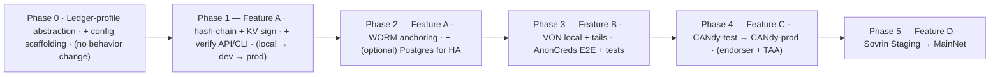

Each phase is independently shippable and reversible. Phase 0/1 deliver the highest value (they make the "immutable ledger" claim true) with the least external dependency. Phases 4–5 depend on external onboarding (endorser, TAA) that has lead time outside our control.

---

## 11. Open decisions I need from you

1. **Primary production trust root** — confirm `did:web` stays default, with CANdy/Sovrin as *additive* (my recommendation), or do you want an Indy network to be primary?
2. **Endorser relationships** — do you already have (or a path to) an endorser/Steward relationship on **CANdy** and **Sovrin**? This gates Phases 4–5.
3. **Anchoring target** — is **Azure immutable Blob (WORM)** acceptable for anchoring audit heads, and at what cadence (per-event / hourly / daily)?
4. **Signing granularity** — sign **every event** (stronger, more Key Vault calls/cost) or sign a **periodic head** (cheaper)? Affects cost and latency.
5. **Prod scale** — will Azure App Service run **more than one instance**? If yes, we add Postgres for the chain sequence now (Phase 2) rather than later.
6. **Revocation** — do you need revocable credentials in the first cut (drives the tails-server work in Phase 3)?
7. **Issuer hosting in prod** — Azure Container Apps vs AKS for the writing ACA-Py issuer agent (only needed once we go to a real Indy network).

---

## Appendix A — Regulations, statutes & certifications to seek

> Informational map, not legal advice. Validate scope with qualified privacy/security counsel and an accredited assessor. Prioritized for a **Canadian, public-sector-facing** identity + digital-signature service; international items are flagged.

### A.1 Canadian privacy & identity law/policy (primary)
- **PIPEDA** — federal private-sector privacy baseline.
- **Privacy Act** — when handling data for federal institutions.
- **Provincial privacy laws** where you operate: **Quebec Law 25**, **BC PIPA/FIPPA**, **Alberta PIPA**, Ontario public-sector.
- **DIACC Pan-Canadian Trust Framework (PCTF)** — *the* Canadian digital-identity trust framework; pursue **PCTF certification** (likely your strongest differentiator for Canadian gov buyers).
- **CAN/CIOSC 103-1** (Digital Trust & Identity) — the underlying Canadian standard.
- **TBS Directive on Identity Management** + **Standard on Identity and Credential Assurance** (Levels of Assurance / CATS).

### A.2 Federal security / hosting (if serving GC data)
- **ITSG-33** (CSE control catalogue) — what GC systems are assessed against.
- **Protected B / Medium-Medium** cloud control profile; host in **Azure Canada regions** with GC-approved configuration.
- **CCCS Cloud Assessment** + **SA&A** (Security Assessment & Authorization).

### A.3 Electronic / digital signatures (you offer signing)
- **PIPEDA Part 2** + federal **Secure Electronic Signature Regulations**.
- Provincial **UECA**-based acts (Ontario **ECA 2000**, BC, Quebec).
- If US: **ESIGN + UETA**. If EU: **eIDAS** (and **eIDAS 2.0** for qualified signatures / EUDI wallet).

### A.4 International (only if global / Sovrin)
- **GDPR** (EU) — directly *why the TAA exists*; drives the "no PII on-ledger" rule.
- **eIDAS 2.0 / EU Digital Identity Wallet (EUDI)** — EU credential interop.
- **US NIST SP 800-63-3/-4** — IAL/AAL/FAL assurance levels. **FedRAMP** only if US federal.

### A.5 ISO / SOC certifications (rough priority order)
1. **ISO/IEC 27001** (ISMS) — table stakes.
2. **SOC 2 Type II** — most-requested by NA enterprise/gov (Security, Availability, Confidentiality, Privacy).
3. **ISO/IEC 27701** (privacy, extends 27001) + **27017** (cloud) + **27018** (PII in cloud).
4. **ISO/IEC 29115** (authentication assurance) & **29003** (identity proofing).
5. **ISO/IEC 18013-5** (mobile driving licence / **mdoc**) & **23220** (mobile eID) — if issuing mobile credentials.
6. **ISO/IEC 24760** (identity-management framework).
7. **FIDO Alliance certification** — for the passkey/WebAuthn components.

### A.6 Technical conformance (not law, but drives trust/interop)
W3C **Verifiable Credentials 2.0** & **DID Core**; **OpenID4VCI/OpenID4VP**; **SD-JWT VC**; **Trust over IP (ToIP)** alignment; **AnonCreds** conformance on the Indy track.

**The "big five" to target first:** PCTF certification · ISO 27001 · SOC 2 Type II · ITSG-33 / Protected B alignment · GDPR-aware ledger design (PII off-ledger).

---

## 12. Reference links

**Standards, assurance & compliance**
- DIACC Pan-Canadian Trust Framework (PCTF): https://diacc.ca/trust-framework/
- CSE ITSG-33 (IT security risk management): https://www.cyber.gc.ca/en/guidance/it-security-risk-management-lifecycle-approach-itsg-33
- NIST SP 800-63 Digital Identity Guidelines: https://pages.nist.gov/800-63-3/
- eIDAS / EU Digital Identity Wallet: https://digital-strategy.ec.europa.eu/en/policies/eudi-wallet
- ISO/IEC 27001: https://www.iso.org/standard/27001
- W3C Verifiable Credentials 2.0: https://www.w3.org/TR/vc-data-model-2.0/
- OpenID for Verifiable Credentials (OID4VCI/OID4VP): https://openid.net/sg/openid4vc/
- Microsoft Entra Verified ID (DID method / formats): https://learn.microsoft.com/en-us/entra/verified-id/

**ACA-Py / Aries**
- ACA-Py (OpenWallet Foundation): https://github.com/openwallet-foundation/acapy
- ACA-Py docs: https://aca-py.org/
- Aries RFCs (protocols, revocation, endorser): https://github.com/hyperledger/aries-rfcs
- indy-tails-server (revocation tails): https://github.com/bcgov/indy-tails-server

**AnonCreds / Indy / DID methods**
- AnonCreds specification: https://hyperledger.github.io/anoncreds-spec/
- Hyperledger Indy: https://www.hyperledger.org/projects/hyperledger-indy
- `did:indy` method spec: https://hyperledger.github.io/indy-did-method/
- VON network (local dev ledger): https://github.com/bcgov/von-network
- Transaction Author Agreement (TAA) overview: https://github.com/hyperledger/indy-node/blob/main/docs/source/transaction_author_agreement.md

**Production networks**
- Sovrin Foundation: https://sovrin.org/
- Sovrin networks (MainNet / StagingNet / BuilderNet): https://sovrin.org/overview/
- CANdy (Canadian Indy network) explorer — CANdyScan: https://candyscan.idlab.org/
- CANdy project info (BC Gov Digital Trust): https://digital.gov.bc.ca/digital-trust/

**Transparency-log / notarization pattern (Feature A background)**
- Certificate Transparency (RFC 6962) — hash-chained, notarized log design: https://datatracker.ietf.org/doc/html/rfc6962
- Merkle trees / tamper-evident logs (background): https://transparency.dev/

**Azure**
- Key Vault sign/verify with keys: https://learn.microsoft.com/en-us/azure/key-vault/keys/about-keys
- Blob immutable storage (WORM, legal hold): https://learn.microsoft.com/en-us/azure/storage/blobs/immutable-storage-overview
- Entra Verified ID: https://learn.microsoft.com/en-us/entra/verified-id/

> Some external links (particularly CANdy governance/genesis and Sovrin onboarding) may move; I have pointed to the canonical project homepages and explorers rather than deep-linking artifacts that rotate. I will pin exact genesis URLs during Phase 4/5.

---

*End of plan — awaiting your review and feedback before any implementation begins.*
