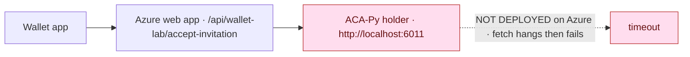
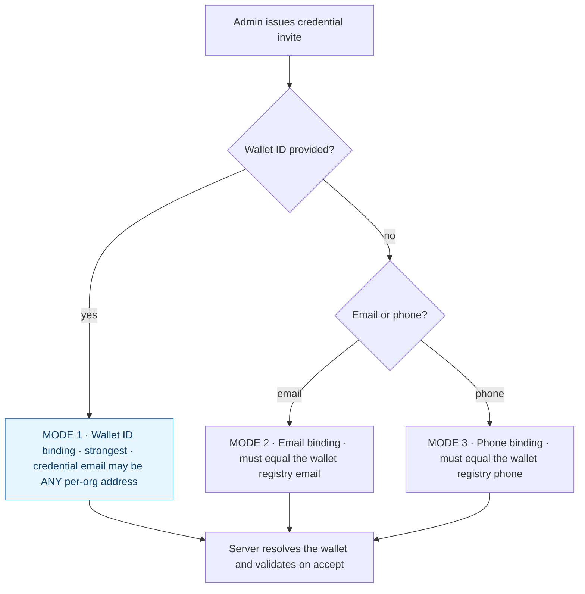
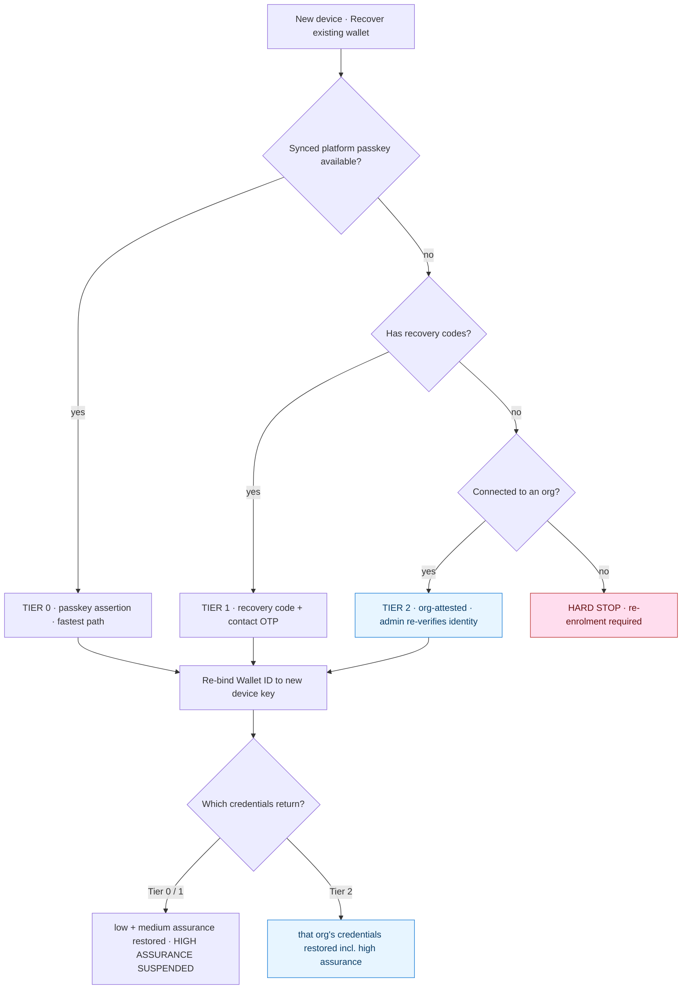
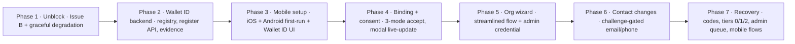

# Implementation Plan — Wallet Identity, Wallet ID, Recovery, and Onboarding Fixes

> **Status:** v4 — **Phases 1 and 2 implemented** on branch `feature/wallet-identity` (local only, not deployed).
> Implemented: product-path org invites + accept (no ACA-Py), graceful degradation, Wallet ID module, wallet registry with 3-mode binding, register/profile APIs, evidence events, 24 new tests.
> Remaining: Phases 3-7 (mobile setup, invite binding wiring, org wizard, contact changes, recovery).
> Covers the **web app**, **iOS wallet**, and **Android wallet**.
> Scope: 7 issues from the dev deployment (4 defects/UX fixes + 3 new features) **plus Wallet Recovery**.

---

## 0. Decisions approved

### Wallet identity (v2)

| # | Decision | Approved |
|---|---|---|
| 1 | **Wallet ID format** — 16 significant characters, `AEG-XXXX-XXXX-XXXX-XXXX` | ✅ |
| 2 | **Existing wallets** — force Wallet ID setup on next app launch (no deferral) | ✅ |
| 3 | **Phone verification** — self-asserted (no SMS provider) | ✅ |
| 4 | **Email-only / SMS-only invites without a Wallet ID** — allowed, but the email/phone **must match the contact registered on the holder's wallet** | ✅ |

### Wallet recovery (v3)

| # | Decision | Approved |
|---|---|---|
| R1 | **Tier 1 self-service recovery exists**, with the **suspend-high-assurance** rule | ✅ |
| R2 | **10 single-use recovery codes**, `XXXX-XXXX` each, shown once at setup | ✅ |
| R3 | **24-hour cooling-off** before high-value operations after a Tier-1 recovery | ✅ 24h |
| R4 | Tier 2 approval requires a **separate, auditable privilege** (`wallet.recovery.approve`) | ✅ |
| R5 | An approving org restores **only its own credentials** | ✅ |
| R6 | **No org + no codes → hard stop** (re-enrolment required) | ✅ |

### Assumptions I'm carrying (flag if wrong)
- **A1** — Admin credential (Issue C) is an **explicit wizard step**, not silent auto-issue.
- **A2** — Wallet connect during org registration is **skippable** ("Finish later").
- **A3** — Contact changes require **in-wallet approval**; a passkey is additionally required only if the holder enabled "require passkey for all challenges".
- **A4** — Phone is **optional** at setup but **required before** a wallet can receive SMS-only invites.
- **A5** — ✅ **Approved.** Post-recovery, **contact changes are frozen for 7 days** (blocks change-email-then-recover). Separate from the R3 cooling-off, which gates high-value operations.
- **A6** — ✅ **Approved.** Mode 2/3 (email/phone) invites carry a **"lower assurance" badge** in the admin UI.
- **A7** — *(assumption — not yet confirmed)* "High assurance" for the Tier-1 suspension rule is an **explicit per-credential flag**, defaulting to *high* for admin-role credentials.

---

## 1. Summary of findings

| # | Issue | Type | Root cause (verified) | Surfaces |
|---|---|---|---|---|
| A | Org registration takes several confusing steps | UX | Subscription → workspace → wallet onboarding are three separate pages | Web |
| B | **QR scan hangs — "accepting invitation through the local holder"** | **Defect (architectural)** | Wallet drives ACA-Py **lab** agents that don't exist on Azure | iOS, Android, Web |
| C | Org registrant gets no credential | Gap | Nothing issues a credential to the registering admin | Web |
| D | Modal stays open + consent stuck at "requested" | Defect | No live status update; wallet accept never grants consent | Web |
| E | Wallet email defaults to `identity@vanguardcs.ca` | Defect/UX | Hard-coded default; no first-run setup exists | iOS, Android, Web |
| F | **No Wallet ID** | **New feature** | Concept does not exist | Web, iOS, Android |
| G | Profile email/phone changes unprotected | New feature | No wallet-challenge gate on profile edits | Web, iOS, Android |
| H | **No wallet recovery** | **New feature** | New phone / reinstall strands the holder | Web, iOS, Android |

---

## 2. Issue B — the QR hang (highest priority)

### 2.1 Root cause

```
iOS WalletStore.acceptInLab()                       WalletStore.swift:292
  → LabAgentClient.acceptInvitation()               LabAgentClient.swift:8
    → POST {webApp}/api/wallet-lab/accept-invitation
      → acceptInvitationWithHolder()                aries-lab-adapter.js
        → POST http://localhost:6011/...            config.aries.holderAdminUrl
```

`config.aries.holderAdminUrl` defaults to **`http://localhost:6011`**. Azure has **no ACA-Py**, so the server's `fetch` hangs then fails — the app sits on *"Accepting invitation through the local holder…"*. Rescanning finds the local record → *"Invitation already accepted."* The workspace only appears after reload because `registerIssuerOrganizationConnection` was never reached. Same root cause as the local `TypeError: fetch failed` on workspace creation ([organizations.js:56](../../src/routes/organizations.js)).



### 2.2 Fix — separate the *product* path from the *lab* path

| Change | Where |
|---|---|
| New `aegisid://org-invite?...` deep link (mirrors the working `aegisid://credential-invite`) — no DIDComm | `issuer-organization-service.js` |
| New `POST /api/wallet/organization-invitations/:id/accept` — registers the wallet↔org connection directly | `routes/api.js` |
| `createIssuerOrganizationInvitation` no longer calls ACA-Py by default; OOB variant kept behind lab mode | `issuer-organization-service.js` |
| Workspace creation **degrades gracefully** — never 500 because the lab is down | `routes/organizations.js` |
| Wallet routes org invites via the product API, not `LabAgentClient` | iOS + Android |
| Lab bridge UI shown only when `usesHostedWebApp == false` (already computed, unused) | iOS + Android |
| Request timeouts + cancel affordance so no screen hangs | iOS + Android |

---

## 3. Issue F — Wallet ID + invite binding

### 3.1 Wallet ID design
`AEG-XXXX-XXXX-XXXX-XXXX` — 16 significant chars, **Crockford Base32** (excludes `I`/`L`/`O`/`U`), case-insensitive, dashes cosmetic, final **mod-37 check symbol** to catch typos/transpositions, ~75 bits entropy. **Minted server-side**; **bound to a device key** (Secure Enclave / Keystore) so possession of the ID alone proves nothing.

### 3.2 Three invite binding modes



| Mode | Binds on | Credential email | Assurance |
|---|---|---|---|
| **1 — Wallet ID** | `walletId` | **Any** per-org address | Highest |
| **2 — Email** | wallet-registry **email** | Must equal registered email | Medium |
| **3 — Phone** | wallet-registry **phone** | Must equal registered phone | Medium |

**Critical change:** today the server rejects an accept when wallet email ≠ credential email ([org-admin-service.js:557](../../src/services/org-admin-service.js)) — exactly the multi-org case. Mode 1 replaces that with a Wallet ID match. `bindingMode` is persisted and written to the evidence ledger.

---

## 4. Web app — identity changes

### 4.1 Data model
| Store | Change |
|---|---|
| **new** `data/wallets.json` | `{ id, walletId, devicePublicKey, deviceKeyAlg, deviceKeyHistory[], email, phone, status, contactFrozenUntil, lastRecoveryAt, createdAt, updatedAt }` |
| `issuer-organizations.json` | add `walletId`, `acceptedAt`; `issuerConnectionId` nullable |
| org-admin credentials | add `walletId`, `holderPhone`, `bindingMode`, `assuranceLevel`, `suspendedAt`, `suspendedReason` |

Phones normalized to **E.164** so lookups are deterministic.

### 4.2 New services
- `src/services/wallet-id.js` — pure: `generateWalletId()`, `parseWalletId()`, `checkSymbol()`, `isValidWalletId()`
- `src/services/wallet-registry-service.js` — `registerWallet()`, `getWalletBy{WalletId,Email,Phone}()`, `resolveWalletForCredential()` (3-mode table), `assertBinding()`, `updateWalletContact()` (challenge-gated)

### 4.3 API — identity
| Endpoint | Purpose | Status |
|---|---|---|
| `POST /api/wallet/register` | Mint Wallet ID; store device key + contact | New |
| `GET /api/wallet/:walletId/profile` | Own wallet profile | New |
| `POST /api/wallet/:walletId/contact/challenge` | Start email/phone change (**G**) | New |
| `POST /api/wallet/:walletId/contact/verify` | Apply after approval (**G**) | New |
| `POST /api/wallet/organization-invitations/:id/accept` | Org connect **without ACA-Py** (**B**) | New |
| `GET /api/wallet/credential-invitations/:id/status` | Modal live-update (**D**) | New |
| `POST /api/wallet/credential-invitations/:id/accept` | 3-mode binding + grant consent (**D**,**F**) | Changed |

### 4.4 Issue A — streamlined org registration
One **3-step wizard**: `Organization details → Admin credential → Connect wallet`, workspace auto-created from the subscription's organization name (removes the "Register your organization to continue" dead-end). Wallet connect skippable (A2).

### 4.5 Issue C — admin credential
Wizard step 2 issues a credential to the registering admin (prefilled email, `personType=administrator`, admin roles, optional Wallet ID → Mode 1, else Mode 2).

### 4.6 Issue D — modal + consent
Poll `GET …/status` every ~3 s while the modal is open; auto-close and update the row on `active`. On wallet accept, **grant consent** for the requested claim keys in the same transaction and append `wallet.challenge.accepted` — today only the admin-side `grantCredentialConsent` ([org-admin-service.js:1000](../../src/services/org-admin-service.js)) does this, which is why it sticks at `requested`.

### 4.7 Issue E — remove hard-coded defaults
Replace `identity@vanguardcs.ca` in the issue-credential form ([dashboard.hbs:410](../../views/pages/dashboard.hbs)) with an empty required field, plus optional **Wallet ID** and **phone** inputs and a binding-mode indicator.

---

## 5. iOS wallet

### 5.1 First-run setup — `Features/Onboarding/WalletSetupView.swift`
1. Welcome → 2. **Contact** (email required, phone optional) → 3. **Register** (Secure Enclave keypair → `POST /api/wallet/register`) → 4. **Your Wallet ID** (large, Copy/Share/QR) → 5. **Recovery codes** (10 codes, shown once, Copy/Share/Print, "save these now" + confirm checkbox) → 6. Optional passkey.

`AppView.swift` gates tabs on `store.isWalletRegistered`. Per **decision 2**, existing installs without a Wallet ID enter this flow on next launch (data preserved).

### 5.2 `WalletStore` additions
`walletId`, `walletEmail`, `walletPhone`, `isWalletRegistered`, `deviceKeyId`. Wallet ID + device key in **Keychain**. `walletPasskeySubject` derives from the registered email (replaces the hard-coded default at [WalletStore.swift:32](../../ios/VanguardAegisWallet/VanguardAegisWallet/Services/WalletStore.swift)).

### 5.3 Invite handling
Parse/validate `wallet_id` (mismatch → *"This invitation is for a different wallet."*); org invites use the product endpoint; lab bridge hidden when `usesHostedWebApp`; timeouts + cancel everywhere.

### 5.4 Settings
Wallet ID row (copy/QR); **challenge-gated** email/phone edits (A3); **recovery-code management** (remaining count, regenerate).

---

## 6. Android wallet — mirror of iOS

| File | Change |
|---|---|
| **new** `ui/WalletSetupScreen.kt` | Same 6-step first-run flow incl. recovery codes; forced setup for existing installs |
| **new** `ui/WalletRecoveryScreen.kt` | Recovery entry flow (§7.6) |
| `data/WalletStore.kt` | `walletId`/`walletEmail`/`walletPhone`/`isWalletRegistered`; remove `identity@vanguardcs.ca` defaults ([lines 50, 320, 329, 416](../../android/VanguardAegisWallet/app/src/main/java/ca/vanguardcs/aegisid/wallet/data/WalletStore.kt)); **EncryptedSharedPreferences** + **Android Keystore** |
| `data/OobInvitationParser.kt` | Parse + validate `wallet_id` |
| `data/LabAgentClient.kt` | Product endpoints; lab gated to local mode; timeouts |
| `ui/WalletApp.kt` | Registration gate; Settings parity |

---

## 7. Wallet Recovery (Issue H) — NEW

### 7.1 The model

Recovery is **not** restoring a backup. The device key is non-exportable by design, and credentials already live server-side. Recovery = **prove you hold Wallet ID X so the server re-binds it to a new device key**; credentials then re-sync.

| Asset | Recovered how |
|---|---|
| Device key | ❌ Never restored — **new key generated and re-bound** |
| Passkeys | ❌ Must be **re-registered** (device-bound) |
| **Wallet ID** | ✅ **Preserved** — never re-shared with orgs |
| Credentials | ✅ Re-synced from the server, **per approving org** |
| Connections / transactions | ✅ Re-synced (local copy was a cache) |

Consequence: **nothing sensitive is ever backed up** — no seed phrase to leak.

**Governing principle:** recovery must not grant more assurance than the evidence presented, and **each org decides whether its own credentials return** (R5).

### 7.2 Tiers



| Tier | Evidence required | Restores |
|---|---|---|
| **0 — Synced passkey** | WebAuthn assertion | Same scope as Tier 1 |
| **1 — Self-service** (R1) | Recovery code **+** contact OTP (two factors) | Identity + **low/medium**; **high-assurance suspended** |
| **2 — Org-attested** (R4, R5) | Org admin re-verifies identity (in person / ID + liveness) | **That org's** credentials, incl. high assurance |
| **Hard stop** (R6) | — | No org + no codes → re-enrolment |

Per **R3**, a Tier-1 recovery imposes a **24-hour cooling-off** before high-value operations (signatures, Protected B encrypt/decrypt, privileged actions). Combined with the **high-assurance suspension** (R1), **immediate notification with one-click cancel**, and the **7-day contact freeze** (A5), a fraudulent self-service recovery has a wide detection window and cannot immediately exercise sensitive capability. Tier 0/2 recoveries are not subject to the cooling-off.

### 7.3 Data model
| Store | Shape |
|---|---|
| **new** `data/wallet-recovery-codes.json` | `{ walletId, codes: [{ index, hash, usedAt }], generatedAt, remaining }` — **Argon2id/scrypt hashed**, plaintext never stored |
| **new** `data/wallet-recovery-requests.json` | `{ id, walletId, tier, status, orgId, otpVerifiedAt, codeIndexUsed, newDevicePublicKey, requestedAt, expiresAt, approvedBy, approvedAt, rejectedReason, evidence: { idImageHash, faceImageHash }, cancelledAt }` |
| `wallets.json` | `deviceKeyHistory[]`, `contactFrozenUntil`, `lastRecoveryAt` |
| credentials | `assuranceLevel`, `suspendedAt`, `suspendedReason` |

Request lifecycle: `initiated → otp-verified → (code-redeemed | awaiting-org-approval) → approved → completed`, with `rejected` / `cancelled` / `expired` terminals.

### 7.4 API — recovery
| Endpoint | Purpose |
|---|---|
| `POST /api/wallet/recovery/start` | Look up by Wallet ID **or** registered email; create request; send OTP |
| `POST /api/wallet/recovery/verify-otp` | Verify contact control |
| `POST /api/wallet/recovery/redeem-code` | **Tier 1** — redeem a single-use code |
| `POST /api/wallet/recovery/passkey-assert` | **Tier 0** |
| `POST /api/wallet/recovery/request-attestation` | **Tier 2** — raise a request to a connected org |
| `POST /api/wallet/recovery/complete` | Bind new device key; revoke old; re-sync per approval scope |
| `POST /api/wallet/recovery/cancel` | "This wasn't me" — kills the request |
| `GET /api/wallet/recovery/:id/status` | Poll from the app |
| `POST /api/wallet/:walletId/recovery-codes/regenerate` | Regenerate the 10-code set (invalidates old) |
| `GET/POST /dashboard/:sub/orgs/:ws/recovery-requests[/:id/{approve,reject}]` | Admin queue — **requires `wallet.recovery.approve`** (R4) |

New RBAC policy `wallet.recovery.approve` (`orgPrivilege`, resource `wallet-recovery`) added to `authorization-service.js` — deliberately **separate** from `credentials.issue` so approval rights are granted and audited independently.

### 7.5 Admin console (Tier 2)
New **Recovery requests** panel in the org dashboard: pending queue with holder identity summary and connected-credential list; **identity re-verification capture** reusing the existing ID + liveness evidence hashing (`idImageHash`/`faceImageHash` in `org-admin-service.js`); Approve / Reject with a required reason; full audit trail. Approval restores **only this org's** credentials (R5).

### 7.6 Mobile flows (iOS + Android)
- **At setup:** step 5 shows the **10 recovery codes** once — Copy / Share / Print, plus an explicit "I've saved these" confirmation before continuing (R2).
- **Recover entry point:** "Recover existing wallet" on the setup screen → Wallet ID *or* registered email → OTP → then Tier 0 (auto if synced passkey), Tier 1 (enter code), or Tier 2 (choose org → wait for approval, with status polling and push/refresh).
- **Hard stop (R6):** if no codes and no connected org, show a clear terminal message directing the user to re-enrol with their organization — no self-service path.
- **After recovery:** prompt to **re-register a passkey** and to **regenerate recovery codes**; show which credentials are suspended and why.

### 7.7 Security controls
- **Old device key revoked** on re-bind (never two live devices); recorded in `deviceKeyHistory`
- **Contact changes frozen 7 days** post-recovery (A5) — blocks change-email-then-recover
- **Rate limiting + lockout** on code redemption and OTP
- Codes **single-use, hashed at rest**, remaining count surfaced, regenerate after use
- **Notify all connected orgs + registered contacts on initiation and completion**, with one-click cancel
- **Passkeys must be re-registered** — they cannot transfer
- Recovery **never** bypasses an org's own policy
- Every step to the **evidence ledger**: `wallet.recovery.initiated`, `.otp.verified`, `.code.redeemed`, `.attestation.requested`, `.attestation.approved`, `.attestation.rejected`, `.completed`, `.cancelled`, `.credentials.suspended`, `.credentials.restored`

---

## 8. Test plan

Conventions match the existing suite (`node:test` + `node:assert/strict`, isolated temp stores via `fs.mkdtemp`, no network). Current suite is **68 passing** and must stay green.

### 8.1 Web — identity
| File | Tests |
|---|---|
| `tests/wallet-id.test.js` | Format matches `AEG-XXXX-XXXX-XXXX-XXXX`; `I/L/O/U` never appear; parse case/dash-insensitive; valid check symbol accepted; **single-char typo rejected**; **transposition rejected**; 10k IDs unique |
| `tests/wallet-registry-service.test.js` | Register mints/persists; duplicate device key deterministic; lookup by walletId/email/phone; **E.164 normalization** (`613-555-0100` ≡ `+16135550100`); unknown → null |
| `tests/wallet-credential-binding.test.js` | **Mode 1:** matching Wallet ID accepted; **succeeds when credential email ≠ wallet email** (multi-org regression); mismatch rejected. **Mode 2:** invite email = registered wallet email accepted; **free-text email on no wallet rejected**. **Mode 3:** same for phone; rejected when no phone on file. Expired/revoked rejected in all modes; `bindingMode` persisted |
| `tests/wallet-organization-accept.test.js` | **Regression for Issue B:** org accept succeeds with **no ACA-Py reachable** (asserts lab adapter never called); connection records `walletId`; idempotent; `wallet.enrolled` written |
| `tests/organization-registration-degradation.test.js` | **Regression for local `fetch failed`:** workspace registration succeeds when the lab adapter throws; not a 500; warning surfaced; audit still written |
| `tests/credential-consent-on-accept.test.js` | Wallet accept flips `requested → granted`; `sharedClaims` populated; `wallet.challenge.accepted` appended; idempotent |
| `tests/wallet-contact-challenge.test.js` | Requires **approved** challenge; pending/declined/expired do **not** mutate; approved updates + writes `wallet.contact.changed`; address already bound to another wallet rejected |
| `tests/wallet-invite-status.test.js` | Status reports `invited → active` (drives modal auto-close) |

### 8.2 Web — recovery (incl. the attack cases)
| File | Tests |
|---|---|
| `tests/wallet-recovery-codes.test.js` | 10 codes generated, `XXXX-XXXX` format; **plaintext never persisted** (store contains only hashes); single-use — **replay of a used code rejected**; remaining count accurate; regenerate invalidates the whole old set |
| `tests/wallet-recovery-tier1.test.js` | Code **+** OTP succeeds; **stolen code alone (no OTP) rejected**; **OTP alone without a code rejected (SIM-swap case)**; wrong code rejected; **high-assurance credentials suspended**, low/medium restored; old device key revoked and history recorded |
| `tests/wallet-recovery-tier2.test.js` | Attestation request raised to a connected org; approval requires **`wallet.recovery.approve`** — an admin with only `credentials.issue` is **denied** (R4); approval restores **only that org's** credentials, **org B's remain suspended** (R5); rejection with reason terminates the request |
| `tests/wallet-recovery-guards.test.js` | **Change-email-then-recover blocked** by the 7-day contact freeze (A5); expired request rejected; **cancel kills an in-flight request**; rate limit/lockout after N failed attempts; **hard stop — no codes + no org yields no self-service path** (R6); completing twice is idempotent |
| `tests/wallet-recovery-evidence.test.js` | All recovery events appended in order and the chain **verifies end-to-end**; suspension/restoration recorded |

### 8.3 Web — extended existing
- `tests/identity-evidence.test.js` — add `wallet.registered`, `wallet.contact.changed`, recovery helpers; assert the full lifecycle verifies as one chain
- `tests/authorization-service.test.js` — new wallet + `wallet.recovery.approve` policies registered; deny-by-default preserved

### 8.4 iOS (XCTest)
`WalletIdFormatTests` (server parity vectors) · `CredentialInviteParserTests` (match/mismatch/fallback) · `WalletSetupFlowTests` (gate; forced setup for existing installs; email required/phone optional; **recovery codes shown once + confirmation required**) · `WalletRecoveryFlowTests` (tier selection; hard-stop message when no codes/no org) · `OrgInviteRoutingTests` (product endpoint; **lab bridge not invoked when `usesHostedWebApp`**)

### 8.5 Android (JUnit)
`WalletIdFormatTest` · `OobInvitationParserTest` · `WalletStoreRegistrationTest` (EncryptedSharedPreferences; gate; no `identity@vanguardcs.ca` default remains) · `WalletRecoveryFlowTest` (tier selection + hard stop)

### 8.6 Shared vectors
`tests/fixtures/wallet-id-vectors.json` (valid IDs, typos, transpositions) consumed by **all three platforms** so format logic can't drift.

### 8.7 Manual verification (local, no Azure)
Register wallet → capture Wallet ID + codes → issue Mode-1/2/3 invites → scan each (accept, consent flip, modal auto-close, mismatch rejection) → **org registration with Docker stopped** (proves Issue B fixed) → recovery: Tier 1 on a fresh install (confirm high-assurance suspended), Tier 2 approval in the admin console (confirm only that org restores), and the hard-stop path. Exact steps provided at implementation time.

Per `AGENTS.md` I'll add tests but only run the targeted scope when you ask.

---

## 9. Phasing



**Phase 1 first** — fixes the hang and the local `fetch failed` with no data-model change and **no mobile release** (server-side only), so you get a working dev environment immediately.

Recovery-code **generation** ships with Phase 3 (setup shows them) while the **redemption/attestation** flows land in Phase 7 — so no wallet is created without codes even before recovery is complete.

All work on a new `feature/wallet-identity` branch (recommended) and **nothing deploys to Azure without your say-so**.

---

## 10. Compatibility & risk

- **Back-compat:** `walletId` nullable; existing credentials keep working via Mode 2; new invites prefer Mode 1.
- **Forced setup (decision 2):** existing installs enter setup on next launch; saved connections/transactions preserved and re-associated.
- **Aries lab preserved:** all ACA-Py paths remain for interop testing, off the product critical path.
- **Security:** Wallet ID alone can't accept a credential; Modes 2/3 bind to *registered* contacts; contact changes need an approved challenge; recovery needs two factors (Tier 1) or org attestation (Tier 2); binding mode and recovery tier are recorded for audit.
- **Residual risk (accepted):** Tier 1 is weaker than supervised in-person enrolment — mitigated by high-assurance suspension, the **24-hour cooling-off** (R3), immediate notification with cancel, the 7-day contact freeze (A5), and rate limiting. Tier 2 remains available for full restoration.
- **Main delivery risk:** mobile release coordination (the forced-setup gate requires an app update). Phase 1 is server-side and ships independently.

---

## 11. Remaining items for your confirmation

1. **A7 only** — confirm what counts as "high assurance" for the Tier-1 suspension rule. I am proceeding with an **explicit per-credential flag defaulting to high for admin-role credentials**; say the word if you'd rather derive it from the assurance level (e.g. hardware/YubiKey) instead.
2. A1–A6 are approved and implemented as described.
3. Branch: proceeding on **`feature/wallet-identity`**.

---

*End of plan — awaiting your approval before any implementation.*
