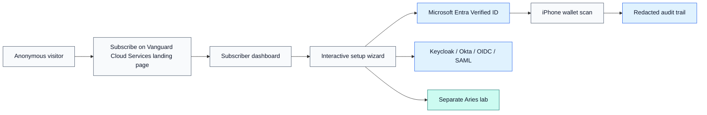
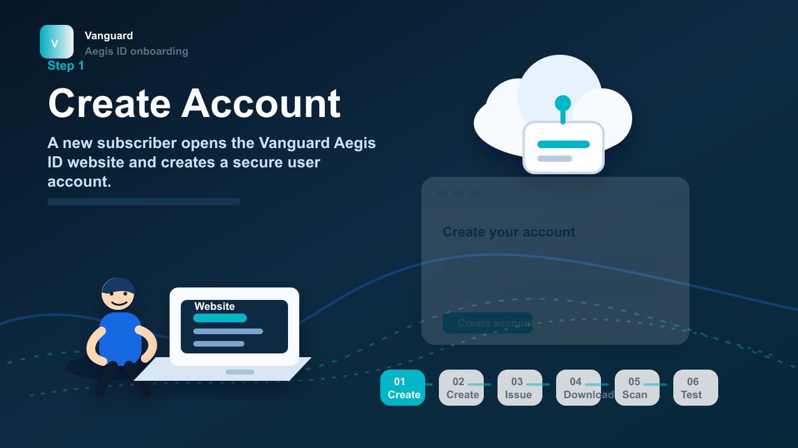
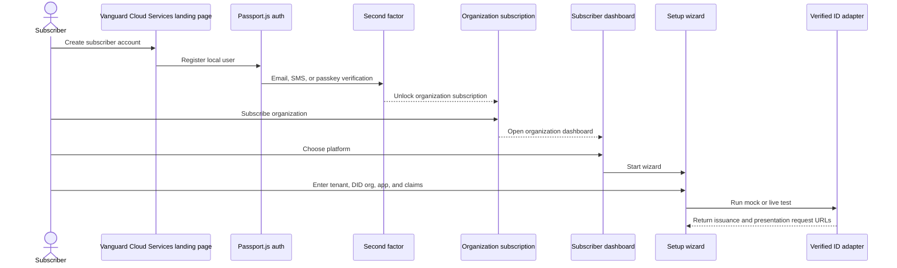
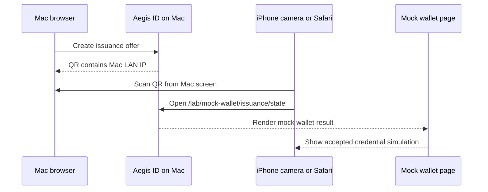
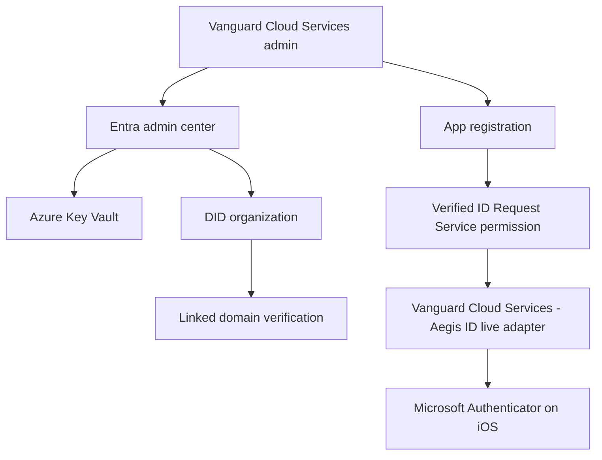
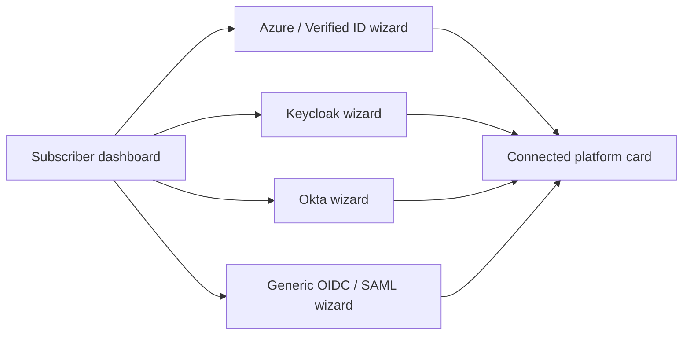

# Vanguard Cloud Services - Aegis ID

<div align="center">


# Vanguard Cloud Services Operator Guide

**Subscriber onboarding, Microsoft Entra Verified ID setup, iPhone wallet testing, and interoperability lab checks**

[](#local-mac-setup)
[](#use-the-app)
[](#microsoft-entra-verified-id-live-path)
[](#aries-interoperability-lab)

</div>

---

## Guide Map

- [What You Are Running](#what-you-are-running)
- [Fast Start Checklist](#fast-start-checklist)
- [Local Mac Setup](#local-mac-setup)
- [Use The App](#use-the-app)
- [iPhone Wallet And QR Testing](#iphone-wallet-and-qr-testing)
- [Microsoft Entra Verified ID Live Path](#microsoft-entra-verified-id-live-path)
- [YubiKey And Passkey Testing](#yubikey-and-passkey-testing)
- [Platform Wizards](#platform-wizards)
- [Aries Interoperability Lab](#aries-interoperability-lab)
- [Azure Free-Tier Pilot Deployment](#azure-free-tier-pilot-deployment)
- [Troubleshooting](#troubleshooting)
- [Reference Links](#reference-links)

---

## What You Are Running

Vanguard Cloud Services - Aegis ID is a dual-track identity service for Vanguard Cloud Services

| Track | Purpose | Wallet / Tooling | Production Posture |
| --- | --- | --- | --- |
| Microsoft-native path | Subscriber onboarding, DID organization setup, claims setup, issuance, and presentation with Microsoft Entra Verified ID | Microsoft Authenticator on iOS, Entra admin center, Azure App Service | Production target |
| Aries interoperability lab | DIDComm, ACA-Py, Bifold/Credo-style lab flows, and proof experiments | Local ACA-Py agents and lab wallets | Research and interoperability only |
| Mock wallet path | Local development before live Verified ID is connected | Browser-based mock wallet pages under `/lab/mock-wallet/...` | Demo and developer testing only |



---

## Fast Start Checklist

Use this checklist when you want the shortest path from clean checkout to a scannable QR test.

- [ ] Install Node.js 20 or newer.
- [ ] Run `npm install`.
- [ ] Copy `.env.example` to `.env`.
- [ ] Keep `VID_MODE=mock` for the first local test.
- [ ] Start the app on your Mac.
- [ ] Subscribe from the home page.
- [ ] Open the subscriber dashboard.
- [ ] Run the Microsoft Verified ID wizard in mock mode.
- [ ] Regenerate the QR request with your Mac LAN IP before scanning from iPhone.
- [ ] Move to `VID_MODE=live` only after Entra Verified ID, app registration, DID organization, and HTTPS callback URL are ready.

<details>
<summary><strong>Copy-paste: first local run</strong></summary>

```bash
npm install
cp .env.example .env
npm test
npm run smoke
npm start
```

Open:

```text
http://localhost:3000
```

</details>

---

## Local Mac Setup

### 1. Confirm prerequisites

```bash
node --version
npm --version
git --version
```

Use Node.js 20 or newer.

### 2. Install and configure

```bash
npm install
cp .env.example .env
```

For local mock testing, keep these values:

```env
VID_MODE=mock
PUBLIC_BASE_URL=http://localhost:3000
```

### 3. Start the app

```bash
npm start
```

Main URLs:

| Page | URL | Use |
| --- | --- | --- |
| Home | `http://localhost:3000/` | Landing page, video, subscription |
| Architecture | `http://localhost:3000/architecture` | Demo API buttons for issuance, presentation, and Aries status |
| Dashboard | `http://localhost:3000/dashboard/<subscription-id>` | Subscriber workspace |
| Wizard | `http://localhost:3000/dashboard/<subscription-id>/platforms/<platform-id>/setup` | Platform setup |

### 4. Watch the setup video

The home page has a **Watch video** button that opens the cartoon setup walkthrough.

Local asset:

```text
public/videos/setup-walkthrough.mp4
```

Regenerate it when needed:

```bash
npm run video:setup
```



---

## Use The App

### Subscriber journey



### Steps

1. Open `http://localhost:3000`.
2. Select **Watch video** if you want the visual walkthrough.
3. Create a subscriber account.
4. Complete email, SMS, or passkey second-factor verification.
5. Subscribe an organization at `/subscribe`.
6. Register or choose the organization, then open the dashboard.
7. Open **Microsoft Entra Verified ID / Azure**.
8. Complete the wizard:
   - Tenant
   - DID organization
   - App registration
   - Claims
   - Test
9. Use mock mode until the Entra tenant and HTTPS callback URL are ready.

<details>
<summary><strong>Suggested Vanguard Cloud Services pilot claim set</strong></summary>

```json
{
  "displayName": "Vanguard Pilot User",
  "email": "pilot@vanguardcs.ca",
  "department": "Architecture",
  "role": "Identity Pilot",
  "organization": "Vanguard Cloud Services"
}
```

</details>

---

## iPhone Wallet And QR Testing

There are two QR testing modes. They look similar, but they use different wallets.

| Mode | QR opens in | When to use |
| --- | --- | --- |
| Mock mode | iPhone Safari or the built-in mock wallet page | Local development before Entra Verified ID is configured |
| Live Microsoft Verified ID mode | Microsoft Authenticator on iOS | Real issuance and presentation with your tenant |

### Mock wallet on iPhone using your Mac

Your mock JSON currently looks like this:

```json
{
  "issuance": {
    "mode": "mock",
    "requestUrl": "http://localhost:3000/lab/mock-wallet/issuance/..."
  },
  "presentation": {
    "mode": "mock",
    "requestUrl": "http://localhost:3000/lab/mock-wallet/presentation/..."
  }
}
```

`localhost` works on the Mac. It does not work from the iPhone because the iPhone treats `localhost` as the iPhone itself.

Use your Mac's Wi-Fi IP instead.

```bash
ipconfig getifaddr en0
```

If the command returns `192.168.1.50`, start the app like this:

```bash
PORT=3000 PUBLIC_BASE_URL=http://192.168.1.50:3000 npm start
```

Then regenerate the issuance or presentation request. The new request URL should look like:

```text
http://192.168.1.50:3000/lab/mock-wallet/issuance/<state>
```

Now scan or open it from the iPhone.



#### Mock scan checklist

- [ ] Mac and iPhone are on the same Wi-Fi network.
- [ ] App is running on the Mac.
- [ ] `PUBLIC_BASE_URL` uses the Mac LAN IP, not `localhost`.
- [ ] The request was regenerated after changing `PUBLIC_BASE_URL`.
- [ ] The QR request has not expired.
- [ ] macOS Firewall allows incoming connections for Node.js, if prompted.
- [ ] iPhone opens the URL in Safari or the Camera QR preview.

### Live wallet on iPhone using Microsoft Authenticator

Use this only after you switch to the live Microsoft-native path.

1. Install **Microsoft Authenticator** from the iOS App Store.
2. Open Microsoft Authenticator.
3. Go to **Verified IDs**.
4. Select **Scan QR code**.
5. Allow camera access when prompted.
6. Scan the QR displayed by Vanguard Cloud Services - Aegis ID.
7. Enter the PIN if the issuance request shows one.
8. Review the credential.
9. Select **Add**.
10. For presentation testing, scan the presentation QR and approve the requested proof.

Important: Microsoft Verified ID callbacks must be publicly reachable over HTTPS for live testing. Use Azure App Service, or a temporary HTTPS tunnel only for development.

---

## Microsoft Entra Verified ID Live Path

### Live path readiness

- [ ] Vanguard Cloud Services Azure tenant exists.
- [ ] You have the required admin roles.
- [ ] Verified ID is configured in the Entra admin center.
- [ ] Key Vault is configured for Verified ID signing material.
- [ ] DID organization / authority DID is created.
- [ ] Linked domain is verified.
- [ ] Entra app registration is created.
- [ ] Verified ID Request Service permission is granted with admin consent.
- [ ] Credential manifest exists.
- [ ] App has a public HTTPS callback base URL.



### App settings for live mode

```env
VID_MODE=live
AZURE_TENANT_ID=<vanguard-tenant-id>
AZURE_CLIENT_ID=<app-registration-client-id>
AZURE_CLIENT_SECRET=<client-secret-or-empty-if-supplied-once-in-wizard>
VID_CLIENT_NAME=Vanguard Cloud Services - Aegis ID
VID_AUTHORITY_DID=<issuer-did>
VID_MANIFEST_URL=<credential-manifest-url>
VID_CREDENTIAL_TYPE=VanguardEmployeeCredential
VID_CALLBACK_API_KEY=<random-callback-secret>
PUBLIC_BASE_URL=https://<app-name>.azurewebsites.net
```

### Wizard values to capture

| Wizard step | Vanguard Cloud Services value |
| --- | --- |
| Tenant | Tenant display name, tenant ID, verified domain |
| DID organization | Issuer DID, DID method, linked domain, Key Vault reference |
| App registration | Client ID, secret reference, manifest URL, callback key reference |
| Claims | Credential type, required claims, optional claims, test subject |
| Test | Create issuance and presentation request |

Do not persist client secrets in subscriber setup data. The wizard's one-time secret field is for testing only.

---

## YubiKey And Passkey Testing

Use YubiKey for phishing-resistant sign-in to Vanguard-controlled admin and subscriber access, Entra admin work, Keycloak, Okta, or other SSO layers.

Do not treat YubiKey as the Verified ID wallet. The wallet path for Microsoft Verified ID is Microsoft Authenticator on iOS.

### YubiKey test plan

- [ ] Enable passkeys/FIDO2 in Microsoft Entra ID.
- [ ] Scope the policy to a Vanguard Cloud Services pilot group first.
- [ ] Register a YubiKey for a pilot user.
- [ ] Confirm the pilot user can sign in with the YubiKey.
- [ ] Add Conditional Access authentication strength for sensitive Vanguard Cloud Services admin paths.
- [ ] Keep a break-glass admin account outside the pilot policy.

---

## Platform Wizards

The subscriber dashboard supports four platform setup paths.

| Platform | Wizard use | Current test behavior |
| --- | --- | --- |
| Microsoft Entra Verified ID / Azure | Tenant, DID org, app registration, claims, issuance/presentation test | Mock or live Verified ID request |
| Keycloak | Realm, discovery URL, client, claim mapping | OIDC/SAML metadata reachability |
| Okta | Issuer, authorization server, client, claim mapping | OIDC/SAML metadata reachability |
| Generic OIDC / SAML | Provider metadata and mapping | OIDC discovery or SAML metadata shape validation |



---

## Aries Interoperability Lab

The Aries lab is intentionally separate from the Microsoft production path.

```bash
cd aries-lab
cp .env.example .env
docker compose up -d acapy-mediator acapy-issuer acapy-verifier
```

From the repo root:

```bash
curl http://localhost:3000/api/aries/status
aries-lab/scripts/create-issuer-invitation.sh
aries-lab/scripts/create-verifier-invitation.sh
```

Use the lab for:

- DIDComm experiments.
- ACA-Py issuer/verifier testing.
- Bifold/Credo-compatible wallet checks.
- Schema and credential definition experiments.
- Proof request experiments.

Do not use the Aries lab as a production dependency for the Microsoft-native Vanguard Cloud Services path.

---

## Azure Free-Tier Pilot Deployment

This app can start on Azure App Service Free `F1` for a Vanguard Cloud Services pilot if you keep it simple:

- Node.js/HBS web app.
- Mock mode or low-volume live testing.
- Default `azurewebsites.net` HTTPS URL.
- Local JSON storage only for pilot data.
- No production Key Vault/database/App Insights dependency in the free baseline.

Deploy:

```bash
az login
az account set --subscription "<subscription-id>"

az group create \
  --name rg-vanguard-aegis-id \
  --location canadacentral

az deployment group create \
  --resource-group rg-vanguard-aegis-id \
  --template-file infra/bicep/main.bicep \
  --parameters appName="<globally-unique-app-name>"
```

Package and publish:

```bash
npm ci
npm test
zip -r aegis-id.zip . \
  -x "node_modules/*" ".git/*" ".env" "data/*.json" "tmp/*"

az webapp deploy \
  --resource-group rg-vanguard-aegis-id \
  --name "<globally-unique-app-name>" \
  --src-path aegis-id.zip \
  --type zip
```

Set live Verified ID app settings only after Entra Verified ID is ready.

---

## Troubleshooting

<details>
<summary><strong>iPhone scans QR but cannot open the mock wallet page</strong></summary>

Most likely the QR still contains `localhost`.

Fix:

```bash
ipconfig getifaddr en0
PORT=3000 PUBLIC_BASE_URL=http://<mac-lan-ip>:3000 npm start
```

Regenerate the QR after restarting. The request URL must contain your Mac LAN IP.

</details>

<details>
<summary><strong>The request URL expired</strong></summary>

Regenerate the issuance or presentation request from the architecture page, API, or wizard test step. The mock and live request payloads include `expiresAt`.

</details>

<details>
<summary><strong>Microsoft Authenticator does not accept the mock URL</strong></summary>

Expected. Mock URLs are browser test pages. Microsoft Authenticator is for live Microsoft Entra Verified ID requests.

</details>

<details>
<summary><strong>Live Verified ID callback does not arrive</strong></summary>

Check that `PUBLIC_BASE_URL` is HTTPS and publicly reachable. Microsoft documents that callback endpoints are part of the web app and should be available over HTTPS.

</details>

<details>
<summary><strong>YubiKey works for sign-in but not wallet issuance</strong></summary>

Expected. YubiKey is for FIDO2/passkey authentication. Microsoft Authenticator is the iOS wallet used for Verified ID issuance and presentation.

</details>

---

## Reference Links

- Microsoft Entra Verified ID Request Service REST API: https://learn.microsoft.com/en-us/entra/verified-id/get-started-request-api
- Microsoft Authenticator with Verified ID: https://learn.microsoft.com/en-us/entra/verified-id/using-authenticator
- Advanced Microsoft Entra Verified ID setup: https://learn.microsoft.com/en-us/entra/verified-id/verifiable-credentials-configure-tenant
- Microsoft Entra passkeys/FIDO2: https://learn.microsoft.com/en-us/entra/identity/authentication/how-to-authentication-passkeys-fido2
- Azure App Service Node.js quickstart: https://learn.microsoft.com/en-us/azure/app-service/quickstart-nodejs
- ACA-Py documentation: https://aca-py.org/latest/

---

## Vanguard Cloud Services Handoff Notes

- Use mock mode for demos and internal walkthroughs.
- Use iPhone Safari for mock wallet QR testing from the Mac.
- Use Microsoft Authenticator for live Microsoft Entra Verified ID.
- Use YubiKey for phishing-resistant sign-in, not as a Verified ID wallet.
- Keep the Aries lab separate from the production trust path.
- Replace local JSON storage before real multi-tenant customer onboarding.
