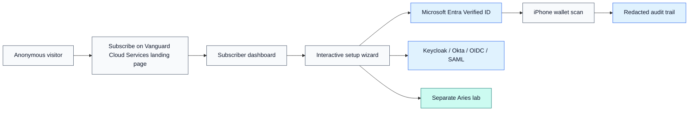
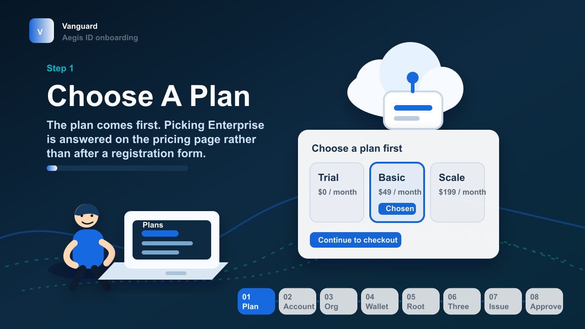
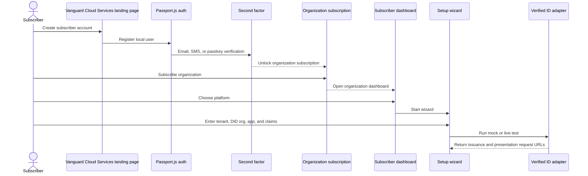
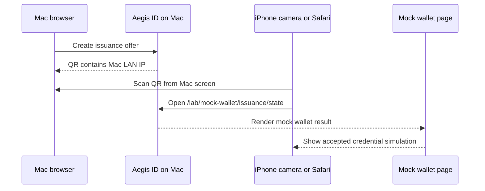
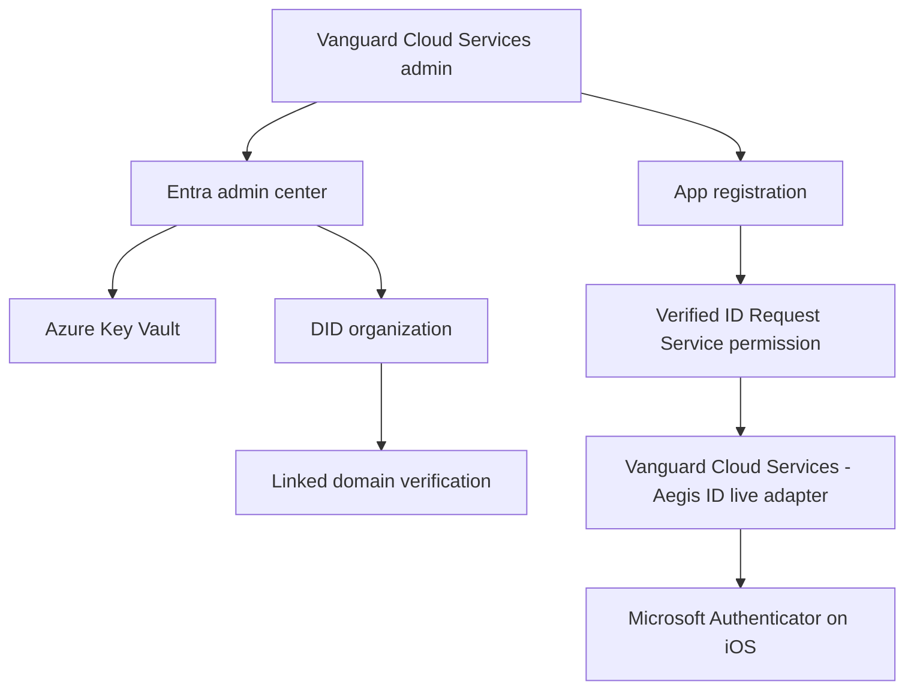
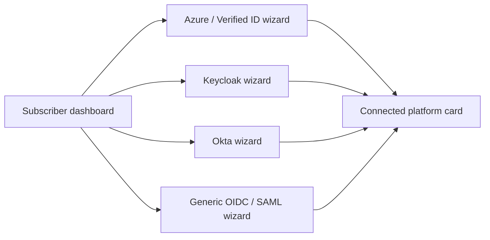

# Vanguard Cloud Services - Aegis ID

<div align="center">


# Vanguard Cloud Services Operator Guide

**Subscriber onboarding, Microsoft Entra Verified ID setup, iPhone wallet testing, and interoperability lab checks**

[](#local-mac-setup)
[](#use-the-app)
[](#microsoft-entra-verified-id-live-path)
[](#aries-interoperability-lab)

</div>

---

## Guide Map

- [What You Are Running](#what-you-are-running)
- [Fast Start Checklist](#fast-start-checklist)
- [Local Mac Setup](#local-mac-setup)
- [Use The App](#use-the-app)
- [iPhone Wallet And QR Testing](#iphone-wallet-and-qr-testing)
- [Microsoft Entra Verified ID Live Path](#microsoft-entra-verified-id-live-path)
- [YubiKey And Passkey Testing](#yubikey-and-passkey-testing)
- [Platform Wizards](#platform-wizards)
- [Aries Interoperability Lab](#aries-interoperability-lab)
- [Azure Free-Tier Pilot Deployment](#azure-free-tier-pilot-deployment)
- [Troubleshooting](#troubleshooting)
- [Reference Links](#reference-links)

---

## What You Are Running

Vanguard Cloud Services - Aegis ID is a dual-track identity service for Vanguard Cloud Services

| Track | Purpose | Wallet / Tooling | Production Posture |
| --- | --- | --- | --- |
| Microsoft-native path | Subscriber onboarding, DID organization setup, claims setup, issuance, and presentation with Microsoft Entra Verified ID | Microsoft Authenticator on iOS, Entra admin center, Azure App Service | Production target |
| Aries interoperability lab | DIDComm, ACA-Py, Vanguard Aegis ID mobile app flows, and proof experiments | Local ACA-Py agents and the Aegis ID mobile app | Research and interoperability only |
| Mock wallet path | Local development before live Verified ID is connected | Browser-based mock wallet pages under `/lab/mock-wallet/...` | Demo and developer testing only |


```mermaid
flowchart LR
    Visitor["Anonymous visitor"] --> Subscribe["Subscribe on Vanguard Cloud Services landing page"]
    Subscribe --> Dashboard["Subscriber dashboard"]
    Dashboard --> Wizard["Interactive setup wizard"]
    Wizard --> Microsoft["Microsoft Entra Verified ID"]
    Wizard --> Federation["Keycloak / Okta / OIDC / SAML"]
    Wizard --> Aries["Separate Aries lab"]
    Microsoft --> Wallet["iPhone wallet scan"]
    Wallet --> Audit["Redacted audit trail"]

    classDef cloud fill:#e0f2fe,stroke:#2563eb,color:#0f172a;
    classDef lab fill:#ccfbf1,stroke:#0f766e,color:#0f172a;
    classDef user fill:#f8fafc,stroke:#475569,color:#0f172a;
    class Visitor,Subscribe,Dashboard,Wizard,Wallet user;
    class Microsoft,Federation,Audit cloud;
    class Aries lab;
```

---

## Fast Start Checklist

Use this checklist when you want the shortest path from clean checkout to a scannable QR test.

- [ ] Install Node.js 20 or newer.
- [ ] Run `npm install`.
- [ ] Copy `.env.example` to `.env`.
- [ ] Keep `VID_MODE=mock` for the first local test.
- [ ] Start the app on your Mac.
- [ ] Subscribe from the home page.
- [ ] Open the subscriber dashboard.
- [ ] Run the Microsoft Verified ID wizard in mock mode.
- [ ] Regenerate the QR request with your Mac LAN IP before scanning from iPhone.
- [ ] Move to `VID_MODE=live` only after Entra Verified ID, app registration, DID organization, and HTTPS callback URL are ready.

<details>
<summary><strong>Copy-paste: first local run</strong></summary>

```bash
npm install
cp .env.example .env
npm test
npm run smoke
npm start
```

Open:

```text
http://localhost:3000
```

</details>

---

## Local Mac Setup

### 1. Confirm prerequisites

```bash
node --version
npm --version
git --version
```

Use Node.js 20 or newer.

### 2. Install and configure

```bash
npm install
cp .env.example .env
```

For local mock testing, keep these values:

```env
VID_MODE=mock
PUBLIC_BASE_URL=http://localhost:3000
```

### 3. Start the app

```bash
npm start
```

Main URLs:

| Page | URL | Use |
| --- | --- | --- |
| Home | `http://localhost:3000/` | Landing page, video, subscription |
| Architecture | `http://localhost:3000/architecture` | Demo API buttons for issuance, presentation, and Aries status |
| Dashboard | `http://localhost:3000/dashboard/<subscription-id>` | Subscriber workspace |
| Wizard | `http://localhost:3000/dashboard/<subscription-id>/platforms/<platform-id>/setup` | Platform setup |

### 4. Watch the setup video

The home page has a **Watch video** button that opens the setup walkthrough.

Local asset:

```text
public/videos/setup-walkthrough.mp4
```

Regenerate it when needed:

```bash
npm run video:setup
```



---

## Use The App

### Subscriber journey


```mermaid
sequenceDiagram
    actor User as Subscriber
    participant Home as Vanguard Cloud Services landing page
    participant Auth as Passport.js auth
    participant MFA as Second factor
    participant Sub as Organization subscription
    participant Dash as Subscriber dashboard
    participant Wiz as Setup wizard
    participant VID as Verified ID adapter

    User->>Home: Create subscriber account
    Home->>Auth: Register local user
    Auth->>MFA: Email, SMS, or passkey verification
    MFA-->>Sub: Unlock organization subscription
    User->>Sub: Subscribe organization
    Sub-->>Dash: Open organization dashboard
    User->>Dash: Choose platform
    Dash->>Wiz: Start wizard
    User->>Wiz: Enter tenant, DID org, app, and claims
    Wiz->>VID: Run mock or live test
    VID-->>Wiz: Return issuance and presentation request URLs
```

### Steps

1. Open `http://localhost:3000`.
2. Select **Watch video** if you want the visual walkthrough.
3. Create a subscriber account.
4. Complete email, SMS, or passkey second-factor verification.
5. Subscribe an organization at `/subscribe`.
6. Register or choose the organization, then open the dashboard.
7. Open **Microsoft Entra Verified ID / Azure**.
8. Complete the wizard:
   - Tenant
   - DID organization
   - App registration
   - Claims
   - Test
9. Use mock mode until the Entra tenant and HTTPS callback URL are ready.

<details>
<summary><strong>Suggested Vanguard Cloud Services pilot claim set</strong></summary>

```json
{
  "displayName": "Vanguard Pilot User",
  "email": "pilot@vanguardcs.ca",
  "department": "Architecture",
  "role": "Identity Pilot",
  "organization": "Vanguard Cloud Services"
}
```

</details>

---

## iPhone Wallet And QR Testing

There are two QR testing modes. They look similar, but they use different wallets.

| Mode | QR opens in | When to use |
| --- | --- | --- |
| Mock mode | iPhone Safari or the built-in mock wallet page | Local development before Entra Verified ID is configured |
| Live Microsoft Verified ID mode | Microsoft Authenticator on iOS | Real issuance and presentation with your tenant |

### Mock wallet on iPhone using your Mac

Your mock JSON currently looks like this:

```json
{
  "issuance": {
    "mode": "mock",
    "requestUrl": "http://localhost:3000/lab/mock-wallet/issuance/..."
  },
  "presentation": {
    "mode": "mock",
    "requestUrl": "http://localhost:3000/lab/mock-wallet/presentation/..."
  }
}
```

`localhost` works on the Mac. It does not work from the iPhone because the iPhone treats `localhost` as the iPhone itself.

Use your Mac's Wi-Fi IP instead.

```bash
ipconfig getifaddr en0
```

If the command returns `192.168.1.50`, start the app like this:

```bash
PORT=3000 PUBLIC_BASE_URL=http://192.168.1.50:3000 npm start
```

Then regenerate the issuance or presentation request. The new request URL should look like:

```text
http://192.168.1.50:3000/lab/mock-wallet/issuance/<state>
```

Now scan or open it from the iPhone.


```mermaid
sequenceDiagram
    participant Mac as Mac browser
    participant App as Aegis ID on Mac
    participant Phone as iPhone camera or Safari
    participant Mock as Mock wallet page

    Mac->>App: Create issuance offer
    App-->>Mac: QR contains Mac LAN IP
    Phone->>Mac: Scan QR from Mac screen
    Phone->>App: Open /lab/mock-wallet/issuance/state
    App-->>Mock: Render mock wallet result
    Mock-->>Phone: Show accepted credential simulation
```

#### Mock scan checklist

- [ ] Mac and iPhone are on the same Wi-Fi network.
- [ ] App is running on the Mac.
- [ ] `PUBLIC_BASE_URL` uses the Mac LAN IP, not `localhost`.
- [ ] The request was regenerated after changing `PUBLIC_BASE_URL`.
- [ ] The QR request has not expired.
- [ ] macOS Firewall allows incoming connections for Node.js, if prompted.
- [ ] iPhone opens the URL in Safari or the Camera QR preview.

### Live wallet on iPhone using Microsoft Authenticator

Use this only after you switch to the live Microsoft-native path.

1. Install **Microsoft Authenticator** from the iOS App Store.
2. Open Microsoft Authenticator.
3. Go to **Verified IDs**.
4. Select **Scan QR code**.
5. Allow camera access when prompted.
6. Scan the QR displayed by Vanguard Cloud Services - Aegis ID.
7. Enter the PIN if the issuance request shows one.
8. Review the credential.
9. Select **Add**.
10. For presentation testing, scan the presentation QR and approve the requested proof.

Important: Microsoft Verified ID callbacks must be publicly reachable over HTTPS for live testing. Use Azure App Service, or a temporary HTTPS tunnel only for development.

---

## Microsoft Entra Verified ID Live Path

### Live path readiness

- [ ] Vanguard Cloud Services Azure tenant exists.
- [ ] You have the required admin roles.
- [ ] Verified ID is configured in the Entra admin center.
- [ ] Key Vault is configured for Verified ID signing material.
- [ ] DID organization / authority DID is created.
- [ ] Linked domain is verified.
- [ ] Entra app registration is created.
- [ ] Verified ID Request Service permission is granted with admin consent.
- [ ] Credential manifest exists.
- [ ] App has a public HTTPS callback base URL.


```mermaid
flowchart TB
    Admin["Vanguard Cloud Services admin"] --> Entra["Entra admin center"]
    Entra --> KV["Azure Key Vault"]
    Entra --> DID["DID organization"]
    DID --> Domain["Linked domain verification"]
    Admin --> AppReg["App registration"]
    AppReg --> API["Verified ID Request Service permission"]
    API --> Aegis["Vanguard Cloud Services - Aegis ID live adapter"]
    Aegis --> Authenticator["Microsoft Authenticator on iOS"]
```

### App settings for live mode

```env
VID_MODE=live
AZURE_TENANT_ID=<vanguard-tenant-id>
AZURE_CLIENT_ID=<app-registration-client-id>
AZURE_CLIENT_SECRET=<client-secret-or-empty-if-supplied-once-in-wizard>
VID_CLIENT_NAME=Vanguard Cloud Services - Aegis ID
VID_AUTHORITY_DID=<issuer-did>
VID_MANIFEST_URL=<credential-manifest-url>
VID_CREDENTIAL_TYPE=VanguardEmployeeCredential
VID_CALLBACK_API_KEY=<random-callback-secret>
PUBLIC_BASE_URL=https://<app-name>.azurewebsites.net
```

### Wizard values to capture

| Wizard step | Vanguard Cloud Services value |
| --- | --- |
| Tenant | Tenant display name, tenant ID, verified domain |
| DID organization | Issuer DID, DID method, linked domain, Key Vault reference |
| App registration | Client ID, secret reference, manifest URL, callback key reference |
| Claims | Credential type, required claims, optional claims, test subject |
| Test | Create issuance and presentation request |

Do not persist client secrets in subscriber setup data. The wizard's one-time secret field is for testing only.

---

## YubiKey And Passkey Testing

Use YubiKey for phishing-resistant sign-in to Vanguard-controlled admin and subscriber access, Entra admin work, Keycloak, Okta, or other SSO layers.

Do not treat YubiKey as the Verified ID wallet. The wallet path for Microsoft Verified ID is Microsoft Authenticator on iOS.

### YubiKey test plan

- [ ] Enable passkeys/FIDO2 in Microsoft Entra ID.
- [ ] Scope the policy to a Vanguard Cloud Services pilot group first.
- [ ] Register a YubiKey for a pilot user.
- [ ] Confirm the pilot user can sign in with the YubiKey.
- [ ] Add Conditional Access authentication strength for sensitive Vanguard Cloud Services admin paths.
- [ ] Keep a break-glass admin account outside the pilot policy.

---

## Platform Wizards

The subscriber dashboard supports four platform setup paths.

| Platform | Wizard use | Current test behavior |
| --- | --- | --- |
| Microsoft Entra Verified ID / Azure | Tenant, DID org, app registration, claims, issuance/presentation test | Mock or live Verified ID request |
| Keycloak | Realm, discovery URL, client, claim mapping | OIDC/SAML metadata reachability |
| Okta | Issuer, authorization server, client, claim mapping | OIDC/SAML metadata reachability |
| Generic OIDC / SAML | Provider metadata and mapping | OIDC discovery or SAML metadata shape validation |


```mermaid
flowchart LR
    Dashboard["Subscriber dashboard"] --> Azure["Azure / Verified ID wizard"]
    Dashboard --> Keycloak["Keycloak wizard"]
    Dashboard --> Okta["Okta wizard"]
    Dashboard --> Generic["Generic OIDC / SAML wizard"]
    Azure --> Result["Connected platform card"]
    Keycloak --> Result
    Okta --> Result
    Generic --> Result
```

---

## Wallet Identity, Wallet ID And Recovery

Every wallet now registers on first launch and receives a **Wallet ID** in the
form `AEG-XXXX-XXXX-XXXX-XXXX`. Holders share it with an administrator so
credentials can be issued to that specific wallet.

**Issuing a credential.** The issue form takes an optional Wallet ID and mobile
number alongside the holder email. Binding to a Wallet ID is the strongest
option and lets the credential email differ from the email the holder registered
on their wallet, which is what supports people who work with several
organizations. Email- and phone-bound invitations must match the contact
registered on the wallet and are flagged **Lower assurance** in the people table.

**Approving a recovery.** Administrators holding the **Approve wallet recovery**
privilege see a **Wallet recovery** panel in the dashboard. Re-verify the person
the same way you did at onboarding — in person, or with government photo ID plus
a liveness check. Approving restores only your organization's credentials.

**Delivery settings.** Recovery codes are sent by email or SMS. Configure this at
**/admin/notifications**, which has presets for Microsoft 365 / Exchange Online
and Gmail / Google Workspace. In production, recovery fails closed if no channel
is configured.

Full detail: [Wallet Identity, Wallet ID and Recovery](wallet-identity-and-recovery.md).

## Plans And Signup

Signup goes **plan first, account second**: `/plans` → checkout (paid plans
only) → create account → subscribe the organization. The account form also
offers the full plan list, defaulting to Trial, for anyone who reaches it
directly — choosing a paid plan there simply routes to checkout after email
verification.

A **registration code** can be entered in either place: at checkout, or in the
optional box on the account form. The code decides the plan, whichever one was
selected beside it.

| Plan | Price | Organizations | Credentials |
|---|---|---|---|
| Trial | Free for 30 days | 1 | 5 |
| Basic | $49/month | 1 | 20 per organization |
| Pro | $149/month | 2 | 20 per organization |
| Pay per credential | $19/month | 1 | 3 included, then $5 each |
| Enterprise | $499/month | Unlimited | 100 included, then $3 each |

Prices and limits live in one file, `src/services/plan-service.js`, so changing
pricing is a one-file edit.

**What a plan is worth is enforced on the server**, at the only two paths that
mint anything — registering an organization and issuing a credential. Hitting a
limit returns **402 Payment Required**, not 403: it is a billing limit, not a
permission failure.

**The plan on the record and the plan in effect are different things.** A trial
that has run out, or a paid plan that is unpaid, past due or cancelled, falls
back to Trial limits — never to nothing. Everything already issued keeps
working and only new issuance stops, because a billing event must not revoke
somebody's identity credential. The account page says which of these applies
rather than leaving the customer to guess why issuing failed.

**Payment** goes through Stripe's hosted Checkout, so card details never touch
Aegis ID.

**Test mode and live mode are chosen by the key, not by the environment name.**
That is deliberate: an environment used to show the product to prospective
customers wants a *test* key, so nobody can be charged by accident, even though
it is called prod. When a test key is in use, the checkout page says so and
names the card to use, and the application logs a banner at startup. The
expensive mistake is the mirror image — a test key still in place once real
money is expected — so neither state is left for somebody to go and check. Apple Pay and Google Pay appear automatically on supported devices —
they are payment methods within Checkout, not separate integrations.

Where no Stripe key is configured, the checkout page says so and a paid plan
still creates the account — the subscription simply starts unpaid, so trial
limits apply until payment is set up, and nothing already issued is affected.

Billing state always comes from Stripe, never from the browser. The page a
customer lands on after paying confirms with Stripe before it says anything,
and a cancellation, failed renewal or upgrade made in Stripe reaches the
subscription within seconds by webhook. If a webhook is ever missed, an
administrator can re-read the true state from Stripe rather than the record
being stuck.

Metered plans currently bill their monthly base through Stripe; per-credential
overage is reported on the account page but not yet charged automatically.

## Organization Domains

An organization's name is free text, and two subscribers can legitimately choose
the same one. A **verified domain** is what lets a credential holder tell a real
organization from one that typed the same name.

Every organization gets a **handle** the moment it is created —
`cloudstrucc-a7f3` — globally unique and permanent. It is shown at
`/orgs/<handle>`, a public page a holder can check before accepting an
invitation. Unverified organizations are labelled as such there, in plain words.

**Verifying a domain** takes one DNS record. From the organization list choose
**Verify domain**, enter the domain, and publish the TXT record shown at
`_aegis-challenge.<your-domain>`. Then choose **Check DNS now**. The in-app
guide at `/help/domain-verification` has step-by-step instructions for GoDaddy,
Namecheap, Cloudflare, Squarespace, Azure DNS and AWS Route 53, plus the fix for
the mistake that catches most people — the host field usually wants only
`_aegis-challenge`, not the full name.

Checks are rate limited to ten per ten minutes, because DNS propagation makes
people click. A claim expires after 14 days; start it again for a fresh record.

**Administrators see every organization identity at `/admin/domains`** and can
**withdraw** a verification. Domains get sold, lapse and change hands — when
that happens the organization that used to hold it must stop being able to point
at it. The handle survives, so the organization keeps its identity and loses
only the claim. Every claim, check, success, failure and withdrawal is on the
evidence chain.

## Registration Codes

A registration code grants a **paid plan without payment**. It exists so testers
on dev and qa can sign up without a card, and so a pilot customer can be comped
without a finance conversation. Issue and revoke them at
**/admin/registration-codes**.

**A code is worth what the plan is worth**, so it is handled like a credential
rather than a coupon:

- Only a hash is stored. The plaintext is shown **once**, on the page that
  issues it, and can never be shown again — if it is lost, revoke it and issue
  another.
- Each code names the environments it may be redeemed in. A code handed out on
  **dev** is refused on **prod**, so leaking the test codes cannot cost revenue.
  Naming `prod` is giving away a real subscription; the form makes you tick it
  deliberately rather than letting a blank field mean "everywhere".
- Codes carry a redemption count and an expiry, and can be revoked at any time.
  Revoking stops further redemptions without erasing what the code already
  granted.
- Every issue, redemption, rejection and revocation is on the evidence chain.

A rejected code always gives the same answer — "That registration code is not
valid" — whether it is unknown, expired, spent, revoked, or simply meant for a
different environment. Distinguishing those would turn the signup form into a
way of discovering which codes exist.

Free plans cannot have codes: there is nothing to bypass, since anyone can start
a trial without one.

## Aries Interoperability Lab

The Aries lab is intentionally separate from the Microsoft production path.

```bash
cd aries-lab
cp .env.example .env
docker compose up -d acapy-mediator acapy-issuer acapy-verifier
```

From the repo root:

```bash
curl http://localhost:3000/api/aries/status
aries-lab/scripts/create-issuer-invitation.sh
aries-lab/scripts/create-verifier-invitation.sh
```

Use the lab for:

- DIDComm experiments.
- ACA-Py issuer/verifier testing.
- Vanguard Aegis ID mobile app wallet checks.
- Schema and credential definition experiments.
- Proof request experiments.

Do not use the Aries lab as a production dependency for the Microsoft-native Vanguard Cloud Services path.

---

## Azure Free-Tier Pilot Deployment

This app can start on Azure App Service Free `F1` for a Vanguard Cloud Services pilot if you keep it simple:

- Node.js/HBS web app.
- Mock mode or low-volume live testing.
- Default `azurewebsites.net` HTTPS URL.
- Local JSON storage only for pilot data.
- No production Key Vault/database/App Insights dependency in the free baseline.

Deploy:

```bash
az login
az account set --subscription "<subscription-id>"

az group create \
  --name rg-vanguard-aegis-id \
  --location canadacentral

az deployment group create \
  --resource-group rg-vanguard-aegis-id \
  --template-file infra/bicep/main.bicep \
  --parameters appName="<globally-unique-app-name>"
```

Package and publish:

```bash
npm ci
npm test
zip -r aegis-id.zip . \
  -x "node_modules/*" ".git/*" ".env" "data/*.json" "tmp/*"

az webapp deploy \
  --resource-group rg-vanguard-aegis-id \
  --name "<globally-unique-app-name>" \
  --src-path aegis-id.zip \
  --type zip
```

Set live Verified ID app settings only after Entra Verified ID is ready.

---

## Troubleshooting

<details>
<summary><strong>iPhone scans QR but cannot open the mock wallet page</strong></summary>

Most likely the QR still contains `localhost`.

Fix:

```bash
ipconfig getifaddr en0
PORT=3000 PUBLIC_BASE_URL=http://<mac-lan-ip>:3000 npm start
```

Regenerate the QR after restarting. The request URL must contain your Mac LAN IP.

</details>

<details>
<summary><strong>The request URL expired</strong></summary>

Regenerate the issuance or presentation request from the architecture page, API, or wizard test step. The mock and live request payloads include `expiresAt`.

</details>

<details>
<summary><strong>Microsoft Authenticator does not accept the mock URL</strong></summary>

Expected. Mock URLs are browser test pages. Microsoft Authenticator is for live Microsoft Entra Verified ID requests.

</details>

<details>
<summary><strong>Live Verified ID callback does not arrive</strong></summary>

Check that `PUBLIC_BASE_URL` is HTTPS and publicly reachable. Microsoft documents that callback endpoints are part of the web app and should be available over HTTPS.

</details>

<details>
<summary><strong>YubiKey works for sign-in but not wallet issuance</strong></summary>

Expected. YubiKey is for FIDO2/passkey authentication. Microsoft Authenticator is the iOS wallet used for Verified ID issuance and presentation.

</details>

---

## Reference Links

- Microsoft Entra Verified ID Request Service REST API: https://learn.microsoft.com/en-us/entra/verified-id/get-started-request-api
- Microsoft Authenticator with Verified ID: https://learn.microsoft.com/en-us/entra/verified-id/using-authenticator
- Advanced Microsoft Entra Verified ID setup: https://learn.microsoft.com/en-us/entra/verified-id/verifiable-credentials-configure-tenant
- Microsoft Entra passkeys/FIDO2: https://learn.microsoft.com/en-us/entra/identity/authentication/how-to-authentication-passkeys-fido2
- Azure App Service Node.js quickstart: https://learn.microsoft.com/en-us/azure/app-service/quickstart-nodejs
- ACA-Py documentation: https://aca-py.org/latest/

---

## Vanguard Cloud Services Handoff Notes

- Use mock mode for demos and internal walkthroughs.
- Use iPhone Safari for mock wallet QR testing from the Mac.
- Use Microsoft Authenticator for live Microsoft Entra Verified ID.
- Use YubiKey for phishing-resistant sign-in, not as a Verified ID wallet.
- Keep the Aries lab separate from the production trust path.
- Replace local JSON storage before real multi-tenant customer onboarding.
